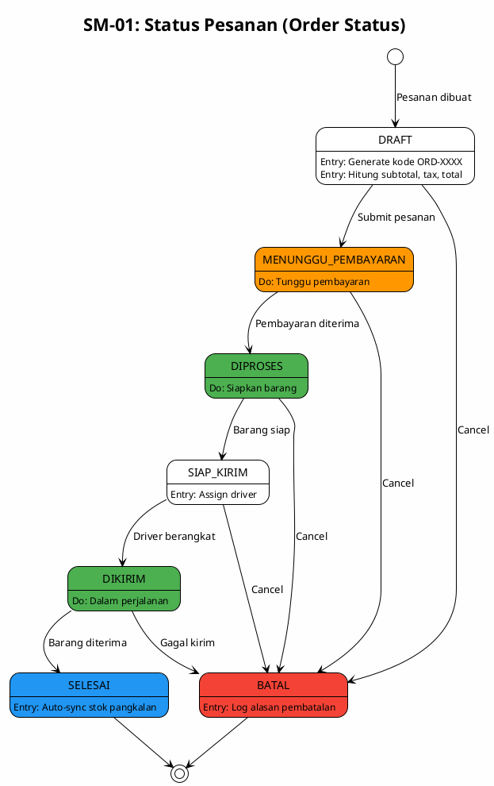
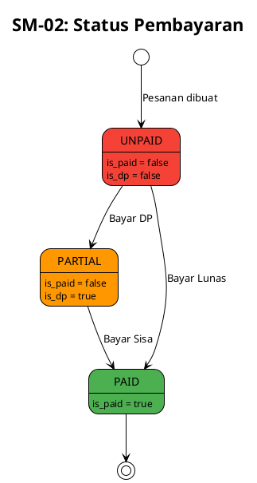
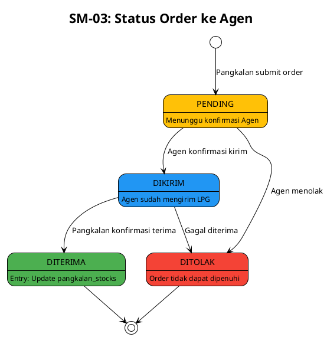
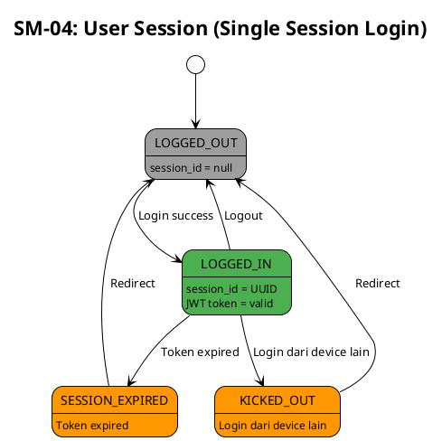
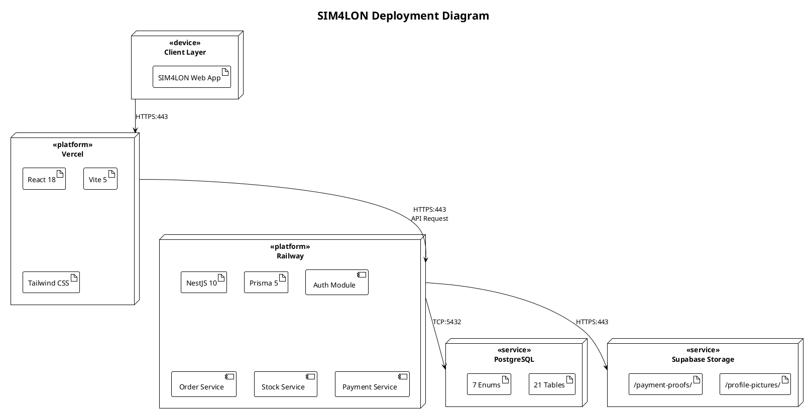

# DOKUMEN ANALISIS SISTEM LENGKAP
# Sistem Informasi Manajemen LPG (SIM4LON)

---

> **Dokumen**: System Analysis & Design Documentation  
> **Versi**: 1.0  
> **Tanggal**: 23 Desember 2024  
> **Sistem**: SIM4LON (Sistem Informasi Manajemen LPG 4 Jalur Online)  
> **Dibuat oleh**: System Analyst Team

---

## DAFTAR ISI

1. [Executive Summary](#1-executive-summary)
2. [Gambaran Umum Sistem](#2-gambaran-umum-sistem)
3. [Full Stack Technology](#3-full-stack-technology)
4. [Use Case Diagram](#4-use-case-diagram)
5. [Class Diagram](#5-class-diagram)
6. [Entity Relationship Diagram (ERD)](#6-entity-relationship-diagram-erd)
7. [Activity Diagram](#7-activity-diagram)
8. [Sequence Diagram](#8-sequence-diagram)
9. [State Machine Diagram](#9-state-machine-diagram)
10. [Deployment Diagram](#10-deployment-diagram)
11. [Lampiran](#11-lampiran)

---

# 1. EXECUTIVE SUMMARY

## 1.1 Tujuan Dokumen

Dokumen ini merupakan **dokumentasi teknis lengkap** untuk sistem SIM4LON yang mencakup seluruh diagram UML dan analisis sistem.

## 1.2 Ringkasan Sistem

**SIM4LON** adalah Sistem Informasi Manajemen LPG 4 Jalur Online yang mengelola distribusi gas LPG dari Agen ke Pangkalan hingga ke Konsumen akhir.

## 1.3 Statistik UML

| Diagram Type | Jumlah | Status |
|--------------|--------|--------|
| Use Case Diagram | 1 | ✅ |
| Class Diagram | 1 | ✅ |
| ERD | 1 | ✅ |
| Activity Diagram | 25 | ✅ |
| Sequence Diagram | 18 | ✅ |
| State Machine Diagram | 4 | ✅ |
| Deployment Diagram | 1 | ✅ |
| **TOTAL** | **51** | ✅ |

---

# 2. GAMBARAN UMUM SISTEM

## 2.1 Alur Bisnis

```
SPBE/SUPPLIER → AGEN → PANGKALAN → KONSUMEN
```

## 2.2 Aktor Sistem

| Aktor | Deskripsi | Hak Akses |
|-------|-----------|-----------|
| **Admin** | Administrator sistem | Full access |
| **Operator** | Staff operasional agen | Operasional |
| **Pangkalan** | Pemilik pangkalan | Data sendiri |

---

# 3. FULL STACK TECHNOLOGY

```
┌─────────────────────────────────────────────────────────────────┐
│                        SIM4LON FULL STACK                       │
├─────────────────────────────────────────────────────────────────┤
│  FRONTEND          │  BACKEND           │  DATABASE/STORAGE     │
│  React 18          │  NestJS 10         │  PostgreSQL 15        │
│  Vite 5            │  Prisma 5          │  Supabase Storage     │
│  TanStack Query v5 │  JWT + Passport    │                       │
│  React Router v6   │  Multer            │                       │
│  Tailwind CSS      │  class-validator   │                       │
│  Shadcn/UI         │                    │                       │
├─────────────────────────────────────────────────────────────────┤
│  Vercel            │  Railway           │  Railway + Supabase   │
└─────────────────────────────────────────────────────────────────┘
```

---

# 4. USE CASE DIAGRAM

## 4.1 Diagram

```plantuml
@startuml SIM4LON_UseCase
!theme plain
skinparam actorStyle awesome
skinparam packageStyle rectangle
skinparam backgroundColor #87CEEB
skinparam usecaseFontSize 11
skinparam ActorBorderColor #1e3a5f

title **SISTEM SIM4LON - DISTRIBUSI GAS LPG**\nUse Case Diagram

actor "Admin" as Admin
actor "Operator" as Operator
actor "Pangkalan" as Pangkalan

rectangle "Sistem SIM4LON" {
    usecase "Login" as UC_Login
    usecase "Kelola Profil" as UC_Profil
    usecase "Kelola Pengguna" as UC_Pengguna
    usecase "Kelola Pangkalan" as UC_KelolaPangkalan
    usecase "Kelola Supir" as UC_Supir
    usecase "Kelola Dashboard" as UC_Dashboard
    usecase "Kelola Pesanan" as UC_Pesanan
    usecase "Update Status" as UC_UpdateStatus
    usecase "Assign Driver" as UC_AssignDriver
    usecase "Kelola Pembayaran" as UC_Pembayaran
    usecase "Cetak Nota" as UC_CetakNota
    usecase "Kelola Stok" as UC_Stok
    usecase "Catat Penerimaan" as UC_Penerimaan
    usecase "Catat Penyaluran" as UC_Penyaluran
    usecase "Kelola Laporan" as UC_Laporan
    usecase "Dashboard Pangkalan" as UC_DashPangkalan
    usecase "Kelola Konsumen" as UC_Konsumen
    usecase "Catat Penjualan" as UC_CatatPenjualan
    usecase "Buat Order ke Agen" as UC_OrderAgen
}

Admin --> UC_Login
Admin --> UC_Pengguna
Admin --> UC_KelolaPangkalan
Admin --> UC_Supir
Admin --> UC_Dashboard
Admin --> UC_Pesanan
Admin --> UC_Pembayaran
Admin --> UC_Stok
Admin --> UC_Laporan

Operator --> UC_Login
Operator --> UC_Dashboard
Operator --> UC_Pesanan
Operator --> UC_Pembayaran
Operator --> UC_Stok

Pangkalan --> UC_Login
Pangkalan --> UC_DashPangkalan
Pangkalan --> UC_Konsumen
Pangkalan --> UC_CatatPenjualan
Pangkalan --> UC_OrderAgen

UC_Stok ..> UC_Penerimaan : <<include>>
UC_Stok ..> UC_Penyaluran : <<include>>
UC_AssignDriver ..> UC_UpdateStatus : <<extend>>
UC_CetakNota ..> UC_Pembayaran : <<extend>>

@enduml
```



## 4.2 Matriks Akses

| Use Case | Admin | Operator | Pangkalan |
|----------|:-----:|:--------:|:---------:|
| Login | ✅ | ✅ | ✅ |
| Kelola Profil | ✅ | ✅ | ✅ |
| Kelola Pengguna | ✅ | ❌ | ❌ |
| Kelola Pangkalan | ✅ | ❌ | ❌ |
| Kelola Supir | ✅ | ❌ | ❌ |
| Kelola Dashboard | ✅ | ✅ | ❌ |
| Kelola Pesanan | ✅ | ✅ | ❌ |
| Kelola Pembayaran | ✅ | ✅ | ❌ |
| Kelola Stok | ✅ | ✅ | ❌ |
| Kelola Penjualan | ❌ | ❌ | ✅ |
| Kelola Konsumen | ❌ | ❌ | ✅ |

---

# 5. CLASS DIAGRAM

## 5.1 Daftar Class (21 Entitas)

### Master Data
| Class | Deskripsi |
|-------|-----------|
| `users` | Akun pengguna |
| `agen` | Distributor LPG |
| `pangkalans` | Pangkalan/outlet |
| `drivers` | Supir pengiriman |
| `lpg_products` | Katalog produk LPG |

### Order Management
| Class | Deskripsi |
|-------|-----------|
| `orders` | Pesanan utama |
| `order_items` | Detail item pesanan |
| `timeline_tracks` | Riwayat status |
| `invoices` | Faktur/invoice |
| `order_payment_details` | Summary pembayaran |
| `payment_records` | Catatan transaksi |

### Stock Management
| Class | Deskripsi |
|-------|-----------|
| `stock_histories` | Riwayat stok agen |
| `penerimaan_stok` | Penerimaan dari SPBE |
| `penyaluran_harian` | Penyaluran ke pangkalan |
| `perencanaan_harian` | Perencanaan alokasi |

### Pangkalan Module
| Class | Deskripsi |
|-------|-----------|
| `consumers` | Konsumen pangkalan |
| `consumer_orders` | Penjualan ke konsumen |
| `pangkalan_stocks` | Stok per pangkalan |
| `pangkalan_stock_movements` | Riwayat pergerakan |
| `lpg_prices` | Harga jual per pangkalan |
| `expenses` | Pengeluaran operasional |
| `agen_orders` | Order ke agen |

### Audit
| Class | Deskripsi |
|-------|-----------|
| `activity_logs` | Log aktivitas sistem |

## 5.2 Enumerasi

| Enum | Values |
|------|--------|
| `user_role` | ADMIN, OPERATOR, PANGKALAN |
| `status_pesanan` | DRAFT, MENUNGGU_PEMBAYARAN, DIPROSES, SIAP_KIRIM, DIKIRIM, SELESAI, BATAL |
| `lpg_type` | kg3, kg5_5, kg12, kg50 |
| `lpg_category` | SUBSIDI, NON_SUBSIDI |
| `payment_method` | TUNAI, TRANSFER |
| `stock_movement_type` | MASUK, KELUAR |
| `consumer_type` | RUMAH_TANGGA, WARUNG |

---

# 6. ENTITY RELATIONSHIP DIAGRAM

## 6.1 Relasi Utama

| Parent | Child | Cardinality |
|--------|-------|-------------|
| agen | pangkalans | 1:N |
| pangkalans | users | 1:N |
| pangkalans | orders | 1:N |
| orders | order_items | 1:N |
| orders | timeline_tracks | 1:N |
| orders | order_payment_details | 1:1 |
| pangkalans | consumers | 1:N |
| consumers | consumer_orders | 1:N |

---

# 7. ACTIVITY DIAGRAM

## 7.1 Daftar Activity Diagram (25 Total)

### Fase 1: Core Processes
| ID | Nama | File |
|----|------|------|
| AD-01 | Login | `AD_01_Login.puml` |
| AD-02 | Buat Pesanan | `AD_02_BuatPesanan.puml` |
| AD-03 | Update Status Pesanan | `AD_03_UpdateStatusPesanan.puml` |
| AD-04 | Catat Pembayaran | `AD_04_CatatPembayaran.puml` |
| AD-05 | Catat Penerimaan Stok | `AD_05_CatatPenerimaanStok.puml` |
| AD-06 | Catat Penyaluran | `AD_06_CatatPenyaluran.puml` |
| AD-07 | Catat Penjualan | `AD_07_CatatPenjualan.puml` |
| AD-08 | Buat Order ke Agen | `AD_08_BuatOrderKeAgen.puml` |
| AD-09 | Kelola Pangkalan | `AD_09_KelolaPangkalan.puml` |

### Fase 2: Supporting Processes
| ID | Nama | File |
|----|------|------|
| AD-10 | Ubah Password | `AD_10_UbahPassword.puml` |
| AD-11 | Kelola Pengguna | `AD_11_KelolaPengguna.puml` |
| AD-12 | Kelola Supir | `AD_12_KelolaSupir.puml` |
| AD-13 | Kelola Produk LPG | `AD_13_KelolaProdukLPG.puml` |
| AD-14 | Assign Driver | `AD_14_AssignDriver.puml` |
| AD-15 | Lihat Detail Pesanan | `AD_15_LihatDetailPesanan.puml` |
| AD-16 | Generate Invoice | `AD_16_GenerateInvoice.puml` |
| AD-17 | Cetak Nota | `AD_17_CetakNota.puml` |
| AD-18 | Kelola Perencanaan | `AD_18_KelolaPerencanaan.puml` |
| AD-19 | Lihat In/Out Agen | `AD_19_LihatInOutAgen.puml` |
| AD-20 | Kelola Konsumen | `AD_20_KelolaKonsumen.puml` |
| AD-21 | Kelola Stok Pangkalan | `AD_21_KelolaStokPangkalan.puml` |
| AD-22 | Terima Order dari Agen | `AD_22_TerimaOrderDariAgen.puml` |
| AD-23 | Kelola Pengeluaran | `AD_23_KelolaPengeluaran.puml` |
| AD-24 | Generate Laporan | `AD_24_GenerateLaporan.puml` |
| AD-25 | Export Laporan | `AD_25_ExportLaporan.puml` |

---

# 8. SEQUENCE DIAGRAM

## 8.1 Daftar Sequence Diagram (18 Total)

### Fase 1: Core Interactions
| ID | Nama | File |
|----|------|------|
| SD-01 | Login | `SD_01_Login.puml` |
| SD-03 | Create Order | `SD_03_CreateOrder.puml` |
| SD-04 | Update Status | `SD_04_UpdateStatus.puml` |
| SD-07 | Record Payment | `SD_07_RecordPayment.puml` |
| SD-09 | Receive Stock | `SD_09_ReceiveStock.puml` |
| SD-10 | Record Distribution | `SD_10_RecordDistribution.puml` |
| SD-12 | Record Sale | `SD_12_RecordSale.puml` |
| SD-16 | Create Pangkalan | `SD_16_CreatePangkalan.puml` |

### Fase 2: Supporting Interactions
| ID | Nama | File |
|----|------|------|
| SD-02 | Logout | `SD_02_Logout.puml` |
| SD-05 | Assign Driver | `SD_05_AssignDriver.puml` |
| SD-06 | Get Order Detail | `SD_06_GetOrderDetail.puml` |
| SD-08 | Generate Invoice | `SD_08_GenerateInvoice.puml` |
| SD-11 | Get Stock Summary | `SD_11_GetStockSummary.puml` |
| SD-13 | Create Order to Agen | `SD_13_CreateOrderToAgen.puml` |
| SD-14 | Confirm Receipt | `SD_14_ConfirmReceipt.puml` |
| SD-15 | Dashboard Pangkalan | `SD_15_DashboardPangkalan.puml` |
| SD-17 | CRUD Generic | `SD_17_CRUDGeneric.puml` |
| SD-18 | Generate Export Report | `SD_18_GenerateExportReport.puml` |

---

# 9. STATE MACHINE DIAGRAM

## 9.1 SM-01: Order Status



## 9.2 SM-02: Payment Status



## 9.3 SM-03: Agen Order Status



## 9.4 SM-04: User Session



---

# 10. DEPLOYMENT DIAGRAM

## 10.1 Diagram



## 10.2 Protokol

| From | To | Protocol | Port |
|------|----|----------|------|
| Browser | Vercel | HTTPS | 443 |
| Vercel | Railway | HTTPS | 443 |
| Railway | PostgreSQL | TCP | 5432 |
| Railway | Supabase | HTTPS | 443 |

---

# 11. LAMPIRAN

## 11.1 Daftar File Diagram (51 files)

```
diagrams/
├── SIM4LON_UseCase.puml
├── SIM4LON_ClassDiagram.puml
├── SIM4LON_ERD.puml
├── SIM4LON_Deployment.puml
├── AD_01_Login.puml ... AD_25_ExportLaporan.puml (25 files)
├── SD_01_Login.puml ... SD_18_GenerateExportReport.puml (18 files)
└── SM_01_OrderStatus.puml ... SM_04_UserSession.puml (4 files)
```

## 11.2 Business Rules

| Rule | Description |
|------|-------------|
| Single-Session | 1 user = 1 device aktif |
| Auto-Sync Stock | Stok pangkalan update saat order SELESAI |
| Auto-Create User | Buat pangkalan bisa auto-generate akun |
| PPN 12% | Diterapkan untuk LPG NON_SUBSIDI |
| Soft Delete | Master data menggunakan deleted_at |
| Multi-Tenant | Pangkalan hanya lihat data sendiri |

## 11.3 Tools

| Tool | Purpose |
|------|---------|
| PlantUML Online | Render diagrams |
| VS Code + PlantUML Extension | Local preview |
| Markdown PDF Extension | Export to PDF |

---

*© 2024 SIM4LON - Sistem Informasi Manajemen LPG 4 Jalur Online*
