# 3.3 Perancangan Sistem

> **Catatan**: Dokumen ini berisi perancangan sistem lengkap meliputi diagram UML, struktur database, dan desain antarmuka aplikasi SIM4LON.

---

## Pengantar Perancangan Sistem

Pada bagian ini dipaparkan perancangan sistem yang merupakan hasil dari tahap Modeling dalam metodologi Waterfall. Perancangan sistem mencakup pemodelan struktural dan behavioral menggunakan **Unified Modeling Language (UML)** sebagai standar notasi industri, serta desain antarmuka pengguna menggunakan wireframe.

Perancangan sistem SIM4LON dibuat dengan mempertimbangkan:
1. **Kebutuhan fungsional** yang teridentifikasi dari hasil wawancara
2. **Arsitektur multi-tenant** untuk mendukung agen dan pangkalan
3. **Skalabilitas** untuk pertumbuhan data dan pengguna
4. **Keamanan** dengan role-based access control

---

## 3.3.1 Entity Relationship Diagram (ERD)

*Entity Relationship Diagram* (ERD) merupakan diagram yang menggambarkan struktur database sistem, meliputi entitas-entitas, atribut, dan relasi antar entitas. Menurut Connolly dan Begg (2015), ERD adalah representasi grafis dari suatu model data yang menunjukkan hubungan antar entitas dalam sebuah sistem. ERD sangat penting dalam tahap perancangan database untuk memastikan integritas dan konsistensi data.

Berikut ini merupakan ERD dari Aplikasi SIM4LON berbasis web di PT Mitra Surya Natasya.


*Gambar 3.1 Entity Relationship Diagram SIM4LON*

Pada gambar 3.1 menunjukkan *Entity Relationship Diagram* lengkap dari sistem SIM4LON. Sistem ini menggunakan database **PostgreSQL** dengan **ORM Prisma** dan memiliki total **23 entitas** yang dikelompokkan menjadi 6 kategori. Diagram ini menggunakan notasi **Crow's Foot** yang merupakan standar industri untuk pemodelan database relasional.

### Notasi ERD (Crow's Foot)

| Simbol | Notasi | Arti |
|--------|--------|------|
| `||` | One (mandatory) | Tepat satu |
| `|o` | Zero or One | Nol atau satu |
| `|{` | One or Many | Satu atau banyak |
| `o{` | Zero or Many | Nol atau banyak |

---

### Daftar Entitas (23 Entitas)

| No | Kategori | Entitas | Primary Key | Foreign Keys | Deskripsi |
|----|----------|---------|-------------|--------------|-----------|
| 1 | Master Data | `users` | id (UUID) | pangkalan_id | Data pengguna sistem |
| 2 | Master Data | `agen` | id (UUID) | - | Data agen LPG |
| 3 | Master Data | `pangkalans` | id (UUID) | agen_id | Data pangkalan mitra |
| 4 | Master Data | `drivers` | id (UUID) | - | Data sopir pengiriman |
| 5 | Master Data | `lpg_products` | id (UUID) | - | Master produk LPG |
| 6 | Master Data | `company_profile` | id (UUID) | - | Profil perusahaan (singleton) |
| 7 | Order | `orders` | id (UUID) | pangkalan_id, driver_id | Data pesanan utama |
| 8 | Order | `order_items` | id (UUID) | order_id | Item dalam pesanan |
| 9 | Order | `timeline_tracks` | id (UUID) | order_id | Riwayat perubahan status |
| 10 | Order | `invoices` | id (UUID) | order_id | Data faktur/invoice |
| 11 | Payment | `order_payment_details` | id (UUID) | order_id | Summary pembayaran (1:1) |
| 12 | Payment | `payment_records` | id (UUID) | order_id, invoice_id, user_id | Riwayat transaksi pembayaran |
| 13 | Stock | `stock_histories` | id (UUID) | lpg_product_id, user_id | Riwayat pergerakan stok agen |
| 14 | Stock | `penerimaan_stok` | id (UUID) | - | Penerimaan tabung dari SPPBE |
| 15 | Stock | `perencanaan_harian` | id (UUID) | pangkalan_id | Perencanaan alokasi distribusi |
| 16 | Stock | `penyaluran_harian` | id (UUID) | pangkalan_id | Realisasi penyaluran ke pangkalan |
| 17 | Pangkalan SAAS | `consumers` | id (UUID) | pangkalan_id | Data konsumen akhir |
| 18 | Pangkalan SAAS | `consumer_orders` | id (UUID) | pangkalan_id, consumer_id | Penjualan ke konsumen |
| 19 | Pangkalan SAAS | `pangkalan_stocks` | id (UUID) | pangkalan_id | Stok per pangkalan |
| 20 | Pangkalan SAAS | `lpg_prices` | id (UUID) | pangkalan_id | Harga jual per pangkalan |
| 21 | Pangkalan SAAS | `expenses` | id (UUID) | pangkalan_id | Pengeluaran operasional |
| 22 | Pangkalan SAAS | `agen_orders` | id (UUID) | pangkalan_id, agen_id | Order pangkalan ke agen |
| 23 | Audit | `activity_logs` | id (UUID) | user_id, order_id | Log aktivitas untuk audit trail |

---

### Deskripsi Struktur Database

Berdasarkan ERD di atas, terdapat **23 entitas** yang dirancang untuk mendukung operasional distribusi LPG secara komprehensif. Database SIM4LON dibangun menggunakan **PostgreSQL** dengan **ORM Prisma** dan menerapkan arsitektur **multi-tenant** serta **role-based access control (RBAC)**.

Entitas `users` dan `agen` memiliki relasi *one-to-many*, karena setiap agen dapat memiliki banyak pangkalan sebagai mitra distribusi. Entitas `users` memiliki atribut `role` yang menentukan hak akses pengguna (ADMIN, OPERATOR, atau PANGKALAN), serta atribut `session_id` yang menerapkan fitur *single-session login* untuk keamanan sistem. Setiap user dengan role PANGKALAN terkait dengan satu entitas `pangkalans` melalui relasi *many-to-one*.

Entitas `pangkalans` menjadi pusat dalam arsitektur multi-tenant sistem. Setiap pangkalan memiliki relasi *one-to-many* dengan entitas `orders` untuk pesanan yang diterima, `consumers` untuk data konsumen akhir, `consumer_orders` untuk transaksi penjualan eceran, `pangkalan_stocks` untuk inventori, `lpg_prices` untuk pengaturan harga custom, `expenses` untuk pencatatan pengeluaran, dan `agen_orders` untuk order pengisian stok ke agen. Desain ini memungkinkan setiap pangkalan beroperasi secara mandiri dalam satu sistem terpadu.

Entitas `orders` merupakan entitas inti dalam modul Order Management yang memiliki relasi *composition* dengan `order_items` dan `timeline_tracks`. Setiap pesanan minimal memiliki satu item (*one-to-many required*), dan setiap perubahan status tercatat dalam timeline untuk keperluan audit trail. Entitas `orders` juga memiliki relasi *one-to-one* dengan `order_payment_details` untuk ringkasan pembayaran, serta relasi *one-to-many* dengan `payment_records` untuk mencatat setiap transaksi pembayaran individual beserta bukti transfer.

Entitas `invoices` di-generate dari pesanan dan memiliki relasi *one-to-many* dengan `payment_records`, memungkinkan satu invoice menerima beberapa pembayaran bertahap. Entitas `drivers` memiliki relasi *one-to-many* dengan `orders`, karena satu driver dapat ditugaskan untuk mengantarkan banyak pesanan.

Modul Stock Management terdiri dari empat entitas utama: `stock_histories` mencatat setiap pergerakan stok dengan tipe MASUK atau KELUAR, `penerimaan_stok` mencatat penerimaan tabung dari SPPBE lengkap dengan nomor SO dan LO, `perencanaan_harian` menyimpan alokasi distribusi yang direncanakan, dan `penyaluran_harian` mencatat realisasi penyaluran ke pangkalan. Entitas `lpg_products` memiliki relasi *one-to-many* dengan `stock_histories` untuk pelacakan inventori per produk.

Entitas `activity_logs` berfungsi sebagai *audit trail* yang mencatat seluruh aktivitas penting dalam sistem dengan relasi ke `users` dan `orders`. Setiap log mencatat tipe aktivitas, timestamp, dan detail terkait untuk mendukung transparansi dan akuntabilitas operasional. Keseluruhan struktur database ini dirancang dengan mempertimbangkan *referential integrity*, *soft delete* untuk data recovery, dan *timestamp tracking* untuk audit compliance.

---

### Relasi Antar Entitas (25 Relasi)

Berikut adalah penjelasan relasi antar entitas dalam database SIM4LON. Seluruh relasi menggunakan notasi Crow's Foot dengan kardinalitas yang menunjukkan jumlah minimum dan maksimum record yang dapat terhubung.

Relasi dalam sistem ini didominasi oleh tipe *one-to-many* (1:0..*) yang menunjukkan satu record di entitas parent dapat memiliki nol atau banyak record di entitas child. Terdapat satu relasi *one-to-one optional* (1:0..1) antara `orders` dan `order_payment_details` yang memastikan setiap pesanan hanya memiliki maksimal satu ringkasan pembayaran. Relasi *one-to-many required* (1:1..*) terdapat antara `orders` dan `order_items` yang menjamin setiap pesanan minimal memiliki satu item produk.

Entitas `pangkalans` memiliki konektivitas tertinggi dengan 10 relasi outgoing, menjadikannya entitas sentral dalam arsitektur multi-tenant sistem. Entitas `orders` juga memiliki konektivitas tinggi sebagai pusat modul Order Management dengan 6 relasi ke entitas pendukung seperti items, timeline, invoice, dan payment.

| No | Entitas A | Cardinality | Entitas B | Deskripsi |
|----|-----------|:-----------:|-----------|-----------|
| 1 | `agen` | 1 : 0..* | `pangkalans` | Satu agen memiliki banyak pangkalan |
| 2 | `pangkalans` | 1 : 0..* | `users` | Satu pangkalan memiliki banyak user |
| 3 | `pangkalans` | 1 : 0..* | `orders` | Satu pangkalan menempatkan banyak pesanan |
| 4 | `drivers` | 1 : 0..* | `orders` | Satu driver mengantarkan banyak pesanan |
| 5 | `orders` | 1 : 1..* | `order_items` | Satu pesanan memiliki minimal satu item |
| 6 | `orders` | 1 : 0..* | `timeline_tracks` | Satu pesanan memiliki banyak riwayat status |
| 7 | `orders` | 1 : 0..* | `invoices` | Satu pesanan menghasilkan banyak invoice |
| 8 | `orders` | 1 : 0..1 | `order_payment_details` | Satu pesanan memiliki maksimal satu summary pembayaran |
| 9 | `orders` | 1 : 0..* | `payment_records` | Satu pesanan menerima banyak pembayaran |
| 10 | `invoices` | 1 : 0..* | `payment_records` | Satu invoice menerima banyak pembayaran |
| 11 | `users` | 1 : 0..* | `payment_records` | Satu user mencatat banyak pembayaran |
| 12 | `users` | 1 : 0..* | `stock_histories` | Satu user mencatat banyak pergerakan stok |
| 13 | `users` | 1 : 0..* | `activity_logs` | Satu user menghasilkan banyak log aktivitas |
| 14 | `orders` | 1 : 0..* | `activity_logs` | Satu pesanan menghasilkan banyak log aktivitas |
| 15 | `lpg_products` | 1 : 0..* | `stock_histories` | Satu produk dilacak di banyak histori stok |
| 16 | `pangkalans` | 1 : 0..* | `consumers` | Satu pangkalan melayani banyak konsumen |
| 17 | `consumers` | 1 : 0..* | `consumer_orders` | Satu konsumen menempatkan banyak pesanan |
| 18 | `pangkalans` | 1 : 0..* | `consumer_orders` | Satu pangkalan menjual ke banyak pesanan konsumen |
| 19 | `pangkalans` | 1 : 0..* | `lpg_prices` | Satu pangkalan mengatur banyak harga |
| 20 | `pangkalans` | 1 : 0..* | `pangkalan_stocks` | Satu pangkalan mengelola banyak stok |
| 21 | `pangkalans` | 1 : 0..* | `expenses` | Satu pangkalan mengeluarkan banyak biaya |
| 22 | `pangkalans` | 1 : 0..* | `penyaluran_harian` | Satu pangkalan menerima banyak penyaluran |
| 23 | `pangkalans` | 1 : 0..* | `perencanaan_harian` | Satu pangkalan memiliki banyak perencanaan |
| 24 | `agen` | 1 : 0..* | `agen_orders` | Satu agen menerima banyak order dari pangkalan |
| 25 | `pangkalans` | 1 : 0..* | `agen_orders` | Satu pangkalan menempatkan banyak order ke agen |

**File Diagram:** `diagrams/SIM4LON_ERD.puml`

---

### Struktur Tabel Database

Berikut adalah struktur detail setiap tabel dalam database SIM4LON. Struktur tabel menjelaskan nama field, tipe data yang digunakan, panjang maksimum (jika applicable), constraint yang diterapkan, dan deskripsi fungsi dari masing-masing field.

**Keterangan Constraint:**
| Kode | Arti | Deskripsi |
|------|------|-----------|
| PK | Primary Key | Identifier unik untuk setiap record |
| FK | Foreign Key | Referensi ke primary key tabel lain |
| UK | Unique Key | Nilai harus unik dalam tabel |
| NN | Not Null | Field wajib diisi, tidak boleh kosong |
| - | Nullable | Field opsional, boleh kosong |

Database menggunakan **UUID v4** sebagai primary key untuk memastikan keunikan global dan mendukung arsitektur terdistribusi. Setiap tabel dilengkapi dengan field `created_at` dan `updated_at` untuk tracking waktu, serta `deleted_at` untuk implementasi **soft delete** yang memungkinkan data recovery.

#### a. Struktur Tabel users

*Tabel 3.1 Struktur Tabel users*

| Nama Field | Tipe Data | Panjang | Constraint | Deskripsi |
|------------|-----------|---------|------------|-----------|
| id | UUID | 36 | PK | Primary Key |
| code | varchar | 20 | UK, NN | Kode unik pengguna |
| email | varchar | 255 | UK, NN | Email pengguna |
| password | varchar | 255 | NN | Password terenkripsi (bcrypt) |
| name | varchar | 255 | NN | Nama lengkap pengguna |
| phone | varchar | 20 | - | Nomor telepon |
| avatar_url | text | - | - | URL foto profil |
| role | enum | - | NN | Role: ADMIN, OPERATOR, PANGKALAN |
| pangkalan_id | UUID | 36 | FK | Foreign Key ke pangkalans |
| session_id | varchar | 100 | - | ID sesi login aktif |
| is_active | boolean | - | NN | Status aktif (default: true) |
| created_at | timestamptz | - | NN | Waktu pembuatan record |
| updated_at | timestamptz | - | NN | Waktu update terakhir |
| deleted_at | timestamptz | - | - | Waktu soft delete |

#### b. Struktur Tabel agen

*Tabel 3.2 Struktur Tabel agen*

| Nama Field | Tipe Data | Panjang | Constraint | Deskripsi |
|------------|-----------|---------|------------|-----------|
| id | UUID | 36 | PK | Primary Key |
| code | varchar | 20 | UK, NN | Kode agen unik |
| name | varchar | 255 | NN | Nama agen |
| address | text | - | - | Alamat lengkap |
| pic_name | varchar | 255 | - | Nama Person In Charge |
| phone | varchar | 20 | - | Nomor telepon |
| email | varchar | 255 | - | Email agen |
| note | text | - | - | Catatan tambahan |
| is_active | boolean | - | NN | Status aktif (default: true) |
| created_at | timestamptz | - | NN | Waktu pembuatan record |
| updated_at | timestamptz | - | NN | Waktu update terakhir |
| deleted_at | timestamptz | - | - | Waktu soft delete |

#### c. Struktur Tabel pangkalans

*Tabel 3.3 Struktur Tabel pangkalans*

| Nama Field | Tipe Data | Panjang | Constraint | Deskripsi |
|------------|-----------|---------|------------|-----------|
| id | UUID | 36 | PK | Primary Key |
| code | varchar | 20 | UK, NN | Kode pangkalan unik |
| name | varchar | 255 | NN | Nama pangkalan |
| address | text | - | - | Alamat lengkap |
| region | varchar | 100 | - | Wilayah operasional |
| pic_name | varchar | 255 | - | Nama Person In Charge |
| phone | varchar | 20 | - | Nomor telepon |
| email | varchar | 255 | - | Email pangkalan |
| capacity | int | - | - | Kapasitas gudang (pcs) |
| alokasi_bulanan | int | - | NN | Alokasi bulanan (pcs) |
| agen_id | UUID | 36 | FK, NN | Foreign Key ke agen |
| note | text | - | - | Catatan tambahan |
| is_active | boolean | - | NN | Status aktif (default: true) |
| created_at | timestamptz | - | NN | Waktu pembuatan record |
| updated_at | timestamptz | - | NN | Waktu update terakhir |
| deleted_at | timestamptz | - | - | Waktu soft delete |

#### d. Struktur Tabel drivers

*Tabel 3.4 Struktur Tabel drivers*

| Nama Field | Tipe Data | Panjang | Constraint | Deskripsi |
|------------|-----------|---------|------------|-----------|
| id | UUID | 36 | PK | Primary Key |
| code | varchar | 20 | UK, NN | Kode driver unik |
| name | varchar | 255 | NN | Nama driver |
| phone | varchar | 20 | - | Nomor telepon |
| vehicle_id | varchar | 20 | - | Nomor plat kendaraan |
| note | text | - | - | Catatan tambahan |
| is_active | boolean | - | NN | Status aktif (default: true) |
| created_at | timestamptz | - | NN | Waktu pembuatan record |
| updated_at | timestamptz | - | NN | Waktu update terakhir |
| deleted_at | timestamptz | - | - | Waktu soft delete |

#### e. Struktur Tabel lpg_products

*Tabel 3.5 Struktur Tabel lpg_products*

| Nama Field | Tipe Data | Panjang | Constraint | Deskripsi |
|------------|-----------|---------|------------|-----------|
| id | UUID | 36 | PK | Primary Key |
| name | varchar | 100 | NN | Nama produk |
| size_kg | decimal | 5,2 | NN | Ukuran tabung (kg) |
| category | enum | - | NN | Kategori: SUBSIDI, NON_SUBSIDI |
| color | varchar | 50 | - | Warna tabung |
| description | text | - | - | Deskripsi produk |
| selling_price | decimal | 15,2 | NN | Harga jual per unit |
| cost_price | decimal | 15,2 | NN | Harga pokok per unit |
| brand | varchar | 50 | - | Merek tabung |
| is_active | boolean | - | NN | Status aktif (default: true) |
| created_at | timestamptz | - | NN | Waktu pembuatan record |
| updated_at | timestamptz | - | NN | Waktu update terakhir |
| deleted_at | timestamptz | - | - | Waktu soft delete |

#### f. Struktur Tabel company_profile

*Tabel 3.6 Struktur Tabel company_profile*

| Nama Field | Tipe Data | Panjang | Constraint | Deskripsi |
|------------|-----------|---------|------------|-----------|
| id | UUID | 36 | PK | Primary Key (singleton) |
| company_name | varchar | 255 | NN | Nama perusahaan |
| address | text | - | - | Alamat perusahaan |
| phone | varchar | 20 | - | Nomor telepon |
| email | varchar | 255 | - | Email perusahaan |
| pic_name | varchar | 255 | - | Nama Person In Charge |
| sppbe_number | varchar | 50 | - | Nomor registrasi SPPBE |
| region | varchar | 100 | - | Wilayah operasional |
| logo_url | text | - | - | URL logo perusahaan |
| ppn_rate | decimal | 5,2 | NN | Tarif PPN (default: 12%) |
| invoice_prefix | varchar | 20 | NN | Prefix nomor invoice |
| order_code_prefix | varchar | 20 | NN | Prefix kode pesanan |
| created_at | timestamptz | - | NN | Waktu pembuatan record |
| updated_at | timestamptz | - | NN | Waktu update terakhir |

#### g. Struktur Tabel orders

*Tabel 3.7 Struktur Tabel orders*

| Nama Field | Tipe Data | Panjang | Constraint | Deskripsi |
|------------|-----------|---------|------------|-----------|
| id | UUID | 36 | PK | Primary Key |
| code | varchar | 20 | UK, NN | Kode pesanan unik (auto-generate) |
| pangkalan_id | UUID | 36 | FK, NN | Foreign Key ke pangkalans |
| driver_id | UUID | 36 | FK | Foreign Key ke drivers (nullable) |
| order_date | date | - | NN | Tanggal pesanan dibuat |
| current_status | enum | - | NN | Status workflow pesanan |
| subtotal | decimal | 15,2 | NN | Subtotal sebelum pajak |
| tax_amount | decimal | 15,2 | NN | Jumlah pajak (PPN) |
| total_amount | decimal | 15,2 | NN | Total setelah pajak |
| note | text | - | - | Catatan tambahan |
| created_at | timestamptz | - | NN | Waktu pembuatan record |
| updated_at | timestamptz | - | NN | Waktu update terakhir |
| deleted_at | timestamptz | - | - | Waktu soft delete |
| updated_at | timestamptz | - | Waktu update terakhir |
| deleted_at | timestamptz | - | Waktu soft delete |

#### h. Struktur Tabel order_items

*Tabel 3.8 Struktur Tabel order_items*

| Nama Field | Tipe Data | Panjang | Deskripsi |
|------------|-----------|---------|-----------|
| id | UUID | 36 | Primary Key |
| order_id | UUID | 36 | Foreign Key ke orders |
| lpg_type | enum | - | Jenis LPG |
| label | varchar | 50 | Label item |
| price_per_unit | decimal | 15,2 | Harga satuan |
| qty | int | - | Jumlah pesanan |
| sub_total | decimal | 15,2 | Subtotal item |
| is_taxable | boolean | - | Apakah kena pajak |
| tax_amount | decimal | 15,2 | Jumlah pajak item |
| created_at | timestamptz | - | Waktu pembuatan |
| updated_at | timestamptz | - | Waktu update terakhir |

#### i. Struktur Tabel timeline_tracks

*Tabel 3.9 Struktur Tabel timeline_tracks*

| Nama Field | Tipe Data | Panjang | Deskripsi |
|------------|-----------|---------|-----------|
| id | UUID | 36 | Primary Key |
| order_id | UUID | 36 | Foreign Key ke orders |
| status | enum | - | Status pesanan |
| description | text | - | Deskripsi perubahan |
| note | text | - | Catatan tambahan |
| created_at | timestamptz | - | Waktu pembuatan |

#### j. Struktur Tabel invoices

*Tabel 3.10 Struktur Tabel invoices*

| Nama Field | Tipe Data | Panjang | Deskripsi |
|------------|-----------|---------|-----------|
| id | UUID | 36 | Primary Key |
| order_id | UUID | 36 | Foreign Key ke orders |
| invoice_number | varchar | 50 | Nomor invoice (Unique) |
| invoice_date | date | - | Tanggal invoice |
| due_date | date | - | Tanggal jatuh tempo |
| billing_address | text | - | Alamat penagihan |
| billed_to_name | varchar | 255 | Nama penerima tagihan |
| sub_total | decimal | 15,2 | Subtotal |
| tax_rate | decimal | 5,2 | Tarif pajak (%) |
| tax_amount | decimal | 15,2 | Jumlah pajak |
| grand_total | decimal | 15,2 | Total akhir |
| payment_status | varchar | 50 | Status pembayaran |
| created_at | timestamptz | - | Waktu pembuatan |
| updated_at | timestamptz | - | Waktu update terakhir |
| deleted_at | timestamptz | - | Waktu soft delete |

#### k. Struktur Tabel order_payment_details

*Tabel 3.11 Struktur Tabel order_payment_details*

| Nama Field | Tipe Data | Panjang | Deskripsi |
|------------|-----------|---------|-----------|
| id | UUID | 36 | Primary Key |
| order_id | UUID | 36 | Foreign Key ke orders (Unique) |
| is_paid | boolean | - | Status lunas |
| is_dp | boolean | - | Status DP |
| payment_method | enum | - | Metode pembayaran |
| amount_paid | decimal | 15,2 | Jumlah terbayar |
| payment_date | timestamptz | - | Tanggal pembayaran |
| proof_url | text | - | URL bukti pembayaran |
| created_at | timestamptz | - | Waktu pembuatan |
| updated_at | timestamptz | - | Waktu update terakhir |

#### l. Struktur Tabel payment_records

*Tabel 3.12 Struktur Tabel payment_records*

| Nama Field | Tipe Data | Panjang | Deskripsi |
|------------|-----------|---------|-----------|
| id | UUID | 36 | Primary Key |
| order_id | UUID | 36 | Foreign Key ke orders |
| invoice_id | UUID | 36 | Foreign Key ke invoices |
| method | enum | - | Metode pembayaran |
| amount | decimal | 15,2 | Jumlah pembayaran |
| payment_time | timestamptz | - | Waktu pembayaran |
| proof_url | text | - | URL bukti transfer |
| recorded_by_user_id | UUID | 36 | Foreign Key ke users |
| note | text | - | Catatan |
| created_at | timestamptz | - | Waktu pembuatan |

#### m. Struktur Tabel stock_histories

*Tabel 3.13 Struktur Tabel stock_histories*

| Nama Field | Tipe Data | Panjang | Deskripsi |
|------------|-----------|---------|-----------|
| id | UUID | 36 | Primary Key |
| lpg_product_id | UUID | 36 | Foreign Key ke lpg_products |
| lpg_type | enum | - | Jenis LPG |
| movement_type | enum | - | Tipe: MASUK, KELUAR |
| qty | int | - | Jumlah tabung |
| note | text | - | Catatan |
| recorded_by_user_id | UUID | 36 | Foreign Key ke users |
| timestamp | timestamptz | - | Waktu pergerakan |
| created_at | timestamptz | - | Waktu pembuatan |

#### n. Struktur Tabel penerimaan_stok

*Tabel 3.14 Struktur Tabel penerimaan_stok*

| Nama Field | Tipe Data | Panjang | Deskripsi |
|------------|-----------|---------|-----------|
| id | UUID | 36 | Primary Key |
| no_so | varchar | 50 | Nomor Sales Order |
| no_lo | varchar | 50 | Nomor Loading Order |
| nama_material | varchar | 255 | Nama material |
| qty_pcs | int | - | Jumlah (pcs) |
| qty_kg | decimal | 10,2 | Jumlah (kg) |
| tanggal | date | - | Tanggal penerimaan |
| sumber | varchar | 255 | Sumber/SPPBE |
| created_at | timestamptz | - | Waktu pembuatan |
| updated_at | timestamptz | - | Waktu update terakhir |

#### o. Struktur Tabel perencanaan_harian

*Tabel 3.15 Struktur Tabel perencanaan_harian*

| Nama Field | Tipe Data | Panjang | Deskripsi |
|------------|-----------|---------|-----------|
| id | UUID | 36 | Primary Key |
| pangkalan_id | UUID | 36 | Foreign Key ke pangkalans |
| tanggal | date | - | Tanggal perencanaan |
| lpg_type | enum | - | Jenis LPG |
| jumlah_normal | int | - | Jumlah normal |
| jumlah_fakultatif | int | - | Jumlah fakultatif |
| alokasi_bulan | int | - | Alokasi bulan |
| created_at | timestamptz | - | Waktu pembuatan |
| updated_at | timestamptz | - | Waktu update terakhir |

#### p. Struktur Tabel penyaluran_harian

*Tabel 3.16 Struktur Tabel penyaluran_harian*

| Nama Field | Tipe Data | Panjang | Deskripsi |
|------------|-----------|---------|-----------|
| id | UUID | 36 | Primary Key |
| pangkalan_id | UUID | 36 | Foreign Key ke pangkalans |
| tanggal | date | - | Tanggal penyaluran |
| lpg_type | enum | - | Jenis LPG |
| jumlah_normal | int | - | Jumlah normal |
| jumlah_fakultatif | int | - | Jumlah fakultatif |
| tipe_pembayaran | varchar | 20 | Tipe pembayaran |
| created_at | timestamptz | - | Waktu pembuatan |
| updated_at | timestamptz | - | Waktu update terakhir |

#### q. Struktur Tabel consumers

*Tabel 3.17 Struktur Tabel consumers*

| Nama Field | Tipe Data | Panjang | Deskripsi |
|------------|-----------|---------|-----------|
| id | UUID | 36 | Primary Key |
| pangkalan_id | UUID | 36 | Foreign Key ke pangkalans |
| name | varchar | 255 | Nama konsumen |
| nik | varchar | 16 | Nomor Induk Kependudukan |
| kk | varchar | 16 | Nomor Kartu Keluarga |
| phone | varchar | 20 | Nomor telepon |
| address | text | - | Alamat |
| note | text | - | Catatan |
| consumer_type | enum | - | Tipe: RUMAH_TANGGA, WARUNG |
| is_active | boolean | - | Status aktif |
| created_at | timestamptz | - | Waktu pembuatan |
| updated_at | timestamptz | - | Waktu update terakhir |

#### r. Struktur Tabel consumer_orders

*Tabel 3.18 Struktur Tabel consumer_orders*

| Nama Field | Tipe Data | Panjang | Deskripsi |
|------------|-----------|---------|-----------|
| id | UUID | 36 | Primary Key |
| code | varchar | 20 | Kode transaksi (Unique) |
| pangkalan_id | UUID | 36 | Foreign Key ke pangkalans |
| consumer_id | UUID | 36 | Foreign Key ke consumers |
| consumer_name | varchar | 255 | Nama konsumen |
| lpg_type | enum | - | Jenis LPG |
| qty | int | - | Jumlah beli |
| price_per_unit | decimal | 15,2 | Harga jual satuan |
| cost_price | decimal | 15,2 | Harga pokok |
| total_amount | decimal | 15,2 | Total transaksi |
| payment_status | enum | - | Status: LUNAS, BELUM_LUNAS |
| note | text | - | Catatan |
| sale_date | timestamptz | - | Tanggal penjualan |
| created_at | timestamptz | - | Waktu pembuatan |
| updated_at | timestamptz | - | Waktu update terakhir |

#### s. Struktur Tabel pangkalan_stocks

*Tabel 3.19 Struktur Tabel pangkalan_stocks*

| Nama Field | Tipe Data | Panjang | Deskripsi |
|------------|-----------|---------|-----------|
| id | UUID | 36 | Primary Key |
| pangkalan_id | UUID | 36 | Foreign Key ke pangkalans |
| lpg_type | enum | - | Jenis LPG |
| qty | int | - | Jumlah stok |
| warning_level | int | - | Level peringatan |
| critical_level | int | - | Level kritis |
| created_at | timestamptz | - | Waktu pembuatan |
| updated_at | timestamptz | - | Waktu update terakhir |

#### t. Struktur Tabel lpg_prices

*Tabel 3.20 Struktur Tabel lpg_prices*

| Nama Field | Tipe Data | Panjang | Deskripsi |
|------------|-----------|---------|-----------|
| id | UUID | 36 | Primary Key |
| pangkalan_id | UUID | 36 | Foreign Key ke pangkalans |
| lpg_type | enum | - | Jenis LPG |
| cost_price | decimal | 15,2 | Harga pokok |
| selling_price | decimal | 15,2 | Harga jual |
| is_active | boolean | - | Status aktif |
| created_at | timestamptz | - | Waktu pembuatan |
| updated_at | timestamptz | - | Waktu update terakhir |

#### u. Struktur Tabel expenses

*Tabel 3.21 Struktur Tabel expenses*

| Nama Field | Tipe Data | Panjang | Deskripsi |
|------------|-----------|---------|-----------|
| id | UUID | 36 | Primary Key |
| pangkalan_id | UUID | 36 | Foreign Key ke pangkalans |
| category | varchar | 50 | Kategori pengeluaran |
| amount | decimal | 15,2 | Jumlah pengeluaran |
| description | text | - | Deskripsi |
| expense_date | timestamptz | - | Tanggal pengeluaran |
| created_at | timestamptz | - | Waktu pembuatan |
| updated_at | timestamptz | - | Waktu update terakhir |

#### v. Struktur Tabel agen_orders

*Tabel 3.22 Struktur Tabel agen_orders*

| Nama Field | Tipe Data | Panjang | Deskripsi |
|------------|-----------|---------|-----------|
| id | UUID | 36 | Primary Key |
| code | varchar | 20 | Kode order (Unique) |
| pangkalan_id | UUID | 36 | Foreign Key ke pangkalans |
| agen_id | UUID | 36 | Foreign Key ke agen |
| lpg_type | enum | - | Jenis LPG |
| qty_ordered | int | - | Jumlah dipesan |
| qty_received | int | - | Jumlah diterima |
| status | varchar | 20 | Status order |
| order_date | timestamptz | - | Tanggal order |
| received_date | timestamptz | - | Tanggal diterima |
| note | text | - | Catatan |
| created_at | timestamptz | - | Waktu pembuatan |
| updated_at | timestamptz | - | Waktu update terakhir |

#### w. Struktur Tabel activity_logs

*Tabel 3.23 Struktur Tabel activity_logs*

| Nama Field | Tipe Data | Panjang | Deskripsi |
|------------|-----------|---------|-----------|
| id | UUID | 36 | Primary Key |
| user_id | UUID | 36 | Foreign Key ke users |
| order_id | UUID | 36 | Foreign Key ke orders |
| type | varchar | 50 | Tipe aktivitas |
| title | varchar | 255 | Judul aktivitas |
| description | text | - | Deskripsi detail |
| pangkalan_name | varchar | 255 | Nama pangkalan terkait |
| detail_numeric | decimal | 15,2 | Detail numerik |
| icon_name | varchar | 50 | Nama ikon |
| order_status | enum | - | Status pesanan |
| timestamp | timestamptz | - | Waktu aktivitas |
| created_at | timestamptz | - | Waktu pembuatan |

---


## 3.3.2 Deployment Diagram

*Deployment Diagram* merupakan diagram yang menggambarkan arsitektur fisik dari sistem, meliputi konfigurasi hardware dan software yang digunakan dalam implementasi. Menurut Booch et al. (2017), deployment diagram menunjukkan bagaimana artefak software di-deploy ke node-node dalam infrastruktur teknologi.

Berikut ini merupakan *Deployment Diagram* dari Aplikasi SIM4LON berbasis web di PT Mitra Surya Natasya.


*Gambar 3.2 Deployment Diagram SIM4LON*

Pada Gambar 3.2 menunjukkan arsitektur deployment sistem SIM4LON yang menggunakan **arsitektur cloud-based** dengan pemisahan yang jelas antara frontend, backend, database, storage, dan layanan AI eksternal.

### Deskripsi Node Deployment

1. **Client Device** merupakan perangkat yang digunakan oleh pengguna untuk mengakses aplikasi melalui web browser. Aplikasi SIM4LON bersifat responsive sehingga dapat diakses dari berbagai perangkat seperti desktop, laptop, tablet, maupun smartphone melalui browser modern seperti Chrome, Firefox, Safari, atau Edge.

2. **Vercel Edge Network** berfungsi sebagai platform hosting untuk aplikasi frontend. Menggunakan Astro 5 sebagai framework Static Site Generation (SSG) yang dikombinasikan dengan React 18 untuk komponen interaktif. Styling menggunakan Tailwind CSS dengan component library Shadcn/UI berbasis Radix UI. Untuk visualisasi data menggunakan Recharts dan icon menggunakan Lucide Icons.

3. **Railway Container** berfungsi sebagai platform untuk menjalankan backend API. Menggunakan NestJS 11 sebagai framework backend yang modular dengan Prisma ORM 6 sebagai query builder type-safe untuk komunikasi dengan database. Backend terdiri dari beberapa service yaitu Auth Module (JWT + Passport), Order Service, Stock Service, Payment Service, Pangkalan Service, Dashboard Service, dan Report Service.

4. **Railway PostgreSQL** digunakan untuk menyimpan dan mengelola seluruh data sistem. Menggunakan PostgreSQL versi 15 dengan 23 tabel dan 7 enum types. Database dilengkapi dengan extensions pgcrypto dan uuid-ossp untuk keamanan dan generasi UUID.

5. **Supabase Storage** digunakan untuk menyimpan file-file seperti foto profil pengguna dan bukti pembayaran. Storage bersifat S3-compatible dengan keamanan Row Level Security (RLS) enabled. Terdapat 2 bucket utama yaitu `/profile-pictures/` dan `/payment-proofs/`.

6. **Google Cloud Gemini** merupakan layanan eksternal yang digunakan untuk fitur Voice Order. Menggunakan Gemini 2.0 Flash API untuk Natural Language Processing (NLP) yang memproses perintah suara pengguna menjadi data pesanan terstruktur.

Semua komunikasi antar komponen menggunakan protokol terenkripsi HTTPS pada port 443, kecuali koneksi ke database yang menggunakan protokol TCP pada port 5432.

### Deployment Frontend (Vercel)

Aplikasi frontend SIM4LON di-deploy menggunakan platform **Vercel** yang menyediakan fitur edge deployment dengan CDN global. Proses deployment dilakukan secara otomatis setiap kali terjadi push ke repository GitHub.


*Gambar 3.3 Dashboard Deployment Vercel SIM4LON*

Pada Gambar 3.3 menunjukkan dashboard Vercel yang menampilkan status deployment aplikasi SIM4LON. Terlihat bahwa aplikasi berhasil di-deploy dengan status **Ready** dan dapat diakses melalui URL **https://sim4lon.vercel.app**. Vercel secara otomatis melakukan build menggunakan Astro dan mengoptimasi asset untuk performa loading yang cepat.

### Deployment Backend (Railway)

Backend API SIM4LON di-deploy menggunakan platform **Railway** yang menyediakan container-based deployment. Railway terhubung langsung dengan repository GitHub dan melakukan auto-deploy setiap ada perubahan pada folder `backend/`.


*Gambar 3.4 Dashboard Deployment Railway SIM4LON*

Pada Gambar 3.4 menunjukkan dashboard Railway yang menampilkan service backend SIM4LON beserta database PostgreSQL. Backend berjalan pada container dengan domain **https://sim4lon-production.up.railway.app**. Railway menyediakan monitoring untuk CPU, memory, dan logs secara real-time.

### Hasil Deployment Production

Aplikasi SIM4LON telah berhasil di-deploy ke lingkungan production dan dapat diakses oleh pengguna melalui internet.


*Gambar 3.5 Tampilan Aplikasi SIM4LON di Production*

Pada Gambar 3.5 menunjukkan halaman login aplikasi SIM4LON yang diakses melalui browser dengan URL production. Aplikasi menampilkan antarmuka login yang responsif dengan branding perusahaan. Terdapat tiga role yang dapat login yaitu Admin, Operator, dan Pangkalan.

Sistem menggunakan environment variable untuk konfigurasi production yang meliputi `PUBLIC_API_URL` untuk komunikasi frontend-backend, `DATABASE_URL` untuk koneksi database PostgreSQL yang terenkripsi, `JWT_SECRET` untuk autentikasi token, `SUPABASE_URL` untuk penyimpanan file, dan `GEMINI_API_KEY` untuk integrasi AI Voice Order.

Proses deployment menggunakan **CI/CD (Continuous Integration/Continuous Deployment)** yang terotomasi. Ketika developer melakukan push code ke branch `main` di GitHub, Vercel dan Railway secara paralel mendeteksi perubahan dan menjalankan build masing-masing. Jika terdapat perubahan schema database, Prisma migrate otomatis dijalankan. Seluruh proses deployment hingga aplikasi live di production memakan waktu sekitar 2-5 menit.

**File Diagram:** `diagrams/SIM4LON_Deployment.puml`

---


## 3.3.3 Use Case Diagram

*Use case diagram* merupakan diagram yang mendeskripsikan aktor dan sistem pada aplikasi yang akan dibuat, berguna untuk membantu memahami kebutuhan dari aktor atau pengguna pada sistem. Menurut Sommerville (2016), *use case* merupakan dasar dari diagram lain yang menggambarkan interaksi antara sistem dan lingkungannya.

Berikut ini merupakan *use case diagram* dari Aplikasi SIM4LON berbasis web di PT Mitra Surya Natasya. Berikut aktor list serta *use case scenario* dari sistem yang akan dibangun.

### Aktor Sistem

SIM4LON memiliki **3 aktor utama** dengan hak akses berbeda:

| No | Aktor | Deskripsi | Hak Akses |
|----|-------|-----------|-----------|
| 1. | **Admin** | Administrator sistem | Full access ke seluruh fitur termasuk master data dan konfigurasi sistem |
| 2. | **Operator** | Staff operasional agen | Akses operasional: pesanan, stok, pembayaran, laporan |
| 3. | **Pangkalan** | Pemilik/pengelola pangkalan LPG | Akses terbatas pada data milik sendiri dan fitur SAAS |

---

### Daftar Use Case (23 Use Case)

#### A. Use Case Semua Aktor

| Kode | Use Case | Deskripsi | Admin | Operator | Pangkalan |
|------|----------|-----------|:-----:|:--------:|:---------:|
| UC-01 | Login | Masuk ke sistem dengan autentikasi | ✅ | ✅ | ✅ |
| UC-02 | Logout | Keluar dari sistem | ✅ | ✅ | ✅ |
| UC-03 | Kelola Profil | Melihat dan mengubah data profil | ✅ | ✅ | ✅ |
| UC-04 | Ubah Password | Mengubah password akun | ✅ | ✅ | ✅ |

#### B. Use Case Admin Only

| Kode | Use Case | Deskripsi |
|------|----------|-----------|
| UC-05 | Kelola Pengguna | CRUD data pengguna sistem |
| UC-06 | Kelola Pangkalan | CRUD data pangkalan mitra |
| UC-07 | Kelola Driver | CRUD data sopir pengiriman |
| UC-08 | Kelola Produk LPG | CRUD data produk LPG |
| UC-09 | Lihat Log Aktivitas | Memonitor aktivitas pengguna |
| UC-10 | Kelola Pengaturan | Konfigurasi sistem dan profil perusahaan |

#### C. Use Case Admin + Operator

| Kode | Use Case | Deskripsi | Admin | Operator |
|------|----------|-----------|:-----:|:--------:|
| UC-11 | Lihat Dashboard | Ringkasan stok, pesanan, KPI | ✅ | ✅ |
| UC-12 | Buat Pesanan | Membuat pesanan baru | ✅ | ✅ |
| UC-13 | Buat Pesanan (Voice Order) | Membuat pesanan dengan suara | ✅ | ✅ |
| UC-14 | Lihat Daftar Pesanan | Melihat semua pesanan | ✅ | ✅ |
| UC-15 | Update Status Pesanan | Mengubah status pesanan | ✅ | ✅ |
| UC-16 | Assign Driver | Menugaskan driver ke pesanan | ✅ | ✅ |
| UC-17 | Catat Pembayaran | Mencatat pembayaran pesanan | ✅ | ✅ |
| UC-18 | Cetak Nota | Mencetak invoice/nota | ✅ | ✅ |
| UC-19 | Kelola Stok | Monitoring dan pencatatan stok | ✅ | ✅ |
| UC-20 | Generate Laporan | Membuat laporan penjualan/stok | ✅ | ✅ |

#### D. Use Case Pangkalan Only

| Kode | Use Case | Deskripsi |
|------|----------|-----------|
| UC-21 | Kelola Penjualan | Mencatat penjualan ke konsumen akhir |
| UC-22 | Kelola Konsumen | CRUD data konsumen tetap |
| UC-23 | Lihat Stok Agen | Melihat ketersediaan stok di agen |

---

### Relasi Use Case

#### Include Relationship
| Use Case Utama | Include | Deskripsi |
|----------------|---------|-----------|
| UC-12 Buat Pesanan | UC-15 Update Status | Pembuatan pesanan otomatis membuat status DRAFT |
| UC-17 Catat Pembayaran | UC-15 Update Status | Pembayaran lunas mengubah status pesanan |

#### Extend Relationship
| Use Case Utama | Extension Point | Extension | Kondisi |
|----------------|-----------------|-----------|---------|
| UC-15 Update Status | Siap Kirim | UC-16 Assign Driver | Ketika status = SIAP_KIRIM |
| UC-17 Catat Pembayaran | Lunas | UC-18 Cetak Nota | Ketika is_paid = true |
| UC-12 Buat Pesanan | Voice Input | UC-13 Voice Order | Ketika mode voice aktif |

---

### Matriks Akses Lengkap

| Use Case | Admin | Operator | Pangkalan |
|----------|:-----:|:--------:|:---------:|
| Login | ✅ | ✅ | ✅ |
| Logout | ✅ | ✅ | ✅ |
| Kelola Profil | ✅ | ✅ | ✅ |
| Ubah Password | ✅ | ✅ | ✅ |
| Kelola Pengguna | ✅ | ❌ | ❌ |
| Kelola Pangkalan | ✅ | ❌ | ❌ |
| Kelola Driver | ✅ | ❌ | ❌ |
| Kelola Produk LPG | ✅ | ❌ | ❌ |
| Lihat Log Aktivitas | ✅ | ❌ | ❌ |
| Kelola Pengaturan | ✅ | ❌ | ❌ |
| Lihat Dashboard | ✅ | ✅ | ✅* |
| Buat Pesanan | ✅ | ✅ | ❌ |
| Voice Order | ✅ | ✅ | ❌ |
| Lihat Daftar Pesanan | ✅ | ✅ | ✅* |
| Update Status | ✅ | ✅ | ❌ |
| Assign Driver | ✅ | ✅ | ❌ |
| Catat Pembayaran | ✅ | ✅ | ❌ |
| Cetak Nota | ✅ | ✅ | ❌ |
| Kelola Stok | ✅ | ✅ | ❌ |
| Generate Laporan | ✅ | ✅ | ✅* |
| Kelola Penjualan | ❌ | ❌ | ✅ |
| Kelola Konsumen | ❌ | ❌ | ✅ |
| Lihat Stok Agen | ❌ | ❌ | ✅ |

> *\* Pangkalan hanya dapat mengakses data milik sendiri (multi-tenant)*

**File Diagram:** `diagrams/SIM4LON_UseCase.puml`

---

## 3.3.3 Class Diagram

*Class diagram* merupakan diagram yang memodelkan struktur statis sistem dan menggambarkan hubungan antar *class* dalam paradigma *Object-Oriented Programming* (OOP). Menurut Pressman dan Maxim (2020), *class diagram* merupakan representasi struktural dari sistem yang menunjukkan *class*, atribut, operasi, dan relasi antar *class*. Diagram ini sangat penting untuk memahami arsitektur perangkat lunak sebelum tahap implementasi.

Berikut ini merupakan *class diagram* dari Aplikasi SIM4LON berbasis web di PT Mitra Surya Natasya.


*Gambar 3.x Class Diagram SIM4LON*

Pada gambar 3.x menunjukkan *class diagram* lengkap dari sistem SIM4LON. Diagram ini terdiri dari **22 classes** dan **7 enumerations** yang dikelompokkan ke dalam 7 package:
- **Enumerations**: 7 tipe data enum untuk mendefinisikan nilai konstanta
- **Master Data**: 6 class untuk data master (users, agen, pangkalans, drivers, lpg_products, company_profile)
- **Order Management**: 4 class untuk pengelolaan pesanan (orders, order_items, timeline_tracks, invoices)
- **Payment**: 2 class untuk manajemen pembayaran
- **Stock Management (Agen)**: 4 class untuk pengelolaan stok level agen
- **Pangkalan SAAS Module**: 6 class untuk fitur multi-tenant pangkalan
- **Audit & Logging**: 1 class untuk pencatatan aktivitas

Berikut daftar *class* beserta deskripsi dari sistem yang akan dibangun.

### Daftar Class (23 Classes)

| No | Kategori | Class | Atribut Utama | Method Utama |
|----|----------|-------|---------------|--------------|
| 1 | Master Data | `users` | id, code, email, password, role, session_id | register(), login(), getProfile() |
| 2 | Master Data | `agen` | id, code, name, address, pic_name, phone | findAll(), findOne(), create() |
| 3 | Master Data | `pangkalans` | id, code, name, address, agen_id, alokasi_bulanan | findAll(), findOne(), create() |
| 4 | Master Data | `drivers` | id, code, name, phone, vehicle_id | findAll(), findOne(), create() |
| 5 | Master Data | `lpg_products` | id, name, size_kg, category, selling_price | findAll(), findOne(), create() |
| 6 | Master Data | `company_profile` | id, company_name, ppn_rate, invoice_prefix | getProfile(), updateProfile() |
| 7 | Order Management | `orders` | id, code, pangkalan_id, current_status, total_amount | findAll(), create(), updateStatus() |
| 8 | Order Management | `order_items` | id, order_id, lpg_type, qty, sub_total | calculateSubtotal() |
| 9 | Order Management | `timeline_tracks` | id, order_id, status, description | addTrack() |
| 10 | Order Management | `invoices` | id, order_id, invoice_number, grand_total | generateInvoice(), getInvoiceById() |
| 11 | Payment | `order_payment_details` | id, order_id, is_paid, is_dp, amount_paid | recordPayment(), checkStatus() |
| 12 | Payment | `payment_records` | id, order_id, amount, method, proof_url | recordPayment(), getPaymentHistory() |
| 13 | Stock Agen | `stock_histories` | id, lpg_product_id, movement_type, qty | getHistory(), createMovement() |
| 14 | Stock Agen | `penerimaan_stok` | id, no_so, no_lo, nama_material, qty_pcs | findAll(), create(), getInOutAgen() |
| 15 | Stock Agen | `perencanaan_harian` | id, pangkalan_id, tanggal, lpg_type, jumlah_normal | findAll(), getRekapitulasi() |
| 16 | Stock Agen | `penyaluran_harian` | id, pangkalan_id, tanggal, lpg_type, jumlah_normal | findAll(), bulkUpdate() |
| 17 | Pangkalan SAAS | `consumers` | id, pangkalan_id, name, nik, consumer_type | findAll(), findOne(), create() |
| 18 | Pangkalan SAAS | `consumer_orders` | id, code, pangkalan_id, lpg_type, total_amount | findAll(), create(), getStats() |
| 19 | Pangkalan SAAS | `pangkalan_stocks` | id, pangkalan_id, lpg_type, qty, warning_level | getStocks(), updateStock() |
| 20 | Pangkalan SAAS | `lpg_prices` | id, pangkalan_id, lpg_type, cost_price, selling_price | getPrices(), updatePrice() |
| 21 | Pangkalan SAAS | `expenses` | id, pangkalan_id, category, amount, expense_date | findAll(), create(), update() |
| 22 | Pangkalan SAAS | `agen_orders` | id, code, pangkalan_id, qty_ordered, status | findAll(), create(), confirm() |
| 23 | Audit | `activity_logs` | id, user_id, order_id, type, title, timestamp | logActivity(), getActivities() |

---

### Daftar Enumeration (7 Enums)

| No | Enum | Values | Deskripsi |
|----|------|--------|-----------|
| 1. | `UserRole` | ADMIN, OPERATOR, PANGKALAN | Role pengguna sistem |
| 2. | `StatusPesanan` | DRAFT, MENUNGGU_PEMBAYARAN, DIPROSES, SIAP_KIRIM, DIKIRIM, SELESAI, BATAL | Status workflow pesanan |
| 3. | `LpgCategory` | SUBSIDI, NON_SUBSIDI | Kategori produk LPG |
| 4. | `PaymentMethod` | TUNAI, TRANSFER | Metode pembayaran |
| 5. | `StockMovementType` | MASUK, KELUAR | Tipe pergerakan stok |
| 6. | `ConsumerType` | RUMAH_TANGGA, WARUNG | Tipe konsumen akhir |
| 7. | `AgenOrderStatus` | PENDING, DIKIRIM, DITERIMA, BATAL | Status order ke agen |

---

### Relasi Antar Class

Berikut adalah 25 relasi antar class dalam sistem SIM4LON:

| No | Kategori | Class A | Relasi | Class B | Cardinality | Deskripsi |
|----|----------|---------|:------:|---------|:-----------:|-----------|
| 1 | Master Data | `users` | ○── | `pangkalans` | 0..* : 0..1 | User dapat terkait dengan satu pangkalan |
| 2 | Master Data | `agen` | ○── | `pangkalans` | 1 : 0..* | Satu agen memiliki banyak pangkalan |
| 3 | Order | `orders` | ○── | `pangkalans` | 0..* : 1 | Order dikirim ke satu pangkalan |
| 4 | Order | `orders` | ○── | `drivers` | 0..* : 0..1 | Order dapat di-assign ke driver |
| 5 | Order | `orders` | ◆── | `order_items` | 1 : 1..* | Order memiliki item (composition) |
| 6 | Order | `orders` | ◆── | `timeline_tracks` | 1 : 0..* | Order memiliki timeline (composition) |
| 7 | Order | `orders` | ◆── | `order_payment_details` | 1 : 0..1 | Order memiliki detail pembayaran |
| 8 | Order | `orders` | ○── | `invoices` | 1 : 0..* | Order dapat memiliki invoice |
| 9 | Order | `orders` | ○── | `payment_records` | 1 : 0..* | Order memiliki riwayat pembayaran |
| 10 | Order | `orders` | ○── | `activity_logs` | 1 : 0..* | Order tercatat di activity log |
| 11 | Payment | `payment_records` | ○── | `users` | 0..* : 1 | Pembayaran dicatat oleh user |
| 12 | Payment | `payment_records` | ○── | `invoices` | 0..* : 0..1 | Pembayaran terkait invoice |
| 13 | Stock | `stock_histories` | ○── | `lpg_products` | 0..* : 0..1 | Stok terkait produk LPG |
| 14 | Stock | `stock_histories` | ○── | `users` | 0..* : 0..1 | Stok dicatat oleh user |
| 15 | Stock | `penyaluran_harian` | ○── | `pangkalans` | 0..* : 1 | Penyaluran ke pangkalan |
| 16 | Stock | `perencanaan_harian` | ○── | `pangkalans` | 0..* : 1 | Perencanaan untuk pangkalan |
| 17 | Pangkalan SAAS | `consumers` | ○── | `pangkalans` | 0..* : 1 | Konsumen milik pangkalan |
| 18 | Pangkalan SAAS | `consumer_orders` | ○── | `pangkalans` | 0..* : 1 | Penjualan milik pangkalan |
| 19 | Pangkalan SAAS | `consumer_orders` | ○── | `consumers` | 0..* : 0..1 | Penjualan ke konsumen |
| 20 | Pangkalan SAAS | `pangkalan_stocks` | ○── | `pangkalans` | 0..* : 1 | Stok milik pangkalan |
| 21 | Pangkalan SAAS | `lpg_prices` | ○── | `pangkalans` | 0..* : 1 | Harga custom per pangkalan |
| 22 | Pangkalan SAAS | `expenses` | ○── | `pangkalans` | 0..* : 1 | Pengeluaran milik pangkalan |
| 23 | Pangkalan SAAS | `agen_orders` | ○── | `pangkalans` | 0..* : 1 | Order dari pangkalan |
| 24 | Pangkalan SAAS | `agen_orders` | ○── | `agen` | 0..* : 0..1 | Order ke agen |
| 25 | Audit | `activity_logs` | ○── | `users` | 0..* : 0..1 | Log aktivitas oleh user |

**Keterangan Notasi:**
- `◆──` : Composition (class B tidak dapat exist tanpa class A)
- `○──` : Aggregation (class B dapat exist independen)
- `──` : Association biasa

**File Diagram:** `diagrams/SIM4LON_ClassDiagram.puml`

---

### Deskripsi Detail Package

Berikut penjelasan detail untuk setiap package dalam class diagram SIM4LON.

#### Package 1: Enumerations

Package ini berisi 7 tipe data enum yang mendefinisikan nilai-nilai konstanta dalam sistem:
- **user_role**: Mendefinisikan 3 role pengguna (ADMIN, OPERATOR, PANGKALAN)
- **status_pesanan**: 7 status dalam workflow pesanan dari DRAFT hingga SELESAI/BATAL
- **lpg_type**: 5 jenis ukuran tabung gas (kg3, kg5, kg12, kg50, gr220)
- **lpg_category**: Kategori produk LPG (SUBSIDI, NON_SUBSIDI) untuk penentuan PPN
- **payment_method**: Metode pembayaran (TUNAI, TRANSFER)
- **stock_movement_type**: Jenis pergerakan stok (MASUK, KELUAR)
- **consumer_type**: Tipe konsumen akhir (RUMAH_TANGGA, WARUNG)

#### Package 2: Master Data

Package ini berisi 6 class untuk mengelola data master sistem:
- **users**: Mengelola akun pengguna dengan autentikasi, role-based access, dan single-session login
- **agen**: Data agen LPG sebagai parent dari pangkalan
- **pangkalans**: Data pangkalan mitra dengan informasi kapasitas dan alokasi bulanan
- **drivers**: Data sopir pengiriman dengan informasi kendaraan
- **lpg_products**: Master produk LPG dengan harga jual dan harga pokok
- **company_profile**: Singleton class untuk profil perusahaan (SPPBE)

#### Package 3: Order Management

Package ini berisi 4 class untuk mengelola pesanan:
- **orders**: Class utama pesanan dengan workflow status, relasi ke pangkalan dan driver
- **order_items**: Detail item pesanan dengan perhitungan subtotal dan pajak
- **timeline_tracks**: Riwayat perubahan status pesanan untuk audit trail
- **invoices**: Generate invoice dengan format nomor standar

#### Package 4: Payment

Package ini berisi 2 class untuk manajemen pembayaran:
- **order_payment_details**: Ringkasan pembayaran per pesanan (is_paid, is_dp, amount_paid)
- **payment_records**: Riwayat transaksi pembayaran dengan bukti transfer

#### Package 5: Stock Management (Agen)

Package ini berisi 4 class untuk pengelolaan stok di level agen:
- **stock_histories**: Riwayat pergerakan stok dengan tipe MASUK/KELUAR
- **penerimaan_stok**: Pencatatan penerimaan stok dari SPPBE (No. SO, No. LO)
- **perencanaan_harian**: Perencanaan alokasi penyaluran ke pangkalan
- **penyaluran_harian**: Realisasi penyaluran harian ke pangkalan

#### Package 6: Pangkalan SAAS Module

Package ini berisi 6 class khusus untuk fitur multi-tenant pangkalan:
- **consumers**: Data konsumen akhir dengan NIK dan KK
- **consumer_orders**: Penjualan ke konsumen dengan perhitungan profit
- **pangkalan_stocks**: Stok tersedia di pangkalan per jenis LPG
- **lpg_prices**: Harga jual custom per pangkalan
- **expenses**: Pencatatan pengeluaran operasional pangkalan
- **agen_orders**: Order pengisian stok dari pangkalan ke agen

#### Package 7: Audit & Logging

Package ini berisi 1 class untuk pencatatan audit:
- **activity_logs**: Log aktivitas pengguna dengan detail order, timestamp, dan tipe aktivitas

---

### Penjelasan Detail Setiap Enumeration dan Class

Berikut penjelasan detail untuk setiap enumeration dan class dalam sistem SIM4LON.

---

#### Enumerations (7 Enum)

##### 1. user_role

Enumeration `user_role` mendefinisikan 3 jenis role pengguna dalam sistem:
- **ADMIN**: Memiliki akses penuh ke semua fitur sistem termasuk manajemen pengguna, pengaturan, dan laporan lengkap
- **OPERATOR**: Dapat mengelola pesanan, stok, dan operasional harian namun tidak dapat mengakses pengaturan sistem
- **PANGKALAN**: Hanya dapat mengakses fitur pangkalan (penjualan ke konsumen, stok pangkalan, laporan pangkalan)

##### 2. status_pesanan

Enumeration `status_pesanan` mendefinisikan 7 status dalam workflow pesanan:
- **DRAFT**: Pesanan baru dibuat, belum disubmit
- **MENUNGGU_PEMBAYARAN**: Pesanan sudah disubmit, menunggu pembayaran
- **DIPROSES**: Pembayaran diterima, pesanan sedang disiapkan
- **SIAP_KIRIM**: Barang siap dikirim, menunggu assign driver
- **DIKIRIM**: Dalam perjalanan ke pangkalan
- **SELESAI**: Pesanan berhasil diterima pangkalan
- **BATAL**: Pesanan dibatalkan

##### 3. lpg_type

Enumeration `lpg_type` mendefinisikan 5 jenis ukuran tabung LPG:
- **kg3**: Tabung 3 kg (subsidi, warna hijau)
- **kg5**: Tabung 5.5 kg (non-subsidi, warna biru)
- **kg12**: Tabung 12 kg (non-subsidi, warna biru)
- **kg50**: Tabung 50 kg (industri)
- **gr220**: Tabung portabel 220 gram

##### 4. lpg_category

Enumeration `lpg_category` mendefinisikan 2 kategori produk LPG untuk penentuan pajak:
- **SUBSIDI**: Produk bersubsidi pemerintah (tidak dikenakan PPN)
- **NON_SUBSIDI**: Produk non-subsidi (dikenakan PPN 12%)

##### 5. payment_method

Enumeration `payment_method` mendefinisikan 2 metode pembayaran:
- **TUNAI**: Pembayaran cash/tunai
- **TRANSFER**: Pembayaran via transfer bank (memerlukan bukti transfer)

##### 6. stock_movement_type

Enumeration `stock_movement_type` mendefinisikan 2 jenis pergerakan stok:
- **MASUK**: Stok masuk (penerimaan dari SPPBE atau supplier)
- **KELUAR**: Stok keluar (penyaluran ke pangkalan atau penjualan)

##### 7. consumer_type

Enumeration `consumer_type` mendefinisikan 2 tipe konsumen akhir untuk verifikasi subsidi:
- **RUMAH_TANGGA**: Konsumen rumah tangga (berhak subsidi)
- **WARUNG**: Usaha kecil/warung (berhak subsidi terbatas)

---

#### Classes (23 Class)

Berikut penjelasan detail untuk setiap class dalam sistem SIM4LON:

#### 1. users

Class `users` merupakan class utama untuk mengelola data pengguna sistem. Setiap pengguna memiliki role yang menentukan hak aksesnya (ADMIN, OPERATOR, atau PANGKALAN). Class ini menerapkan fitur **single-session login** melalui atribut `session_id` yang memastikan satu akun hanya dapat login dari satu device pada satu waktu. Atribut `pangkalan_id` digunakan untuk mengaitkan user dengan pangkalan tertentu jika role-nya adalah PANGKALAN.

#### 2. agen

Class `agen` menyimpan data agen LPG yang menjadi parent dari pangkalan-pangkalan. Dalam sistem SIM4LON, satu agen dapat memiliki banyak pangkalan. Class ini mencatat informasi seperti nama perusahaan, alamat, dan PIC (Person In Charge) yang dapat dihubungi.

#### 3. pangkalans

Class `pangkalans` merepresentasikan pangkalan mitra yang menerima distribusi LPG dari agen. Setiap pangkalan memiliki `agen_id` sebagai foreign key ke agen induknya, serta `alokasi_bulanan` yang menentukan kuota penyaluran per bulan. Class ini juga menyimpan informasi kapasitas gudang dan region operasional.

#### 4. drivers

Class `drivers` menyimpan data sopir pengiriman yang bertugas mengantarkan pesanan ke pangkalan. Atribut `vehicle_id` mengidentifikasi kendaraan yang digunakan oleh sopir tersebut. Sopir dapat di-assign ke pesanan melalui relasi dengan class `orders`.

#### 5. lpg_products

Class `lpg_products` merupakan master produk LPG yang tersedia dalam sistem. Setiap produk memiliki atribut `size_kg` (ukuran tabung), `category` (SUBSIDI atau NON_SUBSIDI), serta `selling_price` dan `cost_price` untuk perhitungan margin. Kategori produk menentukan apakah PPN 12% dikenakan atau tidak.

#### 6. company_profile

Class `company_profile` merupakan singleton class yang menyimpan profil perusahaan (SPPBE). Class ini berisi informasi seperti `ppn_rate` untuk tarif pajak, `invoice_prefix` untuk format penomoran invoice, dan `order_code_prefix` untuk format kode pesanan.

#### 7. orders

Class `orders` merupakan class utama dalam modul Order Management. Setiap pesanan memiliki `current_status` yang mengikuti workflow (DRAFT → SELESAI/BATAL), relasi ke `pangkalans` sebagai tujuan pengiriman, dan opsional relasi ke `drivers` untuk penugasan sopir. Class ini juga menghitung `subtotal`, `tax_amount`, dan `total_amount`.

#### 8. order_items

Class `order_items` menyimpan detail item dalam sebuah pesanan. Setiap item memiliki `lpg_type` yang menentukan jenis tabung, `qty` untuk jumlah, dan `sub_total` hasil perhitungan. Atribut `is_taxable` menentukan apakah item tersebut dikenakan pajak (berlaku untuk produk non-subsidi).

#### 9. timeline_tracks

Class `timeline_tracks` mencatat riwayat perubahan status pesanan untuk keperluan audit trail. Setiap perubahan status pada `orders` akan membuat entry baru di class ini dengan deskripsi perubahan dan timestamp.

#### 10. invoices

Class `invoices` menyimpan data invoice yang di-generate dari pesanan. Invoice memiliki nomor unik dengan format standar, tanggal jatuh tempo (`due_date`), dan detail perhitungan pajak. Invoice dapat di-generate setelah pesanan berstatus tertentu.

#### 11. order_payment_details

Class `order_payment_details` menyimpan ringkasan status pembayaran per pesanan. Atribut `is_paid` menandakan lunas, `is_dp` menandakan ada down payment, dan `amount_paid` menyimpan total yang sudah dibayar. Relasi one-to-one dengan class `orders`.

#### 12. payment_records

Class `payment_records` mencatat setiap transaksi pembayaran yang dilakukan. Berbeda dengan `order_payment_details` yang menyimpan ringkasan, class ini menyimpan riwayat setiap pembayaran dengan bukti transfer (`proof_url`) dan siapa yang mencatat (`recorded_by_user_id`).

#### 13. stock_histories

Class `stock_histories` mencatat setiap pergerakan stok di level agen. Atribut `movement_type` bernilai MASUK (penerimaan dari SPPBE) atau KELUAR (penyaluran ke pangkalan). Class ini menjadi sumber data utama untuk menghitung stok tersedia.

#### 14. penerimaan_stok

Class `penerimaan_stok` mencatat penerimaan stok dari SPPBE (Stasiun Pengisian dan Pengangkutan Bulk Elpiji). Atribut `no_so` (Sales Order) dan `no_lo` (Loading Order) adalah nomor dokumen dari SPPBE yang menjadi bukti penerimaan.

#### 15. perencanaan_harian

Class `perencanaan_harian` menyimpan perencanaan alokasi penyaluran ke setiap pangkalan per hari. Data ini digunakan sebagai acuan untuk penyaluran aktual. Atribut `jumlah_normal` dan `jumlah_fakultatif` membedakan alokasi rutin dengan alokasi tambahan.

#### 16. penyaluran_harian

Class `penyaluran_harian` mencatat realisasi penyaluran harian ke pangkalan. Struktur mirip dengan `perencanaan_harian` namun menyimpan data aktual yang terjadi. Class ini juga mencatat `tipe_pembayaran` (tunai/kredit).

#### 17. consumers

Class `consumers` menyimpan data konsumen akhir yang membeli LPG dari pangkalan. Atribut `nik` dan `kk` digunakan untuk verifikasi subsidi, sedangkan `consumer_type` membedakan antara rumah tangga dan warung/usaha kecil.

#### 18. consumer_orders

Class `consumer_orders` mencatat penjualan dari pangkalan ke konsumen. Setiap transaksi memiliki `cost_price` (harga beli dari agen) dan `price_per_unit` (harga jual ke konsumen) untuk perhitungan profit pangkalan.

#### 19. pangkalan_stocks

Class `pangkalan_stocks` menyimpan stok tersedia di setiap pangkalan per jenis LPG. Atribut `warning_level` dan `critical_level` digunakan untuk notifikasi ketika stok menipis. Stok bertambah saat konfirmasi terima dari agen, berkurang saat penjualan ke konsumen.

#### 20. lpg_prices

Class `lpg_prices` menyimpan harga jual custom per pangkalan. Setiap pangkalan dapat menentukan `selling_price` sendiri berdasarkan `cost_price` dari agen. Class ini memungkinkan fleksibilitas harga antar pangkalan.

#### 21. expenses

Class `expenses` mencatat pengeluaran operasional pangkalan seperti transportasi, gaji, dan biaya lainnya. Data ini digunakan untuk menghitung laba bersih pangkalan dalam laporan keuangan.

#### 22. agen_orders

Class `agen_orders` mencatat order pengisian stok dari pangkalan ke agen. Status order mengikuti workflow: PENDING → DIKIRIM → DITERIMA/DITOLAK. Atribut `qty_ordered` dan `qty_received` memungkinkan partial delivery.

#### 23. activity_logs

Class `activity_logs` mencatat semua aktivitas penting dalam sistem untuk keperluan audit. Setiap log memiliki `type` (kategori aktivitas), `title` (judul singkat), dan `description` (detail lengkap). Class ini dapat difilter berdasarkan user atau order tertentu.

---


## 3.3.4 Activity Diagram

*Activity diagram* merupakan diagram yang memodelkan suatu sistem dan menggambarkan aktivitas sistem berjalan secara berurutan sesuai dengan *use case diagram*. Menurut Dennis et al. (2015), *activity diagram* adalah diagram yang menunjukkan urutan aktivitas dalam sebuah proses, termasuk aktivitas paralel dan percabangan keputusan.

Berikut ini merupakan *activity diagram* dari Aplikasi SIM4LON berbasis web di PT Mitra Surya Natasya.

### Komponen Activity Diagram

| Komponen | Simbol | Deskripsi |
|----------|--------|-----------|
| **Initial Node** | ● | Titik awal proses |
| **Final Node** | â—‰ | Titik akhir proses |
| **Action** | â–­ | Aktivitas/langkah |
| **Decision** | â—‡ | Percabangan kondisi |
| **Fork/Join** | â–¬ | Parallel execution |
| **Swimlane** | Kolom vertikal | Pembagian tanggung jawab per aktor |

---

### Deskripsi Kategori

| Kategori | Deskripsi |
|----------|-----------|
| **Core Business** | Proses utama bisnis distribusi LPG yang dilakukan sehari-hari, meliputi pemesanan, pembayaran, dan pengelolaan stok |
| **Master Data** | Pengelolaan data master/referensi yang digunakan sistem seperti pengguna, driver, produk, dan konsumen |
| **Extended** | Fitur pendukung dan tambahan untuk operasional seperti laporan, invoice, dan perencanaan |

---

### Daftar Activity Diagram (25 Diagram)

| No | Kode | Nama Diagram | Kategori | Aktor |
|----|------|--------------|----------|-------|
| 1 | AD-01 | Login | Core Business | User |
| 2 | AD-02 | Buat Pesanan | Core Business | Admin/Operator |
| 3 | AD-03 | Update Status Pesanan | Core Business | Admin/Operator |
| 4 | AD-04 | Catat Pembayaran | Core Business | Admin/Operator |
| 5 | AD-05 | Catat Penerimaan Stok | Core Business | Admin/Operator |
| 6 | AD-06 | Catat Penyaluran | Core Business | Admin/Operator |
| 7 | AD-07 | Catat Penjualan | Core Business | Pangkalan |
| 8 | AD-08 | Buat Order ke Agen | Extended | Pangkalan |
| 9 | AD-09 | Kelola Pangkalan | Master Data | Admin |
| 10 | AD-10 | Ubah Password | Master Data | User |
| 11 | AD-11 | Kelola Pengguna | Master Data | Admin |
| 12 | AD-12 | Kelola Supir | Master Data | Admin |
| 13 | AD-13 | Kelola Produk LPG | Master Data | Admin |
| 14 | AD-14 | Assign Driver | Core Business | Admin/Operator |
| 15 | AD-15 | Lihat Detail Pesanan | Extended | Admin/Operator |
| 16 | AD-16 | Generate Invoice/Nota | Extended | Admin/Operator |
| 17 | AD-17 | Voice Order AI | Extended | Admin/Operator |
| 18 | AD-18 | Kelola Perencanaan | Extended | Pangkalan |
| 19 | AD-19 | Lihat In-Out Agen | Extended | Admin/Operator |
| 20 | AD-20 | Kelola Konsumen | Master Data | Pangkalan |
| 21 | AD-21 | Kelola Stok Pangkalan | Master Data | Pangkalan |
| 22 | AD-22 | Terima Order dari Agen | Extended | Pangkalan |
| 23 | AD-23 | Kelola Pengeluaran | Extended | Pangkalan |
| 24 | AD-24 | Generate & Export Laporan (Agen) | Extended | Admin/Operator |
| 25 | AD-25 | Generate & Export Laporan (Pangkalan) | Extended | Pangkalan |

---

### Detail Activity Diagram

Berikut ini merupakan penjelasan detail untuk setiap *activity diagram* yang menggambarkan alur aktivitas pada sistem SIM4LON.

#### 1. Login

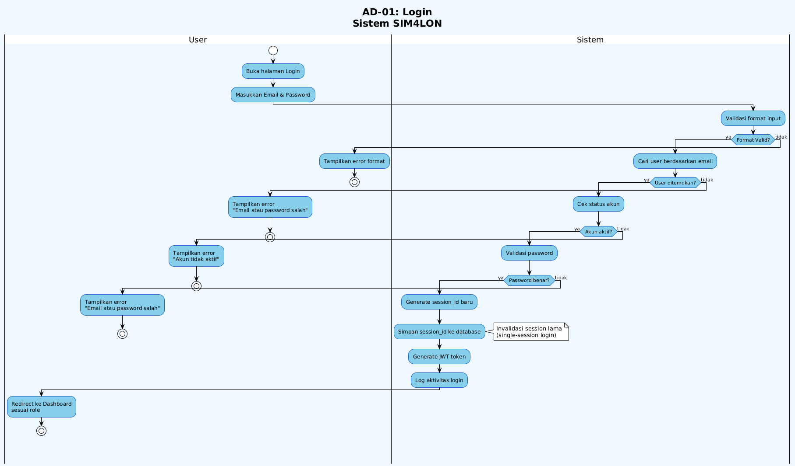
*Gambar 3.x Activity Diagram Login*

Pada gambar 3.x menunjukkan aktivitas login untuk aktor Admin, Operator, dan Pangkalan. Dimulai dengan **User** membuka halaman Login kemudian mengisi form login dengan memasukkan email dan password. Selanjutnya **Sistem** memvalidasi format input. Jika format tidak valid maka sistem akan menampilkan pesan error format dan user harus mengisi ulang form login.

Jika format valid, sistem akan mencari user berdasarkan email dalam database. Jika user tidak ditemukan maka sistem menampilkan pesan "Email atau password salah". Jika user ditemukan, sistem akan mengecek status akun. Apabila akun tidak aktif maka sistem menampilkan pesan "Akun tidak aktif" dan proses berakhir.

Jika akun aktif, sistem selanjutnya memvalidasi password. Apabila password tidak cocok maka sistem menampilkan pesan "Email atau password salah". Jika password benar, sistem akan generate session_id baru, menyimpan session ke database (dengan invalidasi session lama untuk mendukung single-session login), generate JWT token, dan mencatat log aktivitas login. Terakhir, user diarahkan ke halaman Dashboard sesuai dengan role-nya masing-masing.

---

#### 2. Buat Pesanan

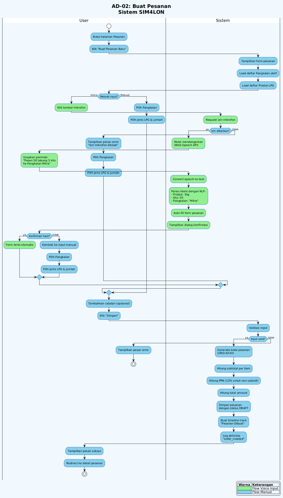
*Gambar 3.x Activity Diagram Buat Pesanan*

Pada gambar 3.x menunjukkan aktivitas membuat pesanan baru untuk aktor Admin dan Operator. Dimulai dengan **User** membuka halaman Pesanan kemudian mengklik tombol "Buat Pesanan Baru". Selanjutnya **Sistem** menampilkan form pesanan dan melakukan load data pangkalan aktif serta daftar produk LPG yang tersedia.

**User** kemudian memilih pangkalan tujuan dari dropdown, memilih jenis LPG, dan memasukkan jumlah (quantity). Jika ingin menambah item lain, user dapat mengklik "Tambah Item" dan mengulangi proses pemilihan jenis LPG dan input jumlah. User juga dapat menambahkan catatan (opsional) sebelum mengklik tombol "Simpan".

Setelah user menekan tombol simpan, **Sistem** akan melakukan validasi input secara berurutan:
1. Jika pangkalan belum dipilih, sistem menampilkan error "Pilih pangkalan"
2. Jika tidak ada item LPG yang ditambahkan, sistem menampilkan error "Tambahkan minimal 1 item"
3. Jika quantity tidak valid (≤ 0), sistem menampilkan error "Jumlah harus > 0"

Jika semua validasi berhasil, sistem akan melakukan proses berikut:
- Generate kode pesanan dengan format ORD-XXXX
- Menghitung subtotal per item
- Menghitung PPN (12% untuk produk non-subsidi)
- Menghitung total amount
- Menyimpan pesanan dengan status DRAFT
- Membuat timeline track "Pesanan Dibuat"
- Mencatat log aktivitas "order_created"

Terakhir, sistem menampilkan pesan sukses dan user diarahkan ke halaman detail pesanan yang baru dibuat.

---

#### 3. Update Status Pesanan

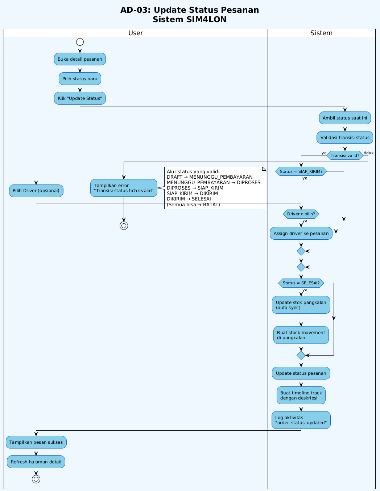
*Gambar 3.x Activity Diagram Update Status Pesanan*

Pada gambar 3.x menunjukkan aktivitas mengubah status pesanan untuk aktor Admin dan Operator. Dimulai dengan **User** membuka detail pesanan, memilih status baru dari dropdown, kemudian mengklik tombol "Update Status".

**Sistem** mengambil status saat ini dan memvalidasi transisi status. Jika transisi tidak valid, sistem menampilkan error "Transisi status tidak valid" beserta informasi alur status yang diperbolehkan (DRAFT → MENUNGGU_PEMBAYARAN → DIPROSES → SIAP_KIRIM → DIKIRIM → SELESAI, atau status manapun dapat berpindah ke BATAL).

Jika transisi valid, terdapat beberapa kondisi khusus:
- Jika status baru adalah **SIAP_KIRIM**, user dapat memilih driver untuk ditugaskan ke pesanan (opsional).
- Jika status baru adalah **SELESAI**, sistem secara otomatis mengupdate stok pangkalan dan membuat stock movement di pangkalan terkait.

Setelah kondisi khusus diproses, sistem akan mengupdate status pesanan, membuat timeline track dengan deskripsi perubahan, dan mencatat log aktivitas "order_status_updated". Terakhir, sistem menampilkan pesan sukses dan halaman detail pesanan direfresh.

---

#### 4. Catat Pembayaran

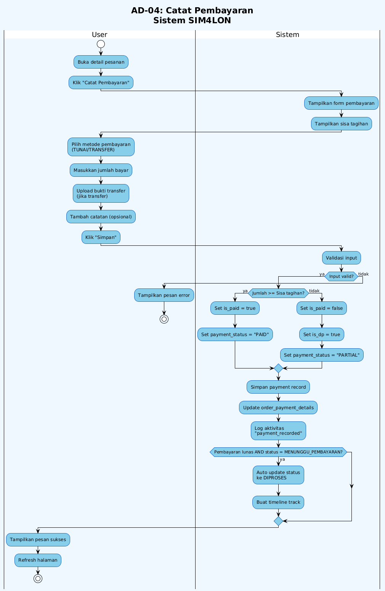
*Gambar 3.x Activity Diagram Catat Pembayaran*

Pada gambar 3.x menunjukkan aktivitas mencatat pembayaran pesanan untuk aktor Admin dan Operator. Dimulai dengan **User** membuka detail pesanan kemudian mengklik tombol "Catat Pembayaran". **Sistem** menampilkan form pembayaran beserta informasi sisa tagihan yang harus dibayar.

**User** memilih metode pembayaran (TUNAI atau TRANSFER), memasukkan jumlah yang dibayar, upload bukti transfer (jika metode transfer), menambahkan catatan (opsional), lalu mengklik "Simpan".

**Sistem** melakukan validasi input. Jika input valid, sistem mengecek apakah jumlah pembayaran mencukupi:
- Jika jumlah **≥ sisa tagihan**, maka sistem set is_paid = true dan payment_status = "PAID" (lunas)
- Jika jumlah **< sisa tagihan**, maka sistem set is_paid = false, is_dp = true, dan payment_status = "PARTIAL" (pembayaran sebagian/DP)

Selanjutnya sistem menyimpan payment record, mengupdate order_payment_details, dan mencatat log aktivitas "payment_recorded". Jika pembayaran lunas dan status pesanan masih MENUNGGU_PEMBAYARAN, sistem secara otomatis mengupdate status ke DIPROSES dan membuat timeline track. Terakhir, sistem menampilkan pesan sukses dan halaman direfresh.

---

#### 5. Catat Penerimaan Stok

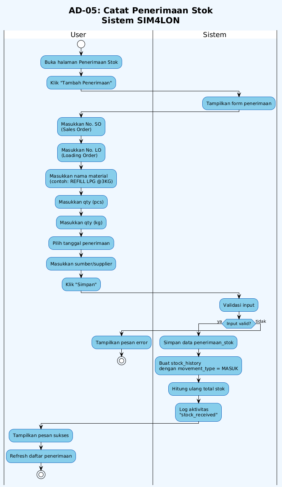
*Gambar 3.x Activity Diagram Catat Penerimaan Stok*

Pada gambar 3.x menunjukkan aktivitas mencatat penerimaan stok LPG dari SPBE untuk aktor Admin dan Operator. Dimulai dengan **User** membuka halaman Penerimaan Stok kemudian mengklik "Tambah Penerimaan". **Sistem** menampilkan form penerimaan.

**User** mengisi data penerimaan meliputi:
- No. SO (Sales Order) dari SPBE
- No. LO (Loading Order)
- Nama material (contoh: REFILL LPG @3KG)
- Quantity dalam pcs dan kg
- Tanggal penerimaan
- Sumber/supplier

Setelah user mengklik "Simpan", **Sistem** memvalidasi input. Jika valid, sistem menyimpan data ke tabel penerimaan_stok, membuat stock_history dengan movement_type = MASUK, menghitung ulang total stok agen, dan mencatat log aktivitas "stock_received". Terakhir, sistem menampilkan pesan sukses dan daftar penerimaan direfresh.

---

#### 6. Catat Penyaluran

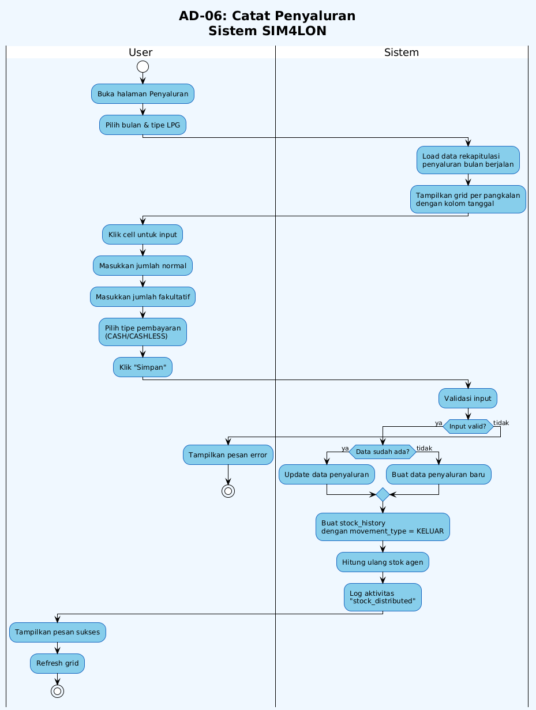
*Gambar 3.x Activity Diagram Catat Penyaluran*

Pada gambar 3.x menunjukkan aktivitas mencatat penyaluran LPG ke pangkalan untuk aktor Admin dan Operator. Dimulai dengan **User** membuka halaman Penyaluran kemudian memilih bulan dan tipe LPG. **Sistem** melakukan load data rekapitulasi penyaluran bulan berjalan dan menampilkan grid per pangkalan dengan kolom tanggal.

**User** mengklik cell pada grid untuk melakukan input, kemudian memasukkan jumlah normal dan jumlah fakultatif, memilih tipe pembayaran (CASH/CASHLESS), lalu mengklik "Simpan".

**Sistem** memvalidasi input. Jika valid, sistem mengecek apakah data sudah ada:
- Jika sudah ada, sistem mengupdate data penyaluran yang ada
- Jika belum ada, sistem membuat data penyaluran baru

Selanjutnya sistem membuat stock_history dengan movement_type = KELUAR, menghitung ulang stok agen, dan mencatat log aktivitas "stock_distributed". Terakhir, sistem menampilkan pesan sukses dan grid direfresh.

---

#### 7. Catat Penjualan (Pangkalan)

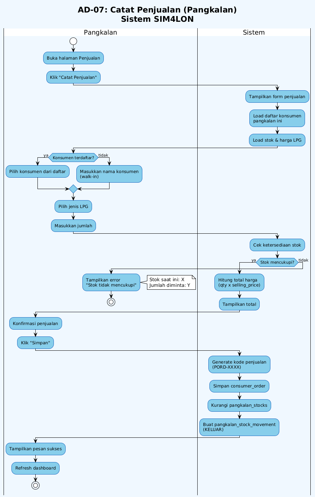
*Gambar 3.x Activity Diagram Catat Penjualan*

Pada gambar 3.x menunjukkan aktivitas mencatat penjualan LPG ke konsumen akhir untuk aktor Pangkalan. Dimulai dengan **Pangkalan** membuka halaman Penjualan kemudian mengklik "Catat Penjualan". **Sistem** menampilkan form penjualan, melakukan load daftar konsumen pangkalan tersebut, serta load data stok dan harga LPG.

**Pangkalan** memilih konsumen:
- Jika konsumen sudah terdaftar, pangkalan memilih dari daftar dropdown
- Jika konsumen baru (walk-in), pangkalan memasukkan nama konsumen secara manual

Selanjutnya pangkalan memilih jenis LPG dan memasukkan jumlah yang dibeli.

**Sistem** mengecek ketersediaan stok. Jika stok tidak mencukupi, sistem menampilkan error "Stok tidak mencukupi" beserta informasi stok saat ini dan jumlah yang diminta.

Jika stok mencukupi, sistem menghitung total harga (qty × selling_price) dan menampilkan total kepada pangkalan. Pangkalan mengkonfirmasi penjualan dan mengklik "Simpan".

**Sistem** kemudian generate kode penjualan dengan format PORD-XXXX, menyimpan data ke tabel consumer_order, mengurangi pangkalan_stocks, dan membuat pangkalan_stock_movement dengan tipe KELUAR. Terakhir, sistem menampilkan pesan sukses dan dashboard direfresh.

---

#### 8. Buat Order ke Agen (Pangkalan)

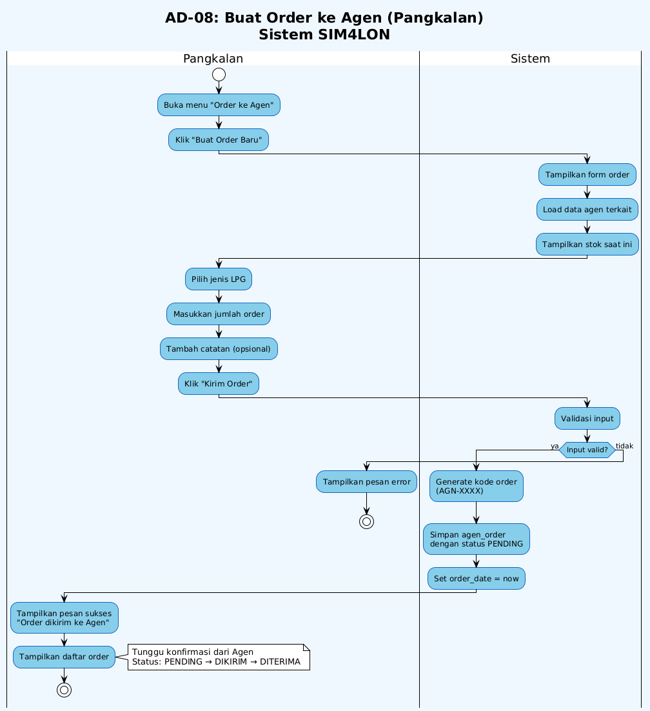
*Gambar 3.x Activity Diagram Buat Order ke Agen*

Pada gambar 3.x menunjukkan aktivitas pangkalan membuat order LPG ke agen. Dimulai dengan **Pangkalan** membuka menu "Order ke Agen" kemudian mengklik "Buat Order Baru". **Sistem** menampilkan form order, melakukan load data agen terkait, dan menampilkan informasi stok saat ini.

**Pangkalan** memilih jenis LPG, memasukkan jumlah order, menambahkan catatan (opsional), lalu mengklik "Kirim Order".

**Sistem** memvalidasi input. Jika valid, sistem generate kode order dengan format AGN-XXXX, menyimpan data ke tabel agen_order dengan status PENDING, dan set order_date = now. Terakhir, sistem menampilkan pesan sukses "Order dikirim ke Agen" dan menampilkan daftar order. Pangkalan kemudian menunggu konfirmasi dari agen dengan alur status: PENDING → DIKIRIM → DITERIMA.

---

#### 9. Kelola Pangkalan

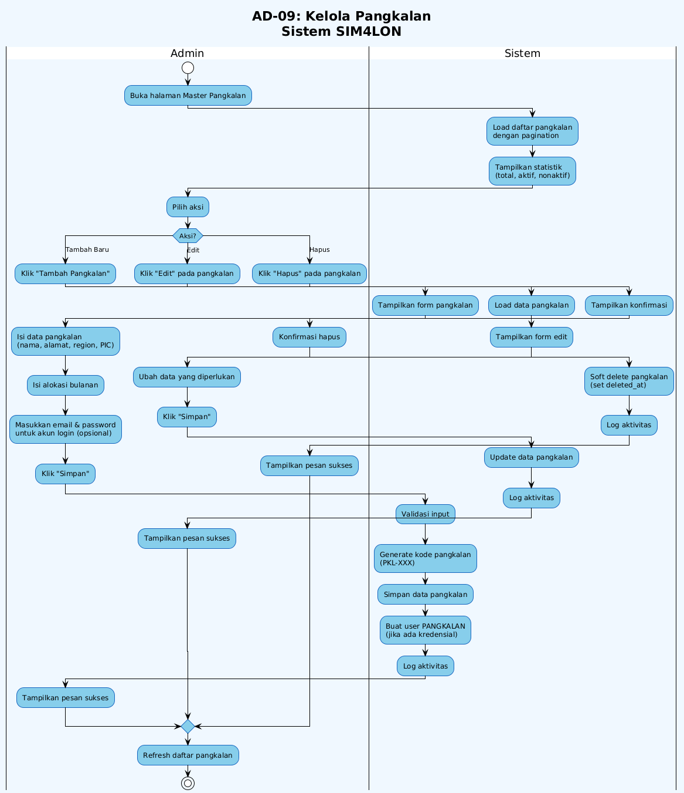
*Gambar 3.x Activity Diagram Kelola Pangkalan*

Pada gambar 3.x menunjukkan aktivitas mengelola data pangkalan untuk aktor Admin. Dimulai dengan **Admin** membuka halaman Master Pangkalan. **Sistem** melakukan load daftar pangkalan dengan pagination dan menampilkan statistik (total, aktif, nonaktif).

**Admin** dapat memilih salah satu dari tiga aksi:

1. **Tambah Baru**: Admin mengklik "Tambah Pangkalan", mengisi data pangkalan (nama, alamat, region, PIC), mengisi alokasi bulanan, dan memasukkan email & password untuk akun login (opsional). Sistem memvalidasi input, generate kode pangkalan (PKL-XXX), menyimpan data pangkalan, membuat user PANGKALAN jika ada kredensial, dan mencatat log aktivitas.

2. **Edit**: Admin mengklik "Edit" pada pangkalan tertentu, mengubah data yang diperlukan, lalu menyimpan. Sistem mengupdate data pangkalan dan mencatat log aktivitas.

3. **Hapus**: Admin mengklik "Hapus", sistem menampilkan konfirmasi, dan setelah dikonfirmasi, sistem melakukan soft delete (set deleted_at) dan mencatat log aktivitas.

Setelah setiap aksi, daftar pangkalan direfresh.

---

#### 10. Ubah Password

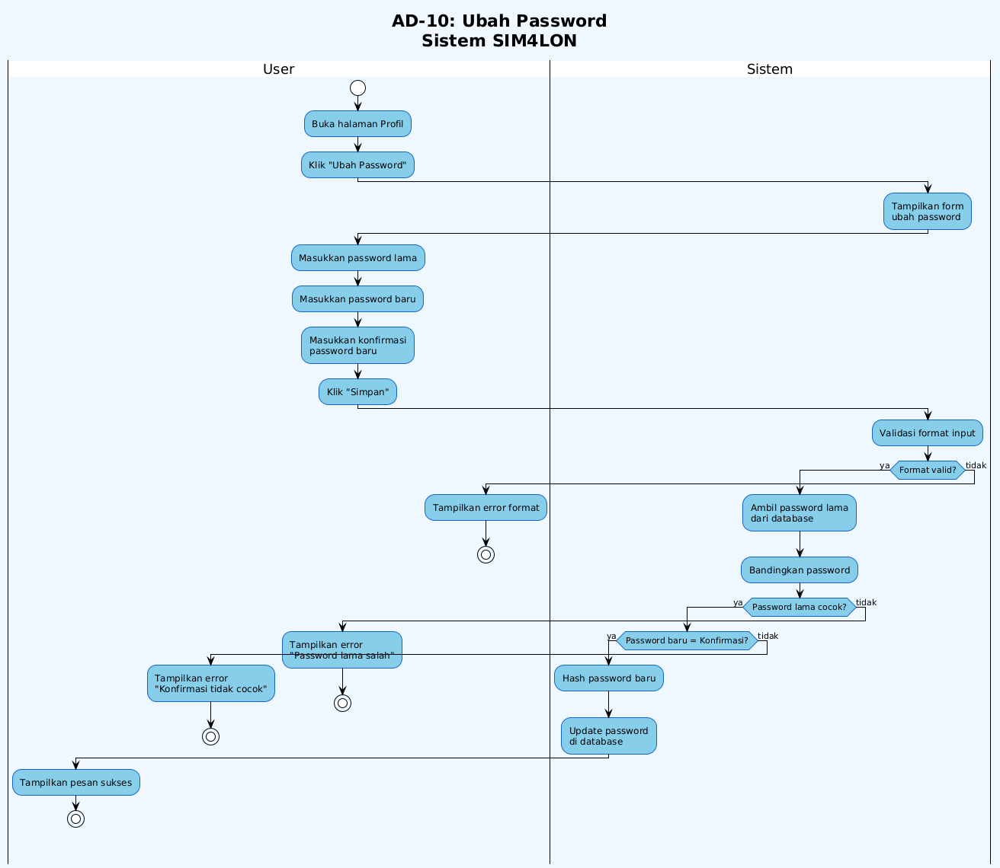
*Gambar 3.x Activity Diagram Ubah Password*

Pada gambar 3.x menunjukkan aktivitas mengubah password untuk semua aktor (Admin, Operator, Pangkalan). Dimulai dengan **User** membuka halaman Profil kemudian mengklik "Ubah Password". **Sistem** menampilkan form ubah password.

**User** memasukkan password lama, password baru, dan konfirmasi password baru, lalu mengklik "Simpan".

**Sistem** melakukan validasi secara bertahap:
1. Jika format input tidak valid, sistem menampilkan error format
2. Jika password lama tidak cocok dengan yang tersimpan di database, sistem menampilkan error "Password lama salah"
3. Jika password baru tidak sama dengan konfirmasi, sistem menampilkan error "Konfirmasi tidak cocok"

Jika semua validasi berhasil, sistem melakukan hash password baru dan mengupdate password di database. Terakhir, sistem menampilkan pesan sukses.

---

#### 11. Kelola Pengguna

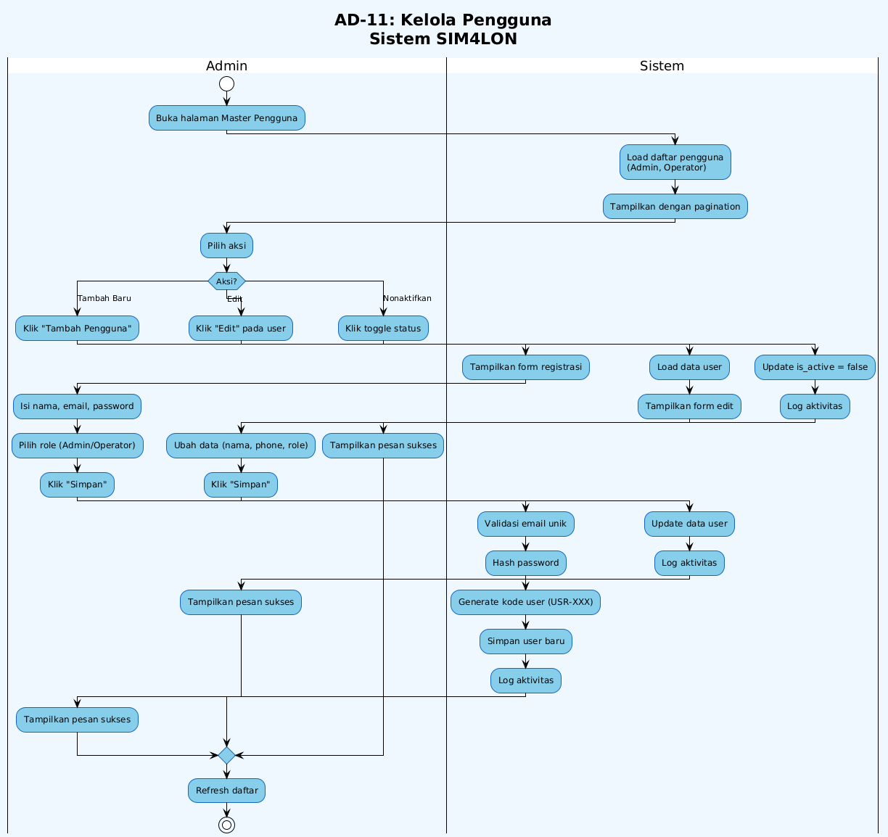
*Gambar 3.x Activity Diagram Kelola Pengguna*

Pada gambar 3.x menunjukkan aktivitas mengelola data pengguna untuk aktor Admin. Dimulai dengan **Admin** membuka halaman Master Pengguna. **Sistem** melakukan load daftar pengguna (Admin, Operator) dengan pagination.

**Admin** dapat memilih salah satu dari tiga aksi:

1. **Tambah Baru**: Admin mengisi nama, email, password, dan memilih role (Admin/Operator). Sistem memvalidasi email unik, melakukan hash password, generate kode user (USR-XXX), menyimpan user baru, dan mencatat log aktivitas.

2. **Edit**: Admin mengubah data (nama, phone, role) pada user yang dipilih. Sistem mengupdate data user dan mencatat log aktivitas.

3. **Nonaktifkan**: Admin mengklik toggle status. Sistem mengupdate is_active = false dan mencatat log aktivitas.

Setelah setiap aksi, daftar pengguna direfresh.

---

#### 12. Kelola Supir

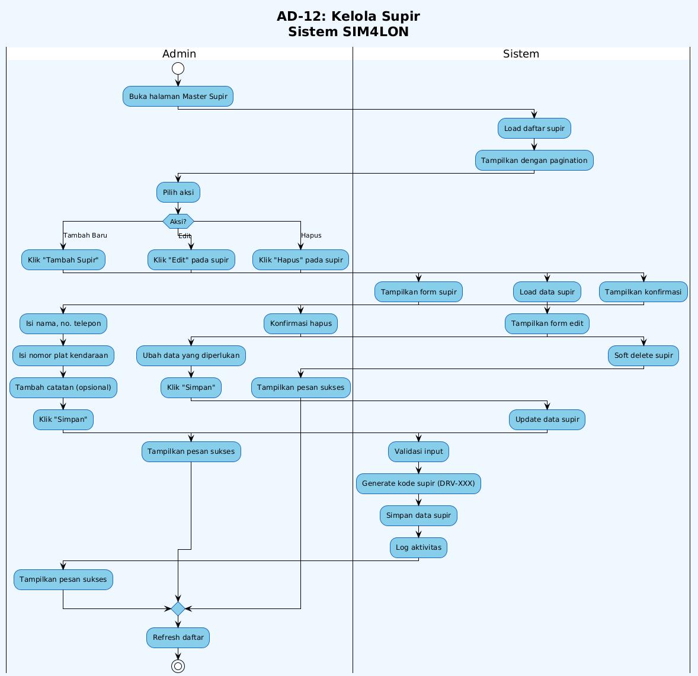
*Gambar 3.x Activity Diagram Kelola Supir*

Pada gambar 3.x menunjukkan aktivitas mengelola data supir untuk aktor Admin. Dimulai dengan **Admin** membuka halaman Master Supir. **Sistem** melakukan load daftar supir dengan pagination.

**Admin** dapat memilih salah satu dari tiga aksi:

1. **Tambah Baru**: Admin mengisi nama, no. telepon, nomor plat kendaraan, dan catatan (opsional). Sistem memvalidasi input, generate kode supir (DRV-XXX), menyimpan data supir, dan mencatat log aktivitas.

2. **Edit**: Admin mengubah data yang diperlukan. Sistem mengupdate data supir.

3. **Hapus**: Admin mengklik "Hapus" dan mengkonfirmasi. Sistem melakukan soft delete supir.

Setelah setiap aksi, daftar supir direfresh.

---

#### 13. Kelola Produk LPG

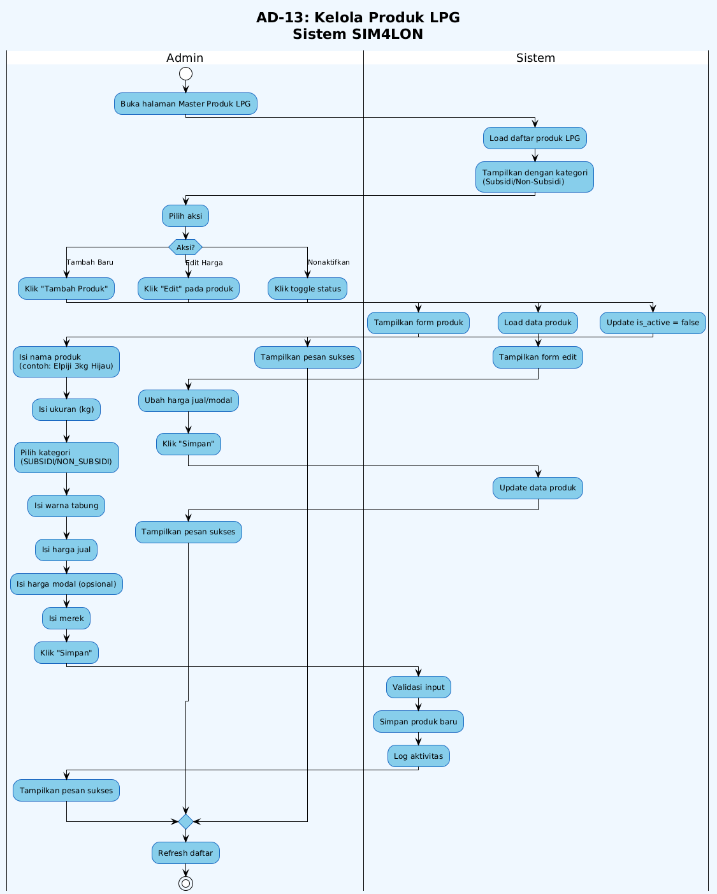
*Gambar 3.x Activity Diagram Kelola Produk LPG*

Pada gambar 3.x menunjukkan aktivitas mengelola data produk LPG untuk aktor Admin. Dimulai dengan **Admin** membuka halaman Master Produk LPG. **Sistem** melakukan load daftar produk LPG dan menampilkan dengan kategori (Subsidi/Non-Subsidi).

**Admin** dapat memilih salah satu dari tiga aksi:

1. **Tambah Baru**: Admin mengisi nama produk (contoh: Elpiji 3kg Hijau), ukuran (kg), kategori (SUBSIDI/NON_SUBSIDI), warna tabung, harga jual, harga modal (opsional), dan merek. Sistem memvalidasi input, menyimpan produk baru, dan mencatat log aktivitas.

2. **Edit Harga**: Admin mengubah harga jual atau harga modal. Sistem mengupdate data produk.

3. **Nonaktifkan**: Admin mengklik toggle status. Sistem mengupdate is_active = false.

Setelah setiap aksi, daftar produk direfresh.

---

#### 14. Assign Driver

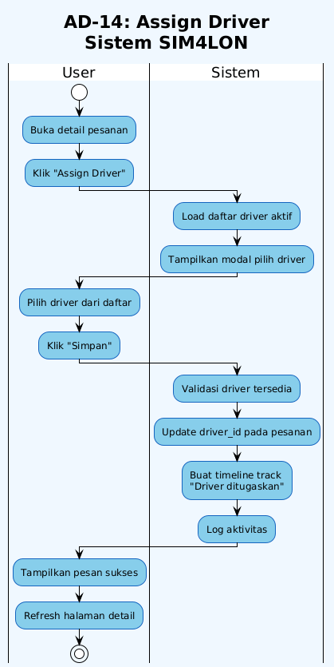
*Gambar 3.x Activity Diagram Assign Driver*

Pada gambar 3.x menunjukkan aktivitas menugaskan driver ke pesanan untuk aktor Admin dan Operator. Dimulai dengan **User** membuka detail pesanan kemudian mengklik "Assign Driver". **Sistem** melakukan load daftar driver aktif dan menampilkan modal pilih driver.

**User** memilih driver dari daftar kemudian mengklik "Simpan".

**Sistem** memvalidasi ketersediaan driver, mengupdate driver_id pada pesanan, membuat timeline track "Driver ditugaskan", dan mencatat log aktivitas. Terakhir, sistem menampilkan pesan sukses dan halaman detail direfresh.

---

#### 15. Lihat Detail Pesanan

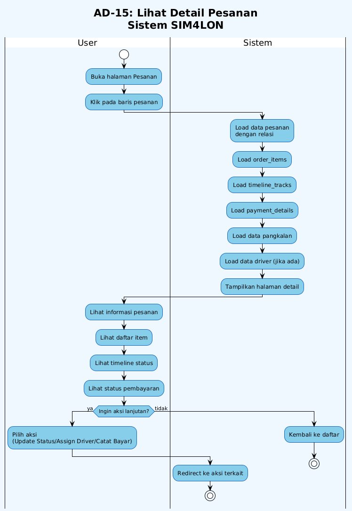
*Gambar 3.x Activity Diagram Lihat Detail Pesanan*

Pada gambar 3.x menunjukkan aktivitas melihat detail pesanan untuk aktor Admin dan Operator. Dimulai dengan **User** membuka halaman Pesanan kemudian mengklik pada baris pesanan yang ingin dilihat.

**Sistem** melakukan load data pesanan dengan semua relasi terkait: order_items, timeline_tracks, payment_details, data pangkalan, dan data driver (jika ada). Sistem kemudian menampilkan halaman detail pesanan.

**User** dapat melihat informasi pesanan, daftar item, timeline status, dan status pembayaran. Jika ingin melakukan aksi lanjutan, user dapat memilih aksi (Update Status, Assign Driver, atau Catat Bayar) dan sistem akan redirect ke aksi terkait. Jika tidak, user dapat kembali ke daftar pesanan.

---

#### 16. Generate Invoice/Nota

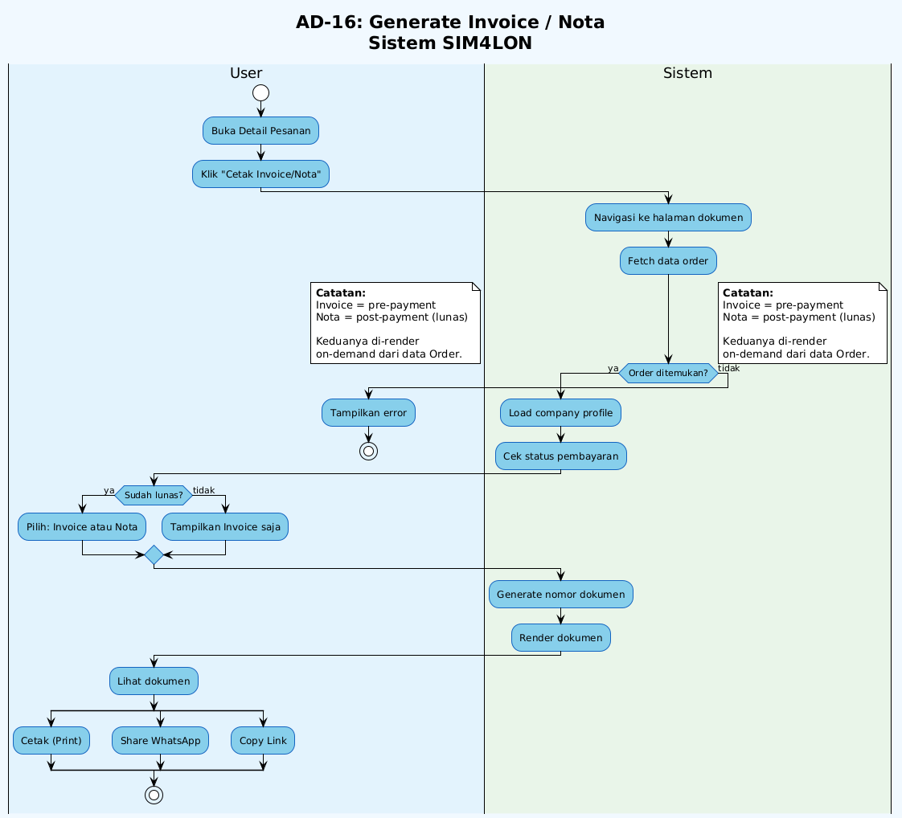
*Gambar 3.x Activity Diagram Generate Invoice*

Pada gambar 3.x menunjukkan aktivitas menampilkan invoice atau nota pembayaran untuk aktor Admin dan Operator. Dimulai dengan **User** membuka detail pesanan kemudian mengklik tombol "Cetak Invoice" atau "Cetak Nota".

**Sistem** navigasi ke halaman dokumen, fetch data order dari API, dan load company profile untuk header dokumen. Jika order ditemukan, sistem cek status pembayaran:
- Jika **lunas**: User dapat memilih antara Invoice atau Nota
- Jika **belum lunas**: Hanya tampilkan Invoice

**Sistem** generate nomor dokumen (INV-XXXX atau NOTA-XXXX) dan render dokumen secara on-demand dari data order yang sudah ada, termasuk header, info pelanggan, tabel items, summary (subtotal, PPN, total), dan footer.

**User** dapat melakukan salah satu aksi:
- **Print**: Cetak dokumen dengan format A4
- **Share WhatsApp**: Kirim ringkasan dokumen via WhatsApp ke nomor pangkalan
- **Copy Link**: Salin URL dokumen ke clipboard

---

#### 17. Kelola Perencanaan

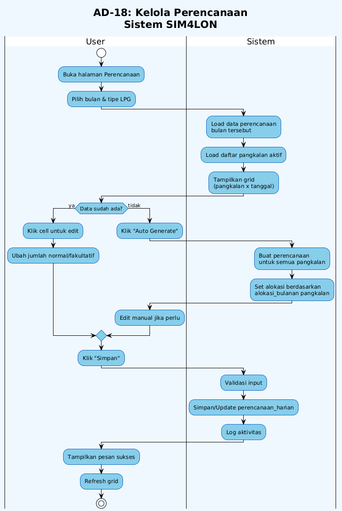
*Gambar 3.x Activity Diagram Kelola Perencanaan*

Pada gambar 3.x menunjukkan aktivitas mengelola perencanaan distribusi untuk aktor Admin dan Operator. Dimulai dengan **User** membuka halaman Perencanaan kemudian memilih bulan dan tipe LPG.

**Sistem** melakukan load data perencanaan bulan tersebut, load daftar pangkalan aktif, dan menampilkan grid (pangkalan × tanggal).

Jika data sudah ada, **User** dapat mengklik cell untuk mengedit dan mengubah jumlah normal/fakultatif. Jika data belum ada, user dapat mengklik "Auto Generate" dan sistem akan membuat perencanaan untuk semua pangkalan berdasarkan alokasi_bulanan masing-masing pangkalan. User dapat edit manual jika perlu.

Setelah mengklik "Simpan", sistem memvalidasi input, menyimpan/update data perencanaan_harian, dan mencatat log aktivitas.

---

#### 18. Lihat In-Out Agen

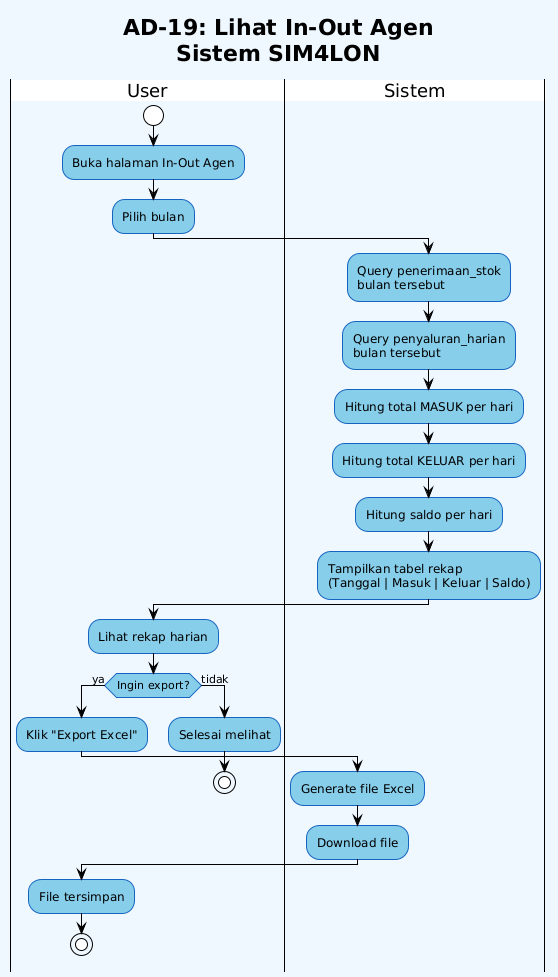
*Gambar 3.x Activity Diagram Lihat In-Out Agen*

Pada gambar 3.x menunjukkan aktivitas melihat rekap stok masuk-keluar agen untuk aktor Admin dan Operator. Dimulai dengan **User** membuka halaman In-Out Agen kemudian memilih bulan.

**Sistem** melakukan query penerimaan_stok dan penyaluran_harian bulan tersebut, menghitung total MASUK dan KELUAR per hari, menghitung saldo per hari, dan menampilkan tabel rekap (Tanggal | Masuk | Keluar | Saldo).

**User** dapat melihat rekap harian. Jika ingin export, user mengklik "Export Excel" dan sistem generate file Excel untuk didownload.

---

#### 19. Kelola Konsumen (Pangkalan)

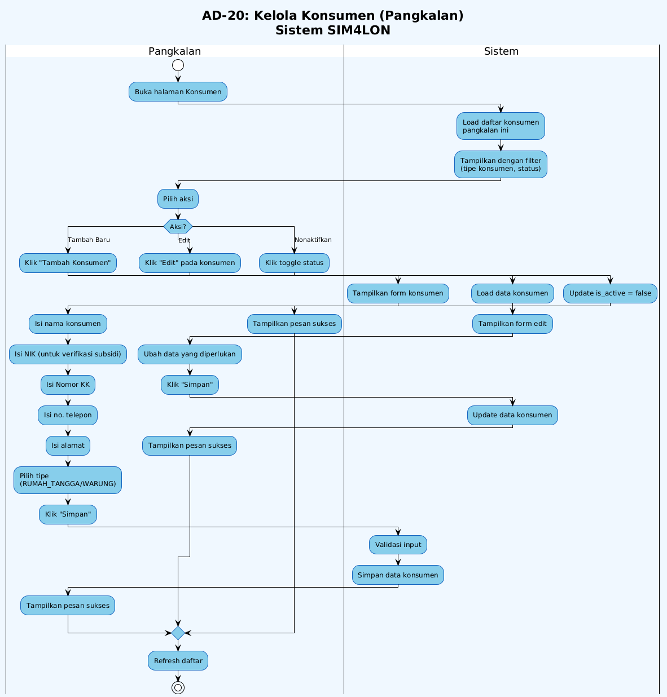
*Gambar 3.x Activity Diagram Kelola Konsumen*

Pada gambar 3.x menunjukkan aktivitas mengelola data konsumen untuk aktor Pangkalan. Dimulai dengan **Pangkalan** membuka halaman Konsumen. **Sistem** melakukan load daftar konsumen pangkalan tersebut dengan filter (tipe konsumen, status).

**Pangkalan** dapat memilih salah satu dari tiga aksi:

1. **Tambah Baru**: Pangkalan mengisi nama konsumen, NIK (untuk verifikasi subsidi), Nomor KK, no. telepon, alamat, dan memilih tipe (RUMAH_TANGGA/WARUNG). Sistem memvalidasi input dan menyimpan data konsumen.

2. **Edit**: Pangkalan mengubah data yang diperlukan. Sistem mengupdate data konsumen.

3. **Nonaktifkan**: Pangkalan mengklik toggle status. Sistem mengupdate is_active = false.

Setelah setiap aksi, daftar konsumen direfresh.

---

#### 20. Kelola Stok Pangkalan

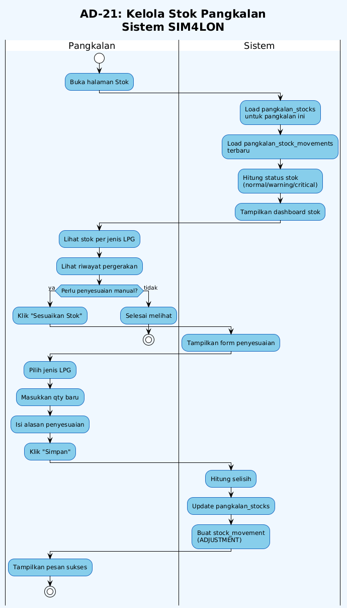
*Gambar 3.x Activity Diagram Kelola Stok Pangkalan*

Pada gambar 3.x menunjukkan aktivitas mengelola stok untuk aktor Pangkalan. Dimulai dengan **Pangkalan** membuka halaman Stok. **Sistem** melakukan load pangkalan_stocks, load pangkalan_stock_movements terbaru, menghitung status stok (normal/warning/critical), dan menampilkan dashboard stok.

**Pangkalan** dapat melihat stok per jenis LPG dan riwayat pergerakan. Jika perlu penyesuaian manual, pangkalan mengklik "Sesuaikan Stok", memilih jenis LPG, memasukkan qty baru, dan mengisi alasan penyesuaian.

**Sistem** menghitung selisih, mengupdate pangkalan_stocks, dan membuat stock_movement dengan tipe ADJUSTMENT. Terakhir, sistem menampilkan pesan sukses.

---

#### 21. Terima Order dari Agen

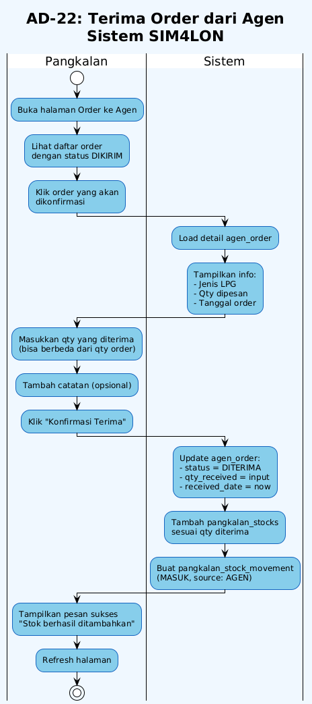
*Gambar 3.x Activity Diagram Terima Order dari Agen*

Pada gambar 3.x menunjukkan aktivitas konfirmasi penerimaan order dari agen untuk aktor Pangkalan. Dimulai dengan **Pangkalan** membuka halaman Order ke Agen, melihat daftar order dengan status DIKIRIM, kemudian mengklik order yang akan dikonfirmasi.

**Sistem** melakukan load detail agen_order dan menampilkan informasi: jenis LPG, qty dipesan, tanggal order.

**Pangkalan** memasukkan qty yang diterima (bisa berbeda dari qty order), menambahkan catatan (opsional), lalu mengklik "Konfirmasi Terima".

**Sistem** mengupdate agen_order (status = DITERIMA, qty_received = input, received_date = now), menambah pangkalan_stocks sesuai qty diterima, dan membuat pangkalan_stock_movement dengan tipe MASUK dan source AGEN. Terakhir, sistem menampilkan pesan sukses "Stok berhasil ditambahkan".

---

#### 22. Kelola Pengeluaran (Pangkalan)

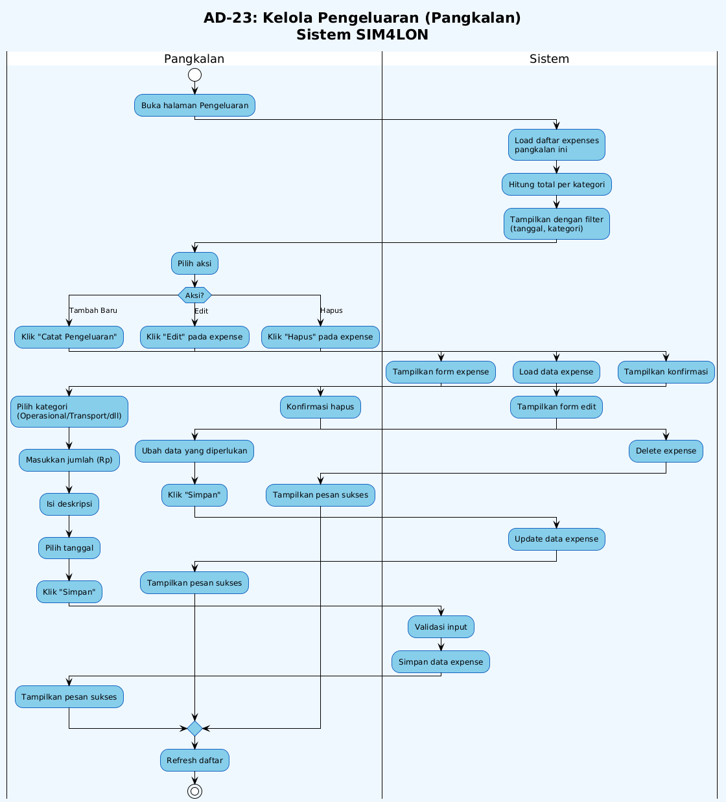
*Gambar 3.x Activity Diagram Kelola Pengeluaran*

Pada gambar 3.x menunjukkan aktivitas mengelola pengeluaran operasional untuk aktor Pangkalan. Dimulai dengan **Pangkalan** membuka halaman Pengeluaran. **Sistem** melakukan load daftar expenses pangkalan tersebut, menghitung total per kategori, dan menampilkan dengan filter (tanggal, kategori).

**Pangkalan** dapat memilih salah satu dari tiga aksi:

1. **Tambah Baru**: Pangkalan memilih kategori (Operasional/Transport/dll), memasukkan jumlah (Rp), mengisi deskripsi, dan memilih tanggal. Sistem memvalidasi input dan menyimpan data expense.

2. **Edit**: Pangkalan mengubah data yang diperlukan. Sistem mengupdate data expense.

3. **Hapus**: Pangkalan mengklik "Hapus" dan mengkonfirmasi. Sistem menghapus expense.

Setelah setiap aksi, daftar pengeluaran direfresh.

---

#### 24. Generate & Export Laporan (Agen)

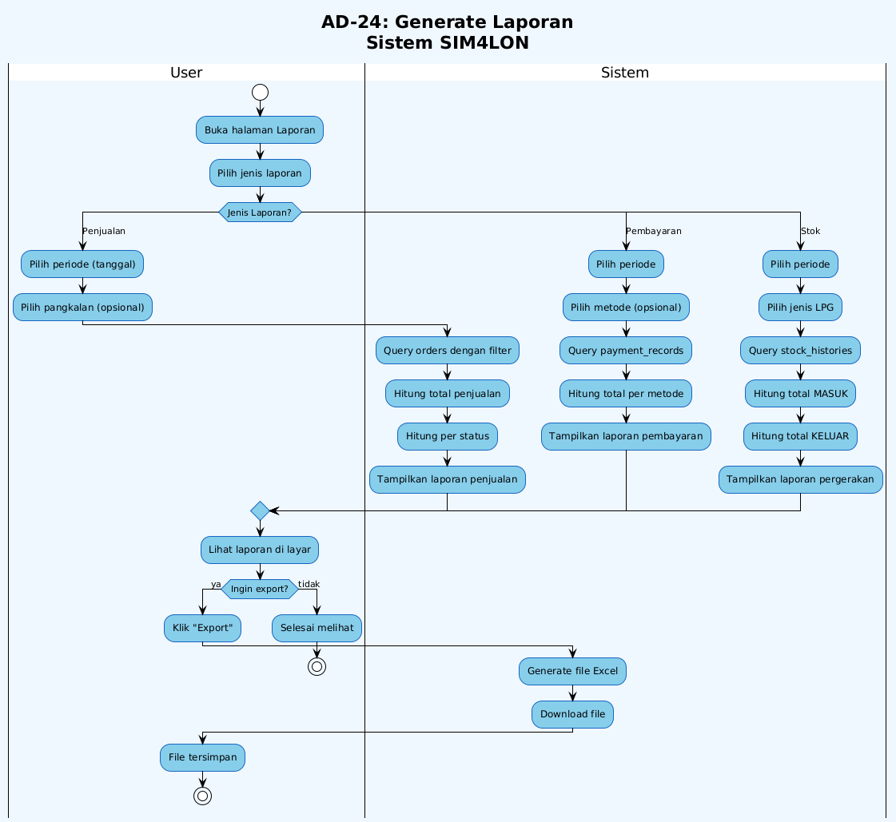
*Gambar 3.x Activity Diagram Generate & Export Laporan (Agen)*

Pada gambar 3.x menunjukkan aktivitas membuat dan mengekspor laporan untuk aktor Admin dan Operator. Dimulai dengan **Admin/Operator** membuka halaman Laporan kemudian memilih periode (preset atau custom date range).

Berdasarkan tab laporan yang dipilih:

1. **Tab Penjualan**: Filter berdasarkan status dan pangkalan. Sistem query orders, menghitung summary penjualan, dan menampilkan grafik trend serta tabel data.

2. **Tab Stok**: Filter berdasarkan jenis LPG. Sistem query stock_histories, menghitung total masuk dan keluar, dan menampilkan grafik pergerakan stok.

3. **Tab Per Pangkalan**: Pilih pangkalan tertentu. Sistem query orders per pangkalan, menghitung ranking penjualan, dan menampilkan performa masing-masing pangkalan.

Setelah melihat laporan, user dapat memilih untuk export. Sistem menyediakan dua format: **Export Excel** (XLSX) dan **Export PDF**. File akan diunduh ke komputer user.

---

#### 25. Generate & Export Laporan (Pangkalan)

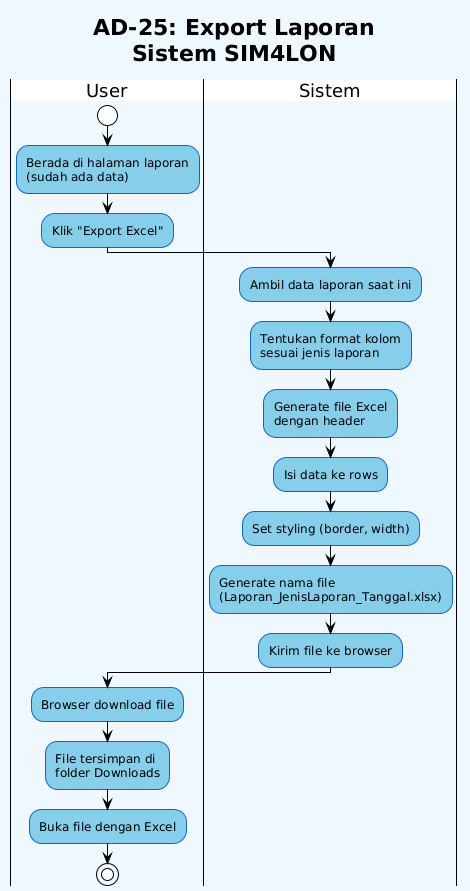
*Gambar 3.x Activity Diagram Generate & Export Laporan (Pangkalan)*

Pada gambar 3.x menunjukkan aktivitas membuat dan mengekspor laporan untuk aktor Pangkalan. Dimulai dengan **Pangkalan** membuka halaman Laporan kemudian memilih periode (preset atau custom date range).

**Sistem** memuat data penjualan ke konsumen, data pengeluaran operasional, dan menghitung laba/rugi bersih. Pangkalan dapat melihat:
- **Ringkasan**: Total Penjualan, Total Pengeluaran, Laba Bersih
- **Grafik Trend**: Visualisasi pendapatan dan pengeluaran
- **Tabel Transaksi**: Detail setiap transaksi

Jika ingin export, pangkalan dapat memilih format **Excel** atau **PDF**. File Excel berisi sheet terpisah untuk Summary, Detail Penjualan, dan Detail Pengeluaran. Sistem menerapkan prinsip multi-tenant sehingga pangkalan hanya dapat melihat data milik sendiri.

---

#### 17. Voice Order dengan AI

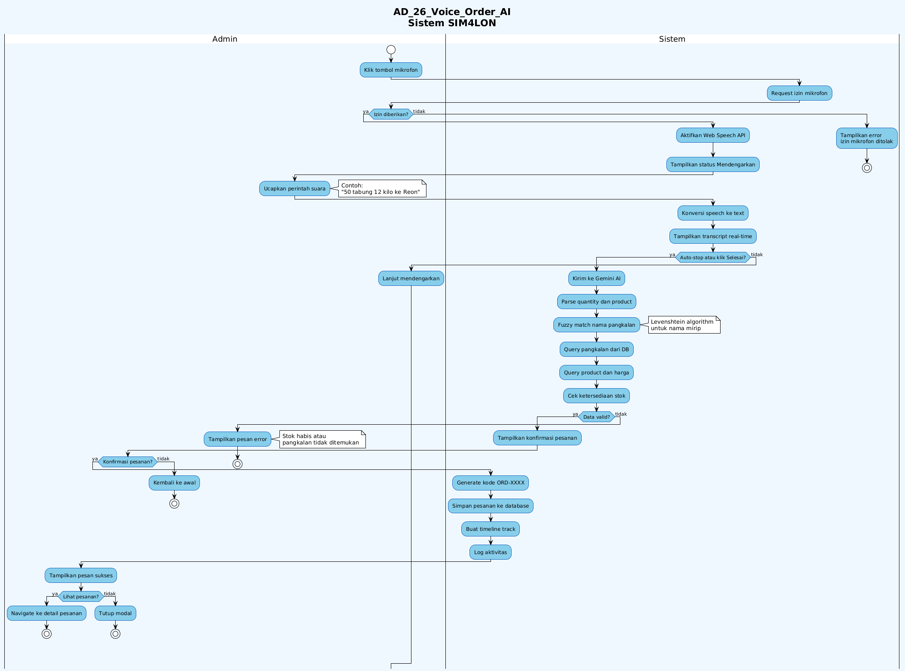
*Gambar 3.x Activity Diagram Voice Order dengan AI*

Pada gambar 3.x menunjukkan aktivitas membuat pesanan menggunakan perintah suara untuk aktor Admin dan Operator. Dimulai dengan **Admin** mengklik tombol mikrofon pada halaman pesanan.

**Sistem** request izin mikrofon. Jika izin ditolak, sistem menampilkan error dan proses berakhir.

Jika izin diberikan, **Sistem** mengaktifkan Web Speech API dan menampilkan status "Mendengarkan". **Admin** mengucapkan perintah suara (contoh: "50 tabung 12 kilo ke Reon"). **Sistem** melakukan konversi speech ke text dan menampilkan transcript real-time.

Ketika auto-stop atau admin klik "Selesai", sistem mengirim transcript ke Gemini AI untuk:
- Parse quantity dan product
- Fuzzy match nama pangkalan (menggunakan algoritma Levenshtein)
- Query pangkalan dari database
- Query product dan harga
- Cek ketersediaan stok

Jika data tidak valid (stok habis atau pangkalan tidak ditemukan), sistem menampilkan pesan error.

Jika data valid, sistem menampilkan konfirmasi pesanan. Jika admin mengkonfirmasi:
- Sistem generate kode ORD-XXXX
- Menyimpan pesanan ke database
- Membuat timeline track
- Mencatat log aktivitas

Terakhir, sistem menampilkan pesan sukses dan admin dapat memilih untuk melihat detail pesanan atau menutup modal.

---

## 3.3.5 Sequence Diagram

*Sequence diagram* merupakan diagram yang menggambarkan interaksi antar objek dalam urutan waktu. Menurut Fowler (2018), *sequence diagram* menunjukkan bagaimana objek-objek berinteraksi dalam skenario tertentu dari sebuah *use case*. Diagram ini sangat berguna untuk memahami alur proses dan pertukaran pesan antar komponen sistem.

Berikut ini merupakan *sequence diagram* dari Aplikasi SIM4LON berbasis web di PT Mitra Surya Natasya.

### Stereotype Participant

| Stereotype | Simbol | Deskripsi | Contoh |
|------------|--------|-----------|--------|
| `<<actor>>` | 🧑 | Pengguna sistem | User, Admin |
| `<<boundary>>` | â—» | Antarmuka pengguna | LoginPage, OrderForm |
| `<<control>>` | â—Ž | Business logic | AuthService, OrderService |
| `<<entity>>` | ⬡ | Data/Database | users, orders |

### Message Types

| Tipe | Simbol | Deskripsi |
|------|--------|-----------|
| Synchronous | ──▶ | Request blocking (menunggu response) |
| Return | ---> | Response dari request |
| Self-call | ↩ | Memanggil method sendiri |
| Create | ──▶▷ | Membuat instance baru |

---

### Daftar Sequence Diagram (20 Diagram)

| No | Kode | Nama Diagram | Kategori | Participants |
|----|------|--------------|----------|--------------|
| 1 | SD-01 | Login | Authentication | User, LoginPage, AuthService, users, activity_logs |
| 2 | SD-02 | Logout | Authentication | User, Header, AuthService, users |
| 3 | SD-03 | Buat Pesanan | Order Management | Admin, OrderPage, OrderService, pangkalans, orders, order_items, timeline_tracks |
| 4 | SD-04 | Update Status Pesanan | Order Management | Admin, OrderDetailPage, OrderService, orders, timeline_tracks, pangkalan_stocks |
| 5 | SD-05 | Assign Driver | Order Management | Admin, OrderDetailPage, OrderService, drivers, orders, timeline_tracks |
| 6 | SD-06 | Lihat Detail Pesanan | Order Management | Admin, OrderListPage, OrderDetailPage, OrderService, orders, order_items, timeline_tracks, pangkalans, drivers |
| 7 | SD-07 | Catat Pembayaran | Order Management | Admin, PaymentPage, PaymentService, order_payment_details, payment_records, orders, timeline_tracks |
| 8 | SD-08 | Generate Invoice | Order Management | Admin, OrderDetailPage, InvoiceService, invoices, orders, order_items, company_profile |
| 9 | SD-09 | Catat Penerimaan Stok | Stock Management | Admin, PenerimaanPage, PenerimaanService, penerimaan_stok, stock_histories |
| 10 | SD-10 | Catat Penyaluran | Stock Management | Admin, PenyaluranPage, PenyaluranService, pangkalans, penyaluran_harian, stock_histories |
| 11 | SD-11 | Lihat Ringkasan Stok | Stock Management | Admin, StockPage, StockService, lpg_products, stock_histories |
| 12 | SD-12 | Catat Penjualan | Pangkalan SAAS | Pangkalan, PenjualanPage, ConsumerOrderService, consumers, lpg_prices, pangkalan_stocks, consumer_orders |
| 13 | SD-13 | Buat Order ke Agen | Pangkalan SAAS | Pangkalan, OrderAgenPage, AgenOrderService, pangkalans, agen, agen_orders |
| 14 | SD-14 | Konfirmasi Terima Order | Pangkalan SAAS | Pangkalan, OrderAgenPage, AgenOrderService, agen_orders, pangkalan_stocks, pangkalan_stock_movements |
| 15 | SD-15 | Dashboard Pangkalan | Pangkalan SAAS | Pangkalan, DashboardPage, DashboardService, consumer_orders, pangkalan_stocks, expenses |
| 16 | SD-16 | Buat Pangkalan | Master Data | Admin, PangkalanPage, PangkalanService, pangkalans, users, activity_logs |
| 17 | SD-17 | CRUD Generic | Master Data | Admin, ListPage, FormPage, EntityService, entity_table |
| 18 | SD-18 | Generate & Export Laporan (Agen) | Extended | Admin, ReportPage, ReportService, orders, payment_records, stock_histories |
| 19 | SD-19 | Generate & Export Laporan (Pangkalan) | Extended | Pangkalan, LaporanPage, LaporanService, consumer_orders, expenses, lpg_prices |
| 20 | SD-20 | Voice Order AI | Extended | Admin, FloatingVoiceWidget, useVoiceOrder, WebSpeechAPI, GeminiAI, Backend API, Database |


---

### Detail Sequence Diagram

Berikut ini merupakan penjelasan detail untuk setiap *sequence diagram* yang menggambarkan interaksi antar objek dalam sistem SIM4LON.

#### 1. Login


*Gambar 3.x Sequence Diagram Login*

Pada gambar 3.x menunjukkan proses alur *sequence diagram* login. Proses diawali ketika **User** membuka halaman login yang memicu **LoginPage** untuk menampilkan form login. Selanjutnya, user mengisi email dan password kemudian menekan tombol login.

**LoginPage** mengirim request `login(email, password)` ke **AuthService**. Service kemudian melakukan query ke database **users** untuk mencari data user berdasarkan email. Jika user tidak ditemukan, sistem mengembalikan error "Email atau password salah".

Jika user ditemukan, **AuthService** melakukan:
1. Validasi password menggunakan `bcrypt.compare()`
2. Pengecekan status akun (aktif/tidak aktif)
3. Generate `session_id` baru untuk mendukung single-session login
4. Update `session_id` di database (invalidasi session lama)
5. Generate JWT token dengan payload user data
6. Mencatat log aktivitas login ke **activity_logs**

Terakhir, **LoginPage** menyimpan token ke localStorage dan mengarahkan user ke halaman Dashboard sesuai dengan role-nya.

---

#### 2. Logout


*Gambar 3.x Sequence Diagram Logout*

Pada gambar 3.x menunjukkan proses alur *sequence diagram* logout. Proses diawali ketika **User** mengklik menu "Logout" pada **Header** aplikasi. **Header** kemudian menghapus token dari localStorage dan membersihkan state user di aplikasi.

Selanjutnya, **Header** mengirim request `logout(userId)` ke **AuthService**. Service melakukan update ke database **users** untuk menghapus `session_id` (set NULL), yang secara efektif menginvalidasi token JWT yang masih berlaku. Setelah berhasil, user diarahkan kembali ke halaman Login.

---

#### 3. Buat Pesanan


*Gambar 3.x Sequence Diagram Buat Pesanan*

Pada gambar 3.x menunjukkan proses alur *sequence diagram* pembuatan pesanan baru. Proses diawali ketika **Admin** membuka halaman Buat Pesanan yang memicu **OrderPage** untuk memanggil `getPangkalanList()` dari **OrderService** guna mengambil daftar pangkalan aktif dari database.

Setelah form ditampilkan, Admin melakukan:
1. Memilih pangkalan tujuan dari dropdown
2. Memilih jenis LPG dan memasukkan quantity
3. Menekan tombol "Simpan"

**OrderPage** mengirim request `createOrder(orderDto)` ke **OrderService**. Service kemudian:
1. Melakukan validasi input data pesanan
2. Query kode pesanan terakhir dari database **orders**
3. Generate kode pesanan baru dengan format "ORD-XXXX"
4. Untuk setiap item: menghitung subtotal, mengecek kategori LPG untuk penerapan PPN (12% untuk non-subsidi), dan menghitung pajak
5. Menghitung total amount keseluruhan
6. Menyimpan data pesanan ke tabel **orders** dengan status DRAFT
7. Menyimpan item pesanan ke tabel **order_items**
8. Membuat timeline track "Pesanan dibuat" ke tabel **timeline_tracks**

Terakhir, sistem menampilkan pesan sukses dan mengarahkan Admin ke halaman detail pesanan yang baru dibuat.

---

#### 4. Update Status Pesanan


*Gambar 3.x Sequence Diagram Update Status Pesanan*

Pada gambar 3.x menunjukkan proses alur *sequence diagram* update status pesanan. Proses diawali ketika **Admin** membuka detail pesanan yang memicu **OrderDetailPage** untuk memanggil `getOrderDetail(orderId)` dari **OrderService**.

Admin memilih status baru dan menekan tombol "Update Status". **OrderService** melakukan validasi transisi status (misalnya DRAFT → DIPROSES valid, tapi SELESAI → DRAFT tidak valid). Jika valid, service:
1. Update `driver_id` jika status = SIAP_KIRIM
2. Update `current_status` di tabel **orders**
3. Insert timeline track ke **timeline_tracks**
4. Jika status = SELESAI, auto-sync stok ke **pangkalan_stocks**

---

#### 5. Assign Driver


*Gambar 3.x Sequence Diagram Assign Driver*

Pada gambar 3.x menunjukkan proses alur *sequence diagram* penugasan driver. Proses diawali ketika **Admin** mengklik "Assign Driver" yang memicu **OrderDetailPage** untuk memanggil `getActiveDrivers()` dari **OrderService** guna mengambil daftar driver aktif.

Admin memilih driver dari daftar dan menekan "Simpan". **OrderService** melakukan validasi driver, kemudian update `driver_id` di tabel **orders** dan mencatat timeline track "Driver ditugaskan: [nama]". Halaman di-refresh untuk menampilkan informasi driver yang baru ditugaskan.

---

#### 6. Lihat Detail Pesanan


*Gambar 3.x Sequence Diagram Lihat Detail Pesanan*

Pada gambar 3.x menunjukkan proses alur *sequence diagram* melihat detail pesanan. Proses diawali ketika **Admin** mengklik baris pesanan di **OrderListPage** yang memicu navigasi ke **OrderDetailPage**.

**OrderService** mengumpulkan data dari multiple tables:
1. Data order dari **orders**
2. Items pesanan dari **order_items**
3. Timeline dari **timeline_tracks**
4. Detail pembayaran dari **order_payment_details**
5. Info pangkalan dari **pangkalans**
6. Info driver (jika ada) dari **drivers**

Semua data dikombinasikan dan ditampilkan ke Admin dalam satu halaman detail lengkap.

---

#### 7. Catat Pembayaran


*Gambar 3.x Sequence Diagram Catat Pembayaran*

Pada gambar 3.x menunjukkan proses alur *sequence diagram* pencatatan pembayaran. Proses diawali ketika **Admin** membuka form pembayaran yang memicu **PaymentPage** untuk mengambil status pembayaran saat ini (total amount, amount paid, remaining).

Admin memilih metode (TUNAI/TRANSFER), input jumlah bayar, upload bukti (jika transfer), lalu menekan "Simpan". **PaymentService** menghitung sisa tagihan dan menentukan status:
- Jika jumlah >= sisa tagihan: status = PAID, is_paid = true
- Jika jumlah < sisa tagihan: status = PARTIAL, is_dp = true

Service menyimpan ke **order_payment_details** dan **payment_records**. Jika lunas dan status pesanan = MENUNGGU_PEMBAYARAN, sistem auto-update status ke DIPROSES.

---

#### 8. Generate Invoice


*Gambar 3.x Sequence Diagram Generate Invoice*

Pada gambar 3.x menunjukkan proses alur *sequence diagram* generate invoice. Proses diawali ketika **Admin** mengklik "Generate Invoice" pada **OrderDetailPage**.

**InvoiceService** mengecek apakah invoice sudah ada. Jika sudah ada, tampilkan invoice yang ada. Jika belum, service:
1. Load data order dari **orders**
2. Load items dari **order_items**
3. Load company profile untuk header invoice
4. Generate nomor invoice (INV-YYYY-XXXX)
5. Hitung subtotal, PPN, dan grand total
6. Set due date (+7 hari)
7. Simpan ke tabel **invoices**

Admin dapat mencetak atau download PDF invoice yang dihasilkan.

---

#### 9. Catat Penerimaan Stok


*Gambar 3.x Sequence Diagram Catat Penerimaan Stok*

Pada gambar 3.x menunjukkan proses alur *sequence diagram* pencatatan penerimaan stok. Proses diawali ketika **Admin** membuka halaman Penerimaan Stok yang menampilkan daftar penerimaan bulan ini.

Admin mengklik "Tambah Penerimaan" dan mengisi form: No. SO, No. LO, nama material, qty_pcs, qty_kg, tanggal, dan sumber. **PenerimaanService** menyimpan data ke **penerimaan_stok**, kemudian mapping material ke lpg_type dan mencatat ke **stock_histories** dengan movement_type = 'MASUK'.

---

#### 10. Catat Penyaluran


*Gambar 3.x Sequence Diagram Catat Penyaluran*

Pada gambar 3.x menunjukkan proses alur *sequence diagram* pencatatan penyaluran. Proses diawali ketika **Admin** membuka halaman Penyaluran dan memilih bulan serta tipe LPG.

**PenyaluranService** membangun grid penyaluran (pangkalan × tanggal) dari data **pangkalans** dan **penyaluran_harian**. Admin mengklik cell untuk input jumlah_normal, jumlah_fakultatif, dan tipe_pembayaran. Service melakukan bulk update ke **penyaluran_harian** (insert jika belum ada, update jika sudah ada) dan mencatat ke **stock_histories** dengan movement_type = 'KELUAR'.

---

#### 11. Lihat Ringkasan Stok


*Gambar 3.x Sequence Diagram Lihat Ringkasan Stok*

Pada gambar 3.x menunjukkan proses alur *sequence diagram* melihat ringkasan stok. Proses diawali ketika **Admin** membuka halaman Stok.

**StockService** mengambil daftar produk aktif dari **lpg_products**, kemudian untuk setiap produk: query total MASUK dan total KELUAR dari **stock_histories**, lalu menghitung balance = totalIn - totalOut. Ringkasan stok per jenis LPG ditampilkan ke Admin.

---

#### 12. Catat Penjualan (Pangkalan)


*Gambar 3.x Sequence Diagram Catat Penjualan*

Pada gambar 3.x menunjukkan proses alur *sequence diagram* pencatatan penjualan oleh pangkalan. Proses diawali ketika **Pangkalan** membuka halaman Penjualan yang memuat daftar konsumen, stok, dan harga jual.

Pangkalan memilih konsumen, jenis LPG, input qty, lalu menekan "Simpan". **ConsumerOrderService** mengecek ketersediaan stok. Jika cukup, service:
1. Generate kode penjualan (PORD-XXXX)
2. Hitung total dan profit
3. Simpan ke **consumer_orders**
4. Kurangi stok di **pangkalan_stocks**
5. Catat movement di **pangkalan_stock_movements**

Sistem menerapkan prinsip multi-tenant dimana pangkalan_id diambil dari JWT token.

---

#### 13. Buat Order ke Agen (Pangkalan)


*Gambar 3.x Sequence Diagram Buat Order ke Agen*

Pada gambar 3.x menunjukkan proses alur *sequence diagram* pembuatan order ke agen oleh pangkalan. Proses diawali ketika **Pangkalan** membuka menu "Order ke Agen" yang memuat info agen terkait.

Pangkalan memilih jenis LPG, input qty, tambah catatan (opsional), lalu menekan "Kirim Order". **AgenOrderService** generate kode order (AGN-XXXX) dan menyimpan ke **agen_orders** dengan status = 'PENDING'. Status flow: PENDING → DIKIRIM → DITERIMA.

---

#### 14. Konfirmasi Terima Order (Pangkalan)


*Gambar 3.x Sequence Diagram Konfirmasi Terima Order*

Pada gambar 3.x menunjukkan proses alur *sequence diagram* konfirmasi penerimaan order oleh pangkalan. Proses diawali ketika **Pangkalan** melihat daftar order dengan status 'DIKIRIM'.

Pangkalan memilih order, input qty yang diterima, tambah catatan, lalu menekan "Konfirmasi Terima". **AgenOrderService** update status ke 'DITERIMA' di **agen_orders**, tambah atau update stok di **pangkalan_stocks**, dan catat movement MASUK di **pangkalan_stock_movements**.

---

#### 15. Dashboard Pangkalan


*Gambar 3.x Sequence Diagram Dashboard Pangkalan*

Pada gambar 3.x menunjukkan proses alur *sequence diagram* load dashboard pangkalan. Proses diawali ketika **Pangkalan** membuka halaman Dashboard.

**DashboardService** mengumpulkan data dari multiple sources:
1. Sales stats (revenue, totalQty, totalTrx) dari **consumer_orders**
2. Today's revenue
3. Stock status dan level dari **pangkalan_stocks**
4. Total expenses dari **expenses**
5. Chart data 7 hari terakhir
6. Recent sales

Service menghitung profit (revenue - cost - expenses) dan me-render dashboard cards, stock indicators, chart, dan recent sales.

---

#### 16. Buat Pangkalan


*Gambar 3.x Sequence Diagram Buat Pangkalan*

Pada gambar 3.x menunjukkan proses alur *sequence diagram* pembuatan pangkalan baru. Proses diawali ketika **Admin** membuka halaman Master Pangkalan dan mengklik "Tambah Pangkalan".

Admin mengisi form: nama, alamat, region, PIC, phone, email, kapasitas, alokasi_bulanan, dan kredensial login (opsional). **PangkalanService** validasi email (jika ada), generate kode pangkalan (PKL-XXX), simpan ke **pangkalans**.

Jika kredensial login diisi, service auto-create user dengan role PANGKALAN, hash password dengan bcrypt, dan link ke pangkalan. Log aktivitas dicatat ke **activity_logs**.

---

#### 17. CRUD Generic


*Gambar 3.x Sequence Diagram CRUD Generic*

Pada gambar 3.x menunjukkan template *sequence diagram* untuk operasi CRUD generic yang berlaku untuk: Kelola Pengguna, Kelola Supir, Kelola Produk LPG, Kelola Konsumen, dll.

Operasi yang didukung:
- **READ**: List dengan pagination dan filter
- **CREATE**: Form kosong → validasi → generate code → insert
- **UPDATE**: Load data existing → edit → validasi → update
- **DELETE**: Konfirmasi → soft delete (set deleted_at)

---

#### 18. Generate & Export Laporan (Agen)


*Gambar 3.x Sequence Diagram Generate & Export Laporan (Agen)*

Pada gambar 3.x menunjukkan proses alur *sequence diagram* generate dan export laporan untuk Admin/Operator. Proses diawali ketika **Admin** membuka halaman Laporan, memilih jenis laporan, periode, dan filter tambahan.

**ReportService** query data sesuai jenis laporan:
- Laporan Penjualan: dari **orders**
- Laporan Pembayaran: dari **payment_records**
- Laporan Stok: dari **stock_histories**

Untuk export Excel, service membuat workbook, add headers dan data rows, apply styles, generate nama file (Laporan_[Jenis]_[Periode].xlsx), dan trigger download.

---

#### 19. Generate & Export Laporan (Pangkalan)


*Gambar 3.x Sequence Diagram Generate & Export Laporan (Pangkalan)*

Pada gambar 3.x menunjukkan proses alur *sequence diagram* generate dan export laporan untuk Pangkalan. Proses diawali ketika **Pangkalan** membuka halaman Laporan dan memilih periode.

**LaporanService** mengumpulkan data penjualan dari **consumer_orders**, data pengeluaran dari **expenses**, dan harga dari **lpg_prices**. Service menghitung total penjualan, total pengeluaran, dan laba bersih.

Pangkalan dapat export ke Excel (dengan 3 sheet: Ringkasan, Detail Penjualan, Detail Pengeluaran) atau PDF. Prinsip multi-tenant diterapkan sehingga pangkalan hanya melihat data miliknya.

---

#### 20. Voice Order AI


*Gambar 3.x Sequence Diagram Voice Order AI*

Pada gambar 3.x menunjukkan proses alur *sequence diagram* pembuatan pesanan menggunakan perintah suara dengan integrasi Gemini AI. Proses diawali ketika **Admin** mengklik tombol FAB (🎤) yang mengaktifkan **FloatingVoiceWidget**.

Alur lengkap:
1. **Aktivasi**: Request izin mikrofon, aktifkan Web Speech API, tampilkan UI "Mendengarkan..."
2. **Speech Recognition**: Konversi suara ke teks secara real-time, tampilkan transcript
3. **AI Parsing**: Setelah silence 4 detik, kirim ke Gemini AI untuk extract quantity, product, dan nama pangkalan
4. **Fuzzy Matching**: Backend melakukan fuzzy match nama pangkalan menggunakan algoritma Levenshtein
5. **Validasi**: Cek pangkalan aktif, stok cukup, quantity valid
6. **Konfirmasi**: Tampilkan parsed result untuk konfirmasi user
7. **Create Order**: Jika dikonfirmasi, buat pesanan seperti flow normal

Teknologi yang digunakan: Google Gemini API, Levenshtein Fuzzy Matching, Web Speech API (Chrome/Edge).


## 3.3.6 State Machine Diagram

*State machine diagram* merupakan diagram yang menggambarkan siklus hidup (*lifecycle*) suatu objek dengan menunjukkan berbagai *state* dan transisi yang mungkin terjadi. Menurut Pressman dan Maxim (2020), *state machine diagram* merepresentasikan perilaku dinamis dari suatu objek dengan menunjukkan respons objek terhadap berbagai *event*.

Berikut ini merupakan *state machine diagram* dari Aplikasi SIM4LON berbasis web di PT Mitra Surya Natasya.

### Komponen State Machine

| Komponen | Simbol | Deskripsi |
|----------|--------|-----------|
| **Initial State** | ● | State awal |
| **Final State** | â—‰ | State akhir |
| **State** | â–­ | Kondisi objek |
| **Transition** | → | Perpindahan state |
| **Guard** | [condition] | Kondisi untuk transisi |
| **Action** | /action | Aksi yang dilakukan |

---

### Daftar State Machine Diagram (4 Diagram)

| No | Kode | Nama Diagram | Entitas | States |
|----|------|--------------|---------|--------|
| 1 | SM-01 | Status Pesanan | Order | DRAFT, MENUNGGU_PEMBAYARAN, DIPROSES, SIAP_KIRIM, DIKIRIM, SELESAI, BATAL |
| 2 | SM-02 | Status Pembayaran | Payment | UNPAID, PARTIAL, PAID |
| 3 | SM-03 | Status Order ke Agen | AgenOrder | PENDING, DIKIRIM, DITERIMA, DITOLAK |
| 4 | SM-04 | User Session | Session | LOGGED_OUT, LOGGED_IN, SESSION_EXPIRED, KICKED_OUT |

---

### Detail State Machine Diagram

Berikut ini merupakan penjelasan detail untuk setiap *state machine diagram* yang menggambarkan siklus hidup entitas dalam sistem SIM4LON.

#### 1. Status Pesanan (Order Workflow)


*Gambar 3.x State Machine Diagram Status Pesanan*

Pada gambar 3.x menunjukkan *state machine diagram* untuk siklus hidup pesanan dalam sistem SIM4LON. Diagram ini menggambarkan 7 state yang mungkin dialami oleh sebuah pesanan dari awal dibuat hingga selesai atau dibatalkan.

**State yang tersedia:**

| State | Deskripsi | Entry Action |
|-------|-----------|--------------|
| **DRAFT** | Pesanan baru dibuat | Generate kode ORD-XXXX, hitung subtotal/tax/total |
| **MENUNGGU_PEMBAYARAN** | Menunggu pembayaran dari pangkalan | Notifikasi ke pangkalan |
| **DIPROSES** | Pembayaran diterima, sedang disiapkan | Verifikasi pembayaran |
| **SIAP_KIRIM** | Barang siap untuk dikirim | Assign driver (opsional) |
| **DIKIRIM** | Dalam perjalanan ke pangkalan | Driver berangkat |
| **SELESAI** | Pesanan berhasil diterima | Auto-sync stok pangkalan |
| **BATAL** | Pesanan dibatalkan | Log alasan pembatalan |

**Transisi yang valid:**
- DRAFT → MENUNGGU_PEMBAYARAN: Submit pesanan
- MENUNGGU_PEMBAYARAN → DIPROSES: Pembayaran diterima
- DIPROSES → SIAP_KIRIM: Barang siap
- SIAP_KIRIM → DIKIRIM: Driver berangkat
- DIKIRIM → SELESAI: Barang diterima
- Semua state (kecuali SELESAI) → BATAL: Cancel

---

#### 2. Status Pembayaran (Payment Status)


*Gambar 3.x State Machine Diagram Status Pembayaran*

Pada gambar 3.x menunjukkan *state machine diagram* untuk status pembayaran pesanan. Diagram ini menggambarkan 3 state yang mencerminkan kondisi pembayaran.

**State yang tersedia:**

| State | is_paid | is_dp | Deskripsi |
|-------|---------|-------|-----------|
| **UNPAID** | false | false | Belum ada pembayaran |
| **PARTIAL** | false | true | Down Payment (DP) diterima, belum lunas |
| **PAID** | true | false | Pembayaran sudah lunas |

**Transisi:**
- UNPAID → PARTIAL: Bayar DP
- UNPAID → PAID: Bayar langsung lunas
- PARTIAL → PAID: Bayar sisa

---

#### 3. Status Order ke Agen


*Gambar 3.x State Machine Diagram Status Order ke Agen*

Pada gambar 3.x menunjukkan *state machine diagram* untuk order yang dibuat pangkalan ke agen. Diagram ini menggambarkan 4 state yang mencerminkan alur order.

**State yang tersedia:**

| State | Deskripsi | Action |
|-------|-----------|--------|
| **PENDING** | Order baru diajukan pangkalan | order_date = now |
| **DIKIRIM** | Agen sudah mengirim LPG | Dalam perjalanan |
| **DITERIMA** | Pangkalan sudah menerima | Update pangkalan_stocks |
| **DITOLAK** | Order ditolak atau gagal | Log alasan |

**Transisi:**
- PENDING → DIKIRIM: Agen konfirmasi kirim
- PENDING → DITOLAK: Agen menolak
- DIKIRIM → DITERIMA: Pangkalan konfirmasi terima
- DIKIRIM → DITOLAK: Gagal diterima

---

#### 4. User Session State


*Gambar 3.x State Machine Diagram User Session*

Pada gambar 3.x menunjukkan *state machine diagram* untuk session pengguna dalam sistem SIM4LON. Diagram ini menggambarkan 4 state yang mencerminkan kondisi session login user, termasuk fitur **Single Session Login**.

**State yang tersedia:**

| State | session_id | JWT Token | Deskripsi |
|-------|------------|-----------|-----------|
| **LOGGED_OUT** | null | null | User belum login |
| **LOGGED_IN** | UUID | valid | User sedang aktif |
| **SESSION_EXPIRED** | - | expired | Token kadaluarsa |
| **KICKED_OUT** | mismatch | - | Login dari device lain |

**Transisi:**
- LOGGED_OUT → LOGGED_IN: Login success
- LOGGED_IN → LOGGED_OUT: Logout
- LOGGED_IN → SESSION_EXPIRED: Token expired
- LOGGED_IN → KICKED_OUT: Login dari device lain
- SESSION_EXPIRED/KICKED_OUT → LOGGED_OUT: Redirect ke login

**Fitur Single Session Login:** Satu akun hanya dapat login dari satu device pada satu waktu. Login dari device baru akan menginvalidasi session lama.


## 3.3.7 Deployment Diagram

### Deskripsi

Deployment Diagram menggambarkan arsitektur fisik sistem, meliputi node (server), artifact (komponen), dan koneksi jaringan.

### Arsitektur Deployment SIM4LON

```
┌─────────────────────────────────────────────────────────────────────────┐
│                        INTERNET (HTTPS)                                  │
└────────────────────────────────┬────────────────────────────────────────┘
                                 │
         ┌───────────────────────┼───────────────────────┐
         │                       │                       │
         â–¼                       â–¼                       â–¼
┌─────────────────┐    ┌─────────────────┐    ┌─────────────────┐
│    BROWSER      │    │     VERCEL      │    │   GOOGLE CLOUD  │
│    (Client)     │    │   (Frontend)    │    │   (Gemini AI)   │
├─────────────────┤    ├─────────────────┤    ├─────────────────┤
│ • Chrome        │    │ • Edge Network  │    │ • Gemini 2.0    │
│ • Firefox       │◄──►│ • CDN Global    │    │ • Flash Model   │
│ • Safari        │    │ • SSL/TLS       │    │ • REST API      │
│ • Edge          │    │                 │    │                 │
└─────────────────┘    └────────┬────────┘    └────────┬────────┘
                                │ HTTPS                │ HTTPS
                                ▼                      │
                       ┌─────────────────┐             │
                       │    RAILWAY      │◄────────────┘
                       │   (Backend)     │
                       ├─────────────────┤
                       │ • NestJS 11     │
                       │ • REST API      │
                       │ • JWT Auth      │
                       │ • Prisma ORM    │
                       └────────┬────────┘
                                │ TCP/5432
                                â–¼
                       ┌─────────────────┐
                       │    RAILWAY      │
                       │  (PostgreSQL)   │
                       ├─────────────────┤
                       │ • PostgreSQL 15 │
                       │ • 23 Tables     │
                       │ • UUID Support  │
                       └─────────────────┘
```

---

### Spesifikasi Node

| Node | Platform | Teknologi | Fungsi |
|------|----------|-----------|--------|
| **Client Browser** | User Device | Chrome, Firefox, Safari, Edge | Akses aplikasi web |
| **Vercel** | Cloud | Edge Network, CDN | Hosting frontend, SSL, caching |
| **Railway (API)** | Cloud Container | NestJS 11, Node.js 20 | REST API server |
| **Railway (DB)** | Cloud | PostgreSQL 15 | Database utama |
| **Google Cloud** | Cloud | Gemini 2.0 Flash | AI voice parsing |

---

### Environment Configuration

| Environment | Frontend URL | Backend URL |
|-------------|--------------|-------------|
| **Development** | http://localhost:4321 | http://localhost:3000/api |
| **Production** | https://sim4lon.vercel.app | https://sim4lon-api.up.railway.app/api |

---

### Protokol Komunikasi

| Dari | Ke | Protokol | Port |
|------|-----|----------|------|
| Browser | Vercel | HTTPS | 443 |
| Vercel | Railway API | HTTPS | 443 |
| Railway API | PostgreSQL | TCP | 5432 |
| Railway API | Gemini AI | HTTPS | 443 |

**File Diagram:** `diagrams/SIM4LON_Deployment.puml`

---

## 3.3.8 Perancangan Antarmuka (UI Design)

*User Interface* (UI) adalah bagian visual dari aplikasi yang memfasilitasi interaksi antara pengguna dan sistem. Menurut Satzinger (Aein, 2021), user interface merupakan komponen sistem informasi yang membutuhkan interaksi pengguna untuk menghasilkan input dan output, baik secara fisik, konseptual, maupun perseptual. Perancangan antarmuka untuk aplikasi SIM4LON dibuat menggunakan **Balsamiq Mockup** yang menghasilkan wireframe dengan fokus pada struktur layout dan alur navigasi.

### Daftar Halaman dan Hak Akses Role

Sistem SIM4LON memiliki 3 role pengguna dengan hak akses berbeda terhadap halaman-halaman dalam sistem. Berikut adalah daftar lengkap 34 halaman beserta hak aksesnya:

| No | Nama Halaman | Admin | Operator | Pangkalan |
|----|--------------|:-----:|:--------:|:---------:|
| 1 | Login | v | v | v |
| 2 | Dashboard Admin | v | v |  |
| 3 | Daftar Pesanan | v | v |  |
| 4 | Buat Pesanan | v | v |  |
| 5 | Detail Pesanan | v | v |  |
| 6 | Catat Pembayaran | v | v |  |
| 7 | Nota/Invoice | v | v |  |
| 8 | Ringkasan Stok | v | v |  |
| 9 | Penerimaan Stok | v |  |  |
| 10 | Penyaluran | v |  |  |
| 11 | In-Out Agen | v |  |  |
| 12 | Pemakaian Stok | v | v |  |
| 13 | Daftar Pangkalan | v |  |  |
| 14 | Detail/Edit Pangkalan | v |  |  |
| 15 | Daftar Driver | v |  |  |
| 16 | Daftar Pengguna | v |  |  |
| 17 | Tambah Pengguna | v |  |  |
| 18 | Laporan | v |  |  |
| 19 | Export Laporan | v |  |  |
| 20 | Tren Penjualan | v |  |  |
| 21 | Perencanaan | v |  |  |
| 22 | Riwayat Aktivitas | v |  |  |
| 23 | Pengaturan | v |  |  |
| 24 | Profil Admin | v | v |  |
| 25 | Edit Profil Admin | v | v |  |
| 26 | Dashboard Pangkalan |  |  | v |
| 27 | Stok Pangkalan |  |  | v |
| 28 | Catat Penjualan |  |  | v |
| 29 | Daftar Penjualan |  |  | v |
| 30 | Daftar Konsumen |  |  | v |
| 31 | Hutang Konsumen |  |  | v |
| 32 | Pengeluaran |  |  | v |
| 33 | Laporan Pangkalan |  |  | v |
| 34 | Profil Pangkalan |  |  | v |

---

### A. Portal Admin (25 Halaman)

Berikut adalah wireframe halaman-halaman yang tersedia pada Portal Admin:

#### 1. Tampilan Halaman Login


*Gambar 3.13 UI Halaman Login*

Keterangan: Halaman ini menampilkan halaman login yang hanya dapat diakses oleh user yang sudah terdaftar di sistem. Halaman login menampilkan logo SIM4LON, form input email dan password, serta tombol login. Sebelum user dapat mengakses fitur lain, user harus mengisi data login dengan benar terlebih dahulu.

#### 2. Tampilan Halaman Dashboard Admin


*Gambar 3.14 UI Halaman Dashboard Admin*

Keterangan: Halaman ini menampilkan ringkasan data operasional agen LPG dalam bentuk cards statistik. Terdapat informasi total pesanan, stok LPG per kategori (3kg, 12kg, 50kg), total pendapatan, serta grafik tren penjualan 7 hari terakhir. Halaman ini juga menampilkan daftar pesanan terbaru dan alert stok yang sudah menipis.

#### 3. Tampilan Halaman Daftar Pesanan


*Gambar 3.15 UI Halaman Daftar Pesanan*

Keterangan: Halaman ini menampilkan tabel daftar semua pesanan dari pangkalan. Tabel dilengkapi dengan fitur search, filter berdasarkan status (DRAFT, DIPROSES, DIKIRIM, SELESAI), filter tanggal, dan pagination. Setiap baris menampilkan kode pesanan, nama pangkalan, tanggal, status, dan total nominal.

#### 4. Tampilan Halaman Buat Pesanan


*Gambar 3.16 UI Halaman Buat Pesanan*

Keterangan: Halaman ini menampilkan form untuk membuat pesanan baru. Terdapat fitur Voice Order yang memungkinkan user membuat pesanan dengan perintah suara menggunakan teknologi AI Gemini. Alternatifnya, user dapat mengisi form manual dengan memilih pangkalan, menambahkan item produk LPG, kuantitas, dan catatan pesanan.

#### 5. Tampilan Halaman Detail Pesanan


*Gambar 3.17 UI Halaman Detail Pesanan*

Keterangan: Halaman ini menampilkan informasi lengkap dari satu pesanan termasuk data pangkalan, daftar item yang dipesan, timeline perubahan status, informasi driver yang ditugaskan, dan riwayat pembayaran. Admin dapat melakukan update status, assign driver, atau catat pembayaran dari halaman ini.

#### 6. Tampilan Halaman Catat Pembayaran


*Gambar 3.18 UI Halaman Catat Pembayaran*

Keterangan: Halaman ini menampilkan form untuk mencatat pembayaran dari pangkalan. Form berisi input jumlah pembayaran, metode pembayaran (TUNAI/TRANSFER), dan upload bukti pembayaran. Sistem secara otomatis menghitung sisa tagihan dan mengupdate status pembayaran pesanan.

#### 7. Tampilan Halaman Nota/Invoice


*Gambar 3.19 UI Halaman Nota Pembayaran*

Keterangan: Halaman ini menampilkan preview nota/invoice dalam format print-ready. Nota berisi header perusahaan, nomor invoice, tanggal, data pangkalan, daftar item pesanan, subtotal, pajak (jika ada), dan total. Terdapat tombol untuk mencetak atau mengunduh nota dalam format PDF.

#### 8. Tampilan Halaman Stok Lpg


*Gambar 3.20 UI Halaman Stok Lpg*

Keterangan: Halaman ini menampilkan dashboard stok LPG agen. Terdapat cards untuk setiap kategori produk (220gr, 3kg Subsidi, 5kg, 12kg, 50kg) yang menunjukkan jumlah stok isi, kosong, dan rusak. Halaman juga menampilkan alert untuk produk dengan stok di bawah batas minimum.

#### 9. Tampilan Halaman Penerimaan Stok


*Gambar 3.21 UI Halaman Penerimaan Stok*

Keterangan: Halaman ini menampilkan form untuk mencatat penerimaan tabung LPG dari SPBE (Stasiun Pengisian Bulk Elpiji). Form berisi input nomor SO, nomor LO, tanggal penerimaan, jenis LPG, dan jumlah tabung yang diterima. Data ini digunakan untuk tracking stok masuk agen.

#### 10. Tampilan Halaman Penyaluran


*Gambar 3.22 UI Halaman Penyaluran*

Keterangan: Halaman ini menampilkan grid penyaluran harian ke pangkalan dalam format calendar view. Baris menunjukkan daftar pangkalan, kolom menunjukkan tanggal. User dapat mengisi jumlah penyaluran untuk setiap sel. Terdapat filter bulan dan jenis LPG.

#### 11. Tampilan Halaman In-Out Agen


*Gambar 3.23 UI Halaman In-Out Agen*

Keterangan: Halaman ini menampilkan monitoring keluar masuk tabung LPG harian dalam bentuk tabel rekap. Kolom terdiri dari tanggal, stok awal, masuk (dari SPBE), keluar (ke pangkalan), dan saldo akhir. Data dapat diexport ke format Excel untuk keperluan laporan.

#### 12. Tampilan Halaman Perencanaan


*Gambar 3.24 UI Halaman Perencanaan*

Keterangan: Halaman ini menampilkan grid perencanaan distribusi harian dalam format spreadsheet. Baris menunjukkan daftar pangkalan, kolom menunjukkan tanggal dalam satu bulan. User dapat mengatur jumlah normal dan fakultatif untuk setiap sel.

#### 13. Tampilan Halaman Daftar Pangkalan


*Gambar 3.25 UI Halaman Daftar Pangkalan*

Keterangan: Halaman ini menampilkan tabel master data pangkalan mitra. Informasi yang ditampilkan meliputi kode pangkalan, nama, alamat, nomor telepon, status aktif, dan alokasi bulanan. Terdapat tombol untuk menambah, melihat detail, edit, dan menonaktifkan pangkalan.

#### 14. Tampilan Halaman Detail/Edit Pangkalan


*Gambar 3.26 UI Halaman Detail/Edit Pangkalan*

Keterangan: Halaman ini menampilkan informasi lengkap dari satu pangkalan termasuk profil, statistik pesanan, riwayat transaksi, dan akun user yang terkait. User dapat langsung mengedit informasi pangkalan pada halaman yang sama.

#### 15. Tampilan Halaman Daftar Driver


*Gambar 3.27 UI Halaman Daftar Driver*

Keterangan: Halaman ini menampilkan tabel master data sopir/driver pengiriman. Informasi yang ditampilkan meliputi kode driver, nama, nomor telepon, nomor kendaraan, dan status aktif. Terdapat aksi untuk menambah, edit, dan menonaktifkan driver melalui modal.

#### 16. Tampilan Halaman Daftar Pengguna


*Gambar 3.28 UI Halaman Daftar Pengguna*

Keterangan: Halaman ini menampilkan tabel manajemen user sistem. Informasi yang ditampilkan meliputi nama, email, role (ADMIN/OPERATOR/PANGKALAN), pangkalan terkait (untuk role PANGKALAN), dan status aktif. Hanya admin yang dapat mengakses halaman ini.

#### X 17. Tampilan Halaman Tambah Pengguna


*Gambar 3.29 UI Halaman Tambah Pengguna*

Keterangan: Halaman ini menampilkan form untuk membuat akun user baru. Form berisi input nama, email, password, konfirmasi password, role, dan pangkalan (jika role PANGKALAN). Admin dapat mengatur akses pengguna melalui pemilihan role.

#### 18. Tampilan Halaman Laporan Penjualan


*Gambar 3.30 UI Halaman Laporan Penjualan*

Keterangan: Halaman ini menampilkan dashboard laporan penjualan

#### 19. Tampilan Halaman Laporan Pangkalan


*Gambar 3.32 UI Halaman Laporan Pangkalan*

Keterangan: Halaman ini menampilkan dashboard laporan pangkalan

#### 20. Tampilan Halaman Laporan Stok


*Gambar 3.33 UI Halaman Laporan Stok*

Keterangan: Halaman ini menampilkan dashboard laporan stok

#### 21. Tampilan Halaman Perencanaan


*Gambar 3.34 UI Halaman Perencanaan*

Keterangan: Halaman ini menampilkan grid perencanaan distribusi harian dalam format spreadsheet. Baris menunjukkan daftar pangkalan, kolom menunjukkan tanggal dalam satu bulan. User dapat mengatur jumlah normal dan fakultatif untuk setiap sel.

#### 22. Tampilan Halaman Riwayat Aktivitas


*Gambar 3.35 UI Halaman Riwayat Aktivitas*

Keterangan: Halaman ini menampilkan audit log semua aktivitas dalam sistem. Setiap entri mencakup timestamp, nama user, jenis aktivitas, dan deskripsi. Fitur ini berguna untuk tracking dan monitoring keamanan sistem.

#### 23. Tampilan Halaman Pengaturan


*Gambar 3.36 UI Halaman Pengaturan*

Keterangan: Halaman ini menampilkan konfigurasi sistem termasuk profil perusahaan (nama, alamat, logo), pengaturan notifikasi, batas stok kritis, tarif pajak, dan prefix invoice. Hanya admin yang dapat mengubah pengaturan ini.

#### 24. Tampilan Halaman Profil Admin


*Gambar 3.37 UI Halaman Profil Admin*

Keterangan: Halaman ini menampilkan profil pengguna yang sedang login. Terdapat informasi nama, email, role, foto profil, dan opsi untuk mengedit profil atau mengubah password melalui modal.

#### 25. Tampilan Halaman Edit Profil Admin


*Gambar 3.38 UI Halaman Edit Profil Admin*

Keterangan: Halaman ini menampilkan form untuk mengedit informasi profil pengguna yang sedang login, termasuk nama, foto profil, dan preferensi lainnya.

---

### B. Portal Pangkalan (9 Halaman)

#### 1. Tampilan Halaman Dashboard Pangkalan


*Gambar 3.47 UI Halaman Dashboard Pangkalan*

Keterangan: Halaman ini menampilkan dashboard khusus untuk user role PANGKALAN. Terdapat ringkasan stok yang dimiliki pangkalan, pesanan terakhir ke agen, total penjualan bulan ini, dan profit summary. Pangkalan hanya dapat melihat data miliknya sendiri.

#### 2. Tampilan Halaman Stok Pangkalan


*Gambar 3.48 UI Halaman Stok Pangkalan*

Keterangan: Halaman ini menampilkan stok LPG yang tersedia di agen untuk dilihat oleh pangkalan. Pangkalan dapat melihat ketersediaan produk sebelum membuat pesanan ke agen. Informasi meliputi jenis LPG, stok tersedia, dan harga.

#### 3. Tampilan Halaman Catat Penjualan


*Gambar 3.49 UI Halaman Catat Penjualan*

Keterangan: Halaman ini menampilkan form untuk mencatat penjualan LPG pangkalan ke konsumen akhir. Form berisi pemilihan konsumen, jenis LPG, jumlah, dan harga jual. Sistem otomatis mengurangi stok pangkalan dan mencatat transaksi.

#### 4. Tampilan Halaman Daftar Penjualan


*Gambar 3.50 UI Halaman Daftar Penjualan*

Keterangan: Halaman ini menampilkan riwayat semua penjualan ke konsumen. Tabel menampilkan tanggal, nama konsumen, jenis LPG, kuantitas, harga, dan total. Terdapat filter tanggal dan fitur pencarian.

#### 5. Tampilan Halaman Daftar Konsumen


*Gambar 3.51 UI Halaman Daftar Konsumen*

Keterangan: Halaman ini menampilkan master data konsumen/pelanggan tetap pangkalan. Informasi yang ditampilkan meliputi nama, NIK, nomor KK, tipe (RUMAH_TANGGA/WARUNG), alamat, dan status aktif. NIK dan KK diperlukan untuk verifikasi subsidi.

#### 6. Tampilan Halaman Tambah Konsumen


*Gambar 3.52 UI Halaman Tambah Konsumen*

Keterangan: Halaman ini menampilkan form untuk menambahkan konsumen baru. Form berisi input nama, NIK (16 digit), nomor KK, nomor telepon, alamat, dan tipe konsumen. Data ini digunakan untuk verifikasi kelayakan subsidi LPG 3kg.

#### 7. Tampilan Halaman Hutang


*Gambar 3.53 UI Halaman Hutang*

Keterangan: Halaman ini menampilkan status piutang pangkalan terhadap agen. Terdapat ringkasan total hutang, saldo jatuh tempo, dan rincian per pesanan yang belum lunas. Pangkalan dapat melihat detail tagihan dan riwayat pembayaran.

#### 8. Tampilan Halaman Pengeluaran


*Gambar 3.54 UI Halaman Pengeluaran*

Keterangan: Halaman ini menampilkan form dan daftar pengeluaran operasional pangkalan. Kategori pengeluaran meliputi Operasional, Transport, Gaji, dan Lainnya. Fitur ini membantu pangkalan menghitung profit bersih dari usaha.

#### 9. Tampilan Halaman Laporan Pangkalan


*Gambar 3.55 UI Halaman Laporan Pangkalan*

Keterangan: Halaman ini menampilkan laporan khusus untuk pangkalan. Terdapat laporan penjualan, laporan pengeluaran, dan laporan profit. Data dapat difilter berdasarkan periode dan diexport ke format Excel.

---

### C. Komponen Modal (33 Modal)

Modal adalah komponen dialog yang muncul di atas halaman utama untuk melakukan aksi spesifik tanpa meninggalkan konteks halaman. Berikut adalah daftar modal yang digunakan dalam sistem SIM4LON:

#### Modul Driver (4 Modal)

#### 1. Modal Tambah Driver


*Gambar 3.56 Modal Tambah Driver*

Keterangan: Modal ini berisi form untuk menambahkan driver baru. Terdapat input nama, nomor telepon, nomor kendaraan (plat), dan tombol Simpan. Validasi dilakukan secara real-time pada setiap field.

#### 2. Modal Konfirmasi Hapus Driver


*Gambar 3.57 Modal Konfirmasi Hapus Driver*

Keterangan: Modal ini muncul ketika admin mengklik tombol hapus pada data driver. Menampilkan peringatan konfirmasi dengan nama driver yang akan dihapus, tombol Batal dan tombol Hapus berwarna merah.

#### 3. Modal Edit Driver


*Gambar 3.58 Modal Edit Driver*

Keterangan: Modal ini menampilkan form untuk mengedit data driver yang sudah ada. Semua field dapat diubah kecuali kode driver yang digenerate otomatis oleh sistem.

#### 4. Modal Nonaktifkan Driver


*Gambar 3.59 Modal Nonaktifkan Driver*

Keterangan: Modal konfirmasi untuk menonaktifkan driver tanpa menghapus data. Driver yang dinonaktifkan tidak dapat ditugaskan untuk pengiriman sampai diaktifkan kembali.

---

#### Modul Pengguna (4 Modal)

#### 5. Modal Tambah Pengguna


*Gambar 3.58 Modal Tambah Pengguna*

Keterangan: Modal ini berisi form lengkap untuk membuat akun pengguna baru. Field meliputi nama, email, password, konfirmasi password, role (Admin/Operator), dan pangkalan terkait jika diperlukan.

#### 6. Modal Edit Pengguna


*Gambar 3.59 Modal Edit Pengguna*

Keterangan: Modal ini menampilkan form edit data pengguna yang sudah ada. Field password dapat dikosongkan jika tidak ingin mengubah password. Perubahan role memerlukan konfirmasi tambahan.

#### 7. Modal Nonaktifkan Pengguna


*Gambar 3.60 Modal Nonaktifkan Pengguna*

Keterangan: Modal ini digunakan untuk menonaktifkan akun pengguna tanpa menghapus data. Pengguna yang dinonaktifkan tidak dapat login ke sistem sampai diaktifkan kembali oleh admin.

#### 8. Modal Konfirmasi Hapus Pengguna


*Gambar 3.61 Modal Konfirmasi Hapus Pengguna*

Keterangan: Modal ini muncul untuk mengkonfirmasi penghapusan akun pengguna. Menampilkan nama dan email pengguna yang akan dihapus dengan peringatan bahwa aksi ini tidak dapat dibatalkan.

---

#### Modul Pangkalan (4 Modal)

#### 9. Modal Tambah Pangkalan


*Gambar 3.62 Modal Tambah Pangkalan*

Keterangan: Modal berisi form untuk menambahkan pangkalan baru. Field meliputi nama pangkalan, nama pemilik, alamat, nomor telepon, region, dan alokasi bulanan.

#### 10. Modal Edit Pangkalan


*Gambar 3.63 Modal Edit Pangkalan*

Keterangan: Modal ini menampilkan form untuk mengedit data pangkalan yang sudah ada. Semua field dapat diubah kecuali kode pangkalan yang digenerate otomatis.

#### 11. Modal Konfirmasi Hapus Pangkalan


*Gambar 3.64 Modal Konfirmasi Hapus Pangkalan*

Keterangan: Modal konfirmasi untuk menghapus data pangkalan. Menampilkan peringatan bahwa data pesanan dan riwayat terkait juga akan terhapus.

#### 12. Modal Nonaktifkan Pangkalan


*Gambar 3.65 Modal Nonaktifkan Pangkalan*

Keterangan: Modal konfirmasi untuk menonaktifkan pangkalan tanpa menghapus data. Pangkalan yang dinonaktifkan tidak dapat melakukan pesanan sampai diaktifkan kembali oleh admin.

---

#### Modul Pesanan (5 Modal)

#### 13. Modal Update Status Pesanan


*Gambar 3.65 Modal Update Status Pesanan*

Keterangan: Modal untuk mengubah status pesanan dari satu tahap ke tahap berikutnya. Menampilkan timeline status dan opsi untuk menambahkan catatan perubahan.

#### 14. Modal Assign Driver


*Gambar 3.66 Modal Assign Driver*

Keterangan: Modal untuk menugaskan driver ke pesanan. Menampilkan dropdown daftar driver yang tersedia beserta informasi kendaraan masing-masing.

#### 15. Modal Catat Pembayaran


*Gambar 3.67 Modal Catat Pembayaran*

Keterangan: Modal form untuk mencatat pembayaran. Field meliputi jumlah pembayaran, metode (Tunai/Transfer), dan upload bukti pembayaran.

#### 16. Modal Konfirmasi Batalkan Pesanan


*Gambar 3.68 Modal Konfirmasi Batalkan Pesanan*

Keterangan: Modal konfirmasi untuk membatalkan pesanan. Wajib mengisi alasan pembatalan sebelum dapat melanjutkan aksi.

#### 17. Modal Preview Invoice


*Gambar 3.69 Modal Preview Invoice*

Keterangan: Modal menampilkan preview invoice/nota dalam format print-ready. Terdapat tombol untuk mencetak atau mengunduh dalam format PDF.

---

#### Modul Stok (3 Modal)

#### 18. Modal Kelola Jenis LPG


*Gambar 3.70 Modal Kelola Jenis LPG*

Keterangan: Modal ini diakses dari halaman Ringkasan Stok untuk mengelola master produk LPG. Admin dapat menambah, edit, atau menonaktifkan jenis LPG beserta harga defaultnya.

#### 19. Modal Tambah Penerimaan Stok


*Gambar 3.71 Modal Tambah Penerimaan Stok*

Keterangan: Modal form untuk mencatat penerimaan tabung LPG dari SPBE. Field meliputi nomor SO, nomor LO, tanggal, jenis LPG, dan jumlah tabung.

#### 20. Modal Tambah Penyaluran


*Gambar 3.72 Modal Tambah Penyaluran*

Keterangan: Modal form untuk mencatat penyaluran tabung ke pangkalan. Field meliputi pemilihan pangkalan, tanggal, jenis LPG, dan jumlah tabung.

---

#### Modul Profil & Pengaturan (4 Modal)

#### 21. Modal Edit Profil


*Gambar 3.74 Modal Edit Profil*

Keterangan: Modal ini menampilkan form untuk mengedit informasi profil pengguna yang sedang login. Field yang dapat diedit meliputi nama dan foto profil.

#### 22. Modal Ubah Password


*Gambar 3.75 Modal Ubah Password*

Keterangan: Modal ini diakses dari halaman profil untuk mengubah password. Field meliputi password lama, password baru, dan konfirmasi password baru. Sistem memvalidasi kekuatan password minimum.

#### 23. Modal Crop Foto Profil


*Gambar 3.76 Modal Crop Foto Profil*

Keterangan: Modal ini muncul setelah pengguna memilih foto untuk profil. Pengguna dapat melakukan crop dan zoom pada gambar sebelum menyimpan. Aspect ratio dilock pada 1:1 (square).

#### 24. Modal Konfirmasi Logout


*Gambar 3.77 Modal Konfirmasi Logout*

Keterangan: Modal konfirmasi yang muncul ketika pengguna mengklik tombol logout. Menampilkan pesan konfirmasi dan tombol Batal/Logout.

---

#### Modul Pangkalan SAAS (6 Modal)

#### 25. Modal Tambah Konsumen


*Gambar 3.78 Modal Tambah Konsumen*

Keterangan: Modal form untuk menambahkan konsumen baru di portal pangkalan. Field meliputi nama, NIK, nomor KK, alamat, dan tipe konsumen (Rumah Tangga/Warung).

#### 26. Modal Edit Konsumen


*Gambar 3.79 Modal Edit Konsumen*

Keterangan: Modal untuk mengedit data konsumen yang sudah ada. Semua field dapat diubah termasuk tipe konsumen.

#### 27. Modal Konfirmasi Hapus Konsumen


*Gambar 3.80 Modal Konfirmasi Hapus Konsumen*

Keterangan: Modal konfirmasi penghapusan data konsumen. Menampilkan peringatan bahwa riwayat pembelian konsumen juga akan terhapus.

#### 28. Modal Tambah Pengeluaran


*Gambar 3.81 Modal Tambah Pengeluaran*

Keterangan: Modal form untuk mencatat pengeluaran operasional pangkalan. Field meliputi tanggal, kategori (Operasional/Transport/Gaji/Lainnya), jumlah, dan keterangan.

#### 29. Modal Edit Pengeluaran


*Gambar 3.82 Modal Edit Pengeluaran*

Keterangan: Modal untuk mengedit data pengeluaran yang sudah dicatat. Dapat mengubah kategori, jumlah, dan keterangan.

#### 30. Modal Konfirmasi Hapus Pengeluaran


*Gambar 3.83 Modal Konfirmasi Hapus Pengeluaran*

Keterangan: Modal konfirmasi untuk menghapus data pengeluaran dari sistem.

---

#### Modal Umum (3 Modal)

#### 31. Modal Notifikasi


*Gambar 3.84 Modal Notifikasi*

Keterangan: Modal ini menampilkan daftar notifikasi sistem secara real-time. Notifikasi dikelompokkan berdasarkan prioritas (kritis, tinggi, normal) dengan ikon dan warna yang berbeda.

#### 32. Modal Voice Order


*Gambar 3.85 Modal Voice Order*

Keterangan: Modal ini muncul ketika pengguna mengaktifkan fitur Voice Order. Menampilkan visualisasi audio, transkrip real-time, dan preview pesanan yang berhasil diparsing oleh AI Gemini.

#### 33. Modal Konfirmasi Umum


*Gambar 3.86 Modal Konfirmasi Umum*

Keterangan: Modal reusable untuk berbagai konfirmasi aksi seperti simpan perubahan, batalkan edit, atau konfirmasi aksi lainnya. Judul dan pesan dapat dikonfigurasi sesuai konteks penggunaan.

---

### Ringkasan Perancangan Antarmuka

Berdasarkan perancangan antarmuka di atas, total terdapat **67 wireframe** yang mencakup:

| Modul | Jumlah | Deskripsi |
|-------|--------|-----------|
| **Portal Admin** | 25 halaman | Fitur lengkap manajemen distribusi LPG agen |
| **Portal Pangkalan** | 9 halaman | Fitur SAAS untuk pangkalan mitra |
| **Komponen Modal** | 33 modal | Dialog interaktif untuk aksi spesifik |
| **Total** | **67 wireframe** | |

Semua wireframe dibuat menggunakan **Balsamiq Mockup** dan tersimpan di folder `diagrams/8 UI Mockup/`.

---

## Kesimpulan Perancangan Sistem

Perancangan sistem SIM4LON telah didokumentasikan secara komprehensif melalui berbagai diagram UML:

| Jenis Diagram | Jumlah | Fungsi |
|---------------|--------|--------|
| **ERD** | 1 | Struktur 23 tabel database |
| **Use Case** | 1 | 23 use case, 3 aktor |
| **Class Diagram** | 1 | 22 classes, 7 enums |
| **Activity Diagram** | 26 | Alur proses bisnis |
| **Sequence Diagram** | 19 | Interaksi komponen |
| **State Machine** | 4 | Lifecycle objek |
| **Deployment** | 1 | Arsitektur fisik |
| **Wireframe** | 67 | Desain antarmuka (34 halaman + 33 modal) |
| **Total** | **122** | |

Semua diagram PlantUML tersimpan di folder `diagrams/` dan dapat di-render menggunakan PlantUML server atau VS Code extension.

---
