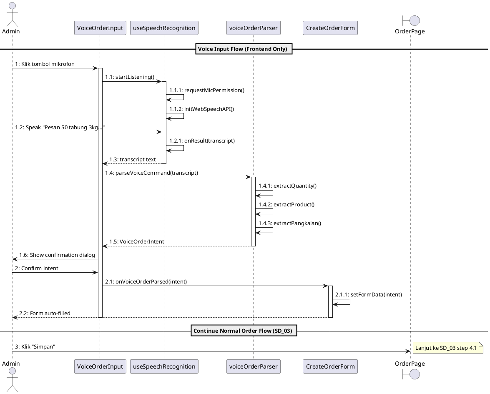

# Analisis Dampak UML - Speech-to-Order Feature

## Ringkasan Dampak

Fitur Speech-to-Order memiliki **dampak MINIMAL** terhadap diagram UML yang ada karena:
1. Fitur ini adalah **frontend-only enhancement**
2. Backend API tetap sama (tidak ada endpoint baru)
3. Database schema tidak berubah
4. Business logic ordering tidak berubah

---

## Dampak per Diagram UML

### 1. Use Case Diagram ❌ TIDAK PERLU DIUBAH

**Alasan:** Speech-to-Order adalah **alternative flow** dari use case "Kelola Pesanan" yang sudah ada. Ini bukan use case baru, melainkan cara alternatif untuk melakukan use case yang sama.

```
┌─────────────────────────────────┐
│       Kelola Pesanan            │
│  ─────────────────────────────  │
│  Extensions:                    │
│  - Speech Input ← BARU (opsional) │
└─────────────────────────────────┘
```

**Opsi (jika ingin update):** Tambahkan catatan di use case atau extend relationship:

```plantuml
usecase "Speech-to-Order" as UCVoice
UCVoice ..> UC15 : <<Extend>>
```

---

### 2. Activity Diagram AD_02 (Buat Pesanan) ⚠️ BISA DITAMBAHKAN

**Dampak:** Perlu menambahkan **alternative path** untuk voice input.

**Diagram saat ini:**
```
User: Buka halaman Pesanan
User: Klik "Buat Pesanan Baru"
System: Tampilkan form
User: Pilih Pangkalan          ← Manual input
User: Pilih jenis LPG & jumlah ← Manual input
User: Klik Simpan
```

**Diagram yang diusulkan (dengan voice):**
```
User: Buka halaman Pesanan
User: Klik "Buat Pesanan Baru"
System: Tampilkan form

    ┌─────────────────────────────────────┐
    │ ALTERNATIVE: Voice Input            │
    ├─────────────────────────────────────┤
    │ User: Klik tombol mikrofon          │
    │ User: Ucapkan perintah suara        │
    │ System: Convert speech-to-text      │
    │ System: Parse intent (NLP)          │
    │ System: Auto-fill form              │
    │ User: Review & konfirmasi           │
    └─────────────────────────────────────┘

    OR (current flow)

    User: Pilih Pangkalan (manual)
    User: Pilih jenis LPG & jumlah (manual)

User: Klik Simpan
... (rest sama)
```

---

### 3. Sequence Diagram SD_03 (Create Order) ⚠️ BISA DITAMBAHKAN

**Dampak:** Perlu menambahkan **sub-sequence** untuk voice processing di sisi frontend.

**Sequence baru yang perlu ditambahkan:**



---

### 4. Class Diagram ⚠️ BISA DITAMBAHKAN

**Dampak:** Menambahkan class baru di sisi frontend (opsional untuk dokumentasi).

```plantuml
package "Frontend - Speech Module" {
    
    class VoiceOrderInput {
        - isListening: boolean
        - transcript: string
        + onVoiceOrderParsed(intent): void
        + render(): JSX
    }
    
    class useSpeechRecognition <<hook>> {
        - recognition: SpeechRecognition
        + isListening: boolean
        + transcript: string
        + error: string
        + startListening(): void
        + stopListening(): void
    }
    
    class voiceOrderParser <<module>> {
        + parseVoiceCommand(text): VoiceOrderIntent
        - extractQuantity(text): number
        - extractProduct(text): string
        - extractPangkalan(text, list): string
        - fuzzyMatch(query, items): string
    }
    
    class VoiceOrderIntent <<interface>> {
        + intent: 'CREATE_ORDER' | 'UNKNOWN'
        + confidence: number
        + items: OrderItemIntent[]
        + pangkalanKeyword: string
        + rawText: string
    }
}

VoiceOrderInput --> useSpeechRecognition : uses
VoiceOrderInput --> voiceOrderParser : uses
voiceOrderParser --> VoiceOrderIntent : returns
```

---

### 5. ERD (Entity Relationship Diagram) ❌ TIDAK PERLU DIUBAH

**Alasan:** Tidak ada tabel baru atau kolom baru yang ditambahkan. Order tetap disimpan dengan struktur yang sama.

---

### 6. Deployment Diagram ❌ TIDAK PERLU DIUBAH

**Alasan:** Tidak ada service baru, server baru, atau dependency eksternal yang ditambahkan. Semua proses berjalan di browser client.

---

### 7. State Machine Diagram ❌ TIDAK PERLU DIUBAH

**Alasan:** State pesanan (DRAFT → MENUNGGU_PEMBAYARAN → DIPROSES → etc.) tetap sama. Voice input hanya mengubah cara input, bukan state flow.

---

## Rekomendasi Update UML

| Diagram | Action | Priority |
|---------|--------|----------|
| Use Case | Opsional: Tambah extend relationship | Low |
| Activity AD_02 | **Buat versi baru** dengan alternative path | Medium |
| Sequence SD_03 | **Buat SD_Voice** sebagai sub-diagram | Medium |
| Class Diagram | Opsional: Tambah frontend class | Low |
| ERD | Tidak perlu update | - |
| Deployment | Tidak perlu update | - |
| State Machine | Tidak perlu update | - |

---

## File UML yang Perlu Dibuat/Dimodifikasi

### Diagram Baru (Opsional)

1. **AD_02_BuatPesanan_Voice.puml** - Activity diagram dengan voice path
2. **SD_Voice_CreateOrder.puml** - Sequence diagram untuk voice flow

### Modifikasi Minor (Opsional)

1. **SIM4LON_UseCase.puml** - Tambah extend relationship

---

## Kesimpulan

**Untuk MVP (Minimum Viable Product), TIDAK WAJIB mengubah UML yang ada.**

Fitur Speech-to-Order adalah enhancement frontend yang tidak mengubah:
- Business logic
- Data model
- API contract
- System architecture

Jika ingin dokumentasi lengkap, bisa menambahkan:
1. Sub-sequence diagram untuk voice flow
2. Alternative path di activity diagram

Ini murni untuk kelengkapan dokumentasi, bukan requirement teknis.
