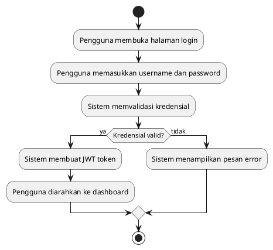

# BAB II - STUDI LITERATUR (SIM4LON)

> **Catatan**: Dokumen ini berisi Studi Literatur profesional untuk Laporan Kerja Praktik aplikasi SIM4LON. Semua referensi dan penjelasan disesuaikan dengan teknologi yang digunakan dalam pengembangan sistem.

---

## 2.2 Studi Literatur

Studi literatur merupakan tahap pengumpulan referensi teoritis dan konseptual yang akan digunakan dalam pembuatan laporan dari kegiatan Kerja Praktik. Teori yang akan dibahas berdasarkan dari konsep analisis dan pembuatan program yang akan dibuat, serta alat yang akan digunakan dalam pembangunan program.

---

## 2.2.1 Aplikasi

Aplikasi adalah program atau paket yang dapat digunakan untuk menjalankan perintah-perintah dari pengguna aplikasi tersebut dengan tujuan mendapatkan hasil yang lebih akurat sesuai dengan tujuan pembuatan aplikasi tersebut. Aplikasi mempunyai arti yaitu pemecahan masalah yang menggunakan salah satu teknik pemrosesan data aplikasi yang biasanya berpacu pada sebuah komputasi yang diinginkan atau diharapkan maupun pemrosesan data yang diharapkan (Santoso, 2017).

Menurut Kamus Besar Bahasa Indonesia (KBBI), aplikasi merupakan sebuah penerapan dari rancangan sistem untuk mengolah data yang menggunakan aturan atau ketentuan bahasa pemrograman tertentu. Aplikasi merupakan suatu program komputer yang dibuat untuk mengerjakan dan melaksanakan tugas khusus dari pengguna.

Dalam konteks SIM4LON, aplikasi yang dikembangkan merupakan **Sistem Informasi Manajemen berbasis web** yang dirancang untuk mengelola distribusi LPG pada tingkat agen. Aplikasi ini mengintegrasikan berbagai modul seperti manajemen pesanan, stok, keuangan, dan pelaporan dalam satu platform terpadu.

---

## 2.2.2 Website

Menurut Arief (2011) dalam Jurnal *Pemrograman Web*, website adalah "salah satu aplikasi yang berisikan dokumen-dokumen multimedia (teks, gambar, suara, animasi, video) di dalamnya yang menggunakan protokol HTTP (*Hypertext Transfer Protocol*) dan untuk mengaksesnya menggunakan perangkat lunak yang disebut *browser*."

Menurut Bing Tanajik (2010) pada jurnal *Cybernetics and System, An International Journal* Vol.13, November 2010 yang berjudul "*Risk Information Monitoring for Comparative Intelligence*" mengungkapkan bahwa web merupakan salah satu media yang paling penting dalam penyediaan informasi saat ini, dan digunakan di berbagai bidang khususnya perusahaan oleh badan *competitive intelligence* (CI). Penelitian ini mengembangkan sebuah sistem *monitoring* web WebMon, untuk membantu pengguna memenuhi kebutuhan web dinamik untuk pembuatan berbagai dan *update* informasi. Fungsi fungsi pemantauan memantau ini targetnya, *monitoring* kita lihat, *monitoring* link dan pemantauan pola yang ditafsirkan oleh sistem. Oleh karena itu, karena ide dan fungsi penggaran juga dapat dirumuskan.

Website dapat dikategorikan menjadi dua jenis utama:
1. **Website Statis**: Konten tidak berubah kecuali diubah secara manual oleh developer
2. **Website Dinamis**: Konten dapat berubah sesuai interaksi pengguna dan data dari database

SIM4LON termasuk dalam kategori **website dinamis** karena:
- Menampilkan data real-time dari database PostgreSQL
- Memungkinkan interaksi pengguna (CRUD operations)
- Menggunakan autentikasi dan otorisasi berbasis role
- Mendukung fitur Voice Order dengan AI

---

## 2.2.3 Waterfall

Metode Waterfall adalah hal yang menggambarkan pendekatan secara sistematis dan juga berurutan (*step by step*) pada sebuah pengembangan perangkat lunak. Tahapan dengan spesifikasi kebutuhan pengguna lalu berlanjut melalui tahapan-tahapan perencanaan yaitu *planning*, pemodelan, konstruksi, serta *system* dan penyerahan sistem kepada pengguna, sampai pada perawatan yang *ongoing* yang dihasilkan (Novritasari, 2018).

Menurut Pressman (2015), model Waterfall adalah model klasik yang bersifat sistematis dan berurutan dalam membangun *software*. Nama model ini sebenarnya adalah "Linear Sequential Model". Model ini sering disebut juga dengan "classic life cycle" atau model Waterfall. Model ini termasuk ke dalam model *generic* pada rekayasa perangkat lunak dan pertama kali diperkenalkan oleh Winston Royce sekitar tahun 1970.

### Tahapan Metode Waterfall

```
┌─────────────────┐
│  Requirements   │ ─── Analisis kebutuhan sistem
└────────┬────────┘
         │
         ▼
┌─────────────────┐
│     Design      │ ─── Perancangan arsitektur & UI
└────────┬────────┘
         │
         ▼
┌─────────────────┐
│ Implementation  │ ─── Pengkodean program
└────────┬────────┘
         │
         ▼
┌─────────────────┐
│   Verification  │ ─── Pengujian sistem
└────────┬────────┘
         │
         ▼
┌─────────────────┐
│   Maintenance   │ ─── Pemeliharaan sistem
└─────────────────┘
```

**Penjelasan Tahapan:**

| Tahap | Deskripsi | Implementasi pada SIM4LON |
|-------|-----------|---------------------------|
| **Requirements** | Analisis kebutuhan sistem melalui wawancara dan observasi | Identifikasi kebutuhan agen LPG untuk manajemen pesanan, stok, dan pelaporan |
| **Design** | Perancangan arsitektur sistem, database, dan UI | Pembuatan ERD, Class Diagram, Activity Diagram, dan mockup antarmuka |
| **Implementation** | Penulisan kode program berdasarkan desain | Pengembangan frontend (Astro + React) dan backend (NestJS) |
| **Verification** | Pengujian untuk menemukan kesalahan | Black-box testing pada setiap modul sistem |
| **Maintenance** | Perbaikan bug dan penambahan fitur | Pemeliharaan sistem setelah deployment |

**Kelebihan Metode Waterfall:**
1. Mudah dipahami dan dikelola karena bersifat linier
2. Dokumentasi lengkap di setiap tahap
3. Cocok untuk proyek dengan requirement yang sudah jelas
4. Estimasi waktu dan biaya lebih akurat

**Kekurangan Metode Waterfall:**
1. Sulit untuk mengakomodasi perubahan requirement
2. Testing dilakukan di akhir sehingga bug ditemukan terlambat
3. Tidak cocok untuk proyek yang kompleks dan dinamis

---

## 2.2.4 UML (Unified Modeling Language)

### a. BPMN

BPMN merupakan singkatan dari *Business Process Model and Notation*, yaitu standar pemodelan bisnis dengan kemampuan memahami prosedur bisnis internal dalam notasi grafis dan memberikan kemampuan mengkomunikasikan prosedur yang terstandar. Sehingga notasi grafis akan memfasilitasi pemahaman tentang kolaborasi, kinerja dan transaksi bisnis antara organisasi. Tujuan BPMN dalam organisasi untuk mempersyaratkan notasi yang dapat memenuhi pengguna bisnis dan memenuhi bahasa XML yang dikembangkan untuk melaksanakan proses bisnis, seperti BPEL4WS (*Business Process Execution Languages for Web Services*) dan BPML (*Business Process Modeling Language*), dapat divisualisasikan secara visual dengan menggunakan BPMN.

1. BPMN merupakan teknik untuk memediakan alur proses dengan cara yang terstandar
2. BPMN dapat dilekatkan di dalam UML dan memadukan bahasa *Business Modeling* untuk dirumuskan proses dengan menggunakan UML

### b. Use Case Diagram

Menurut Tokan (2014:47) menjelaskan bahwa, "*Use Case* adalah rangkaian sekuensi yang saling berkait dan membantu sistem secara teratur yang dilaksanakan oleh penyebab dari serangkaian peristiwa."

Use Case Diagram digunakan untuk menggambarkan interaksi antara pengguna (*actor*) dengan sistem. Diagram ini menunjukkan fungsionalitas sistem dari sudut pandang pengguna.

**Komponen Use Case Diagram:**
| Komponen | Simbol | Deskripsi |
|----------|--------|-----------|
| Actor | Stick figure | Pengguna sistem |
| Use Case | Ellipse (oval) | Fungsionalitas sistem |
| Association | Garis lurus | Hubungan actor-use case |
| Include | Garis putus-putus dengan `<<include>>` | Use case yang selalu dipanggil |
| Extend | Garis putus-putus dengan `<<extend>>` | Use case opsional |

### c. Activity Diagram

Menurut Tokan dalam Darmayanti dan Agistyari (2019:43), mendefinisikan bahwa "diagram ini mendeskripsikan urutan proses bisnis dan urutan aktivitas dalam sebuah proses. Diagram ini sangat mirip dengan *flowchart* karena memodelkan *workflow* dari satu aktivitas ke aktivitas lainnya atau dari aktivitas ke status."

Sedangkan menurut Novitasari (2018), pengertian *activity diagram* adalah pemodelan yang dilakukan pada suatu sistem dan menggambarkan aktivitas sistem berjalan. Activity diagram ini digunakan sebagai pengganti petunjuk aktivitas program tanpa melihat coding dan tampilan.

**Activity Diagram pada SIM4LON:**
- AD_01: Login
- AD_02: Buat Pesanan
- AD_03: Update Status Pesanan
- AD_VoiceOrder_AI: Voice Order dengan Gemini AI

### d. Sequence Diagram

Sequence Diagram adalah salah satu dari diagram-diagram yang ada pada UML. *Sequence diagram* ini digunakan untuk memperlihatkan kelakuan (*behavior*) sistem antara satu entitas objek. Kegunaannya untuk menunjukkan rangkaian pesan yang dikirim antara *object* yang dikembalikan antara objek-objek yang berinteraksi. Sesuatu yang terjadi pada titik tertentu dalam eksekusi sistem (Pratama, 2019).

**Komponen Sequence Diagram:**
| Komponen | Deskripsi |
|----------|-----------|
| Object/Lifeline | Garis vertikal yang menunjukkan waktu hidup object |
| Message | Panah horizontal yang menunjukkan komunikasi |
| Return Message | Panah putus-putus untuk nilai kembalian |
| Activation | Kotak kecil yang menunjukkan object sedang aktif |

### e. Class Diagram

Class Diagram adalah sebuah spesifikasi yang jika diinstansiasi akan menghasilkan sebuah objek, dan merupakan inti dari pengembangan dan desain berorientasi objek. Selain itu class diagram digunakan untuk menunjukkan keberadaan dari kelas dan hubungannya di dalam pandangan logis dari sistem. Sebuah kelas menggambarkan keadaan (*attribute/property*) suatu sistem, sekaligus menawarkan layanan untuk memanipulasi keadaan tersebut (*method/function*) (Pratama, 2019).

---

## 2.2.5 Tools Yang Digunakan

Agar memudahkan dalam pembangunan web, maka diperlukan beberapa alat atau *tools* yang digunakan dalam pembuatan *website* sebagai berikut:

### a. Visual Studio Code

Penulis menggunakan *tools* Visual Studio Code karena Visual Studio Code merupakan sebuah *text editor* ringan dan handal yang dibuat oleh Microsoft untuk sistem operasi *Windows*, *Mac*, dan *Linux*. Text editor ini secara langsung mendukung pengembangan *JavaScript*, *TypeScript*, dan *Node.js*, serta bahasa pemrograman lainnya dengan bantuan *plugin* yang dapat dipasang via *marketplace* Visual Studio Code seperti *C++*, *Python*, *Go*, *Java*, *PHP*, dan sebagainya (Yessi Gani Saputro, 2021).

Visual Studio Code memiliki fitur-fitur unggulan yang sangat membantu dalam pengembangan aplikasi web, di antaranya:

1. **IntelliSense**: Fitur autocomplete cerdas yang memberikan saran kode berdasarkan variabel, fungsi, dan modul yang tersedia. IntelliSense memahami konteks kode sehingga dapat memberikan rekomendasi yang relevan dan akurat.

2. **Integrated Terminal**: Terminal bawaan yang memungkinkan developer menjalankan perintah command-line langsung dari editor tanpa perlu membuka aplikasi terminal terpisah.

3. **Built-in Git Integration**: Integrasi dengan sistem version control Git yang memungkinkan developer melakukan commit, push, pull, dan mengelola branch langsung dari interface Visual Studio Code.

4. **Live Share**: Fitur kolaborasi real-time yang memungkinkan beberapa developer bekerja pada kode yang sama secara bersamaan dari lokasi yang berbeda.

5. **Debugging**: Visual Studio Code menyediakan debugger bawaan untuk JavaScript dan TypeScript, serta mendukung debugging untuk bahasa lain melalui extensions.

6. **Extensions Marketplace**: Marketplace yang menyediakan ribuan extensions untuk menambah fungsionalitas editor, seperti Prettier untuk code formatting, ESLint untuk linting, dan Tailwind CSS IntelliSense untuk autocomplete class Tailwind.

Dalam pengembangan SIM4LON, Visual Studio Code digunakan sebagai *Integrated Development Environment* (IDE) utama untuk menulis seluruh kode program baik frontend maupun backend.

---

### b. TypeScript

Penulis menggunakan *tools* TypeScript karena TypeScript merupakan bahasa pemrograman yang dikembangkan dan dikelola oleh Microsoft. TypeScript adalah *superset* dari JavaScript yang menambahkan fitur *static typing* dan konsep *object-oriented programming* yang lebih kuat. Anders Hejlsberg, yang juga merupakan pencipta bahasa C# dan Turbo Pascal, memimpin pengembangan TypeScript sejak versi pertamanya dirilis pada Oktober 2012.

Menurut dokumentasi resmi TypeScript (2024), TypeScript adalah "JavaScript with syntax for types." Artinya, semua kode JavaScript yang valid juga merupakan kode TypeScript yang valid, namun TypeScript menambahkan kemampuan untuk mendefinisikan tipe data secara eksplisit.

**Keunggulan TypeScript dalam pengembangan SIM4LON:**

1. **Static Type Checking**: TypeScript melakukan pengecekan tipe data pada saat kompilasi (*compile-time*), bukan saat runtime seperti JavaScript. Hal ini memungkinkan developer mendeteksi error lebih awal dalam proses development.

2. **Enhanced IDE Support**: Dengan type annotations, IDE seperti Visual Studio Code dapat memberikan autocomplete yang lebih akurat, refactoring yang aman, dan navigasi kode yang lebih baik.

3. **Better Documentation**: Type annotations berfungsi sebagai dokumentasi inline yang selalu ter-update. Developer lain dapat langsung memahami struktur data yang diharapkan dari sebuah function atau component.

4. **Scalability**: Untuk proyek berskala besar seperti SIM4LON dengan ratusan file dan ribuan baris kode, TypeScript membantu menjaga konsistensi dan mencegah bug yang sering terjadi pada proyek JavaScript murni.

Contoh penggunaan TypeScript di SIM4LON:

```typescript
// Interface untuk mendefinisikan struktur data Order
interface Order {
  id: string;
  code: string;
  pangkalan_id: string;
  current_status: StatusPesanan;
  total_amount: number;
  items: OrderItem[];
}

// Function dengan type annotations
async function createOrder(data: CreateOrderDto): Promise<Order> {
  // Implementation
}
```

---

### c. Node.js

Penulis menggunakan *tools* Node.js karena Node.js merupakan *runtime environment* JavaScript yang dibangun di atas Chrome V8 JavaScript Engine. Node.js memungkinkan eksekusi kode JavaScript di luar browser, yaitu di sisi server. Ryan Dahl memperkenalkan Node.js pada tahun 2009, dan sejak saat itu Node.js telah menjadi salah satu platform paling populer untuk pengembangan aplikasi web backend.

Menurut Tilkov dan Vinoski (2010) dalam artikel "Node.js: Using JavaScript to Build High-Performance Network Programs" yang diterbitkan di IEEE Internet Computing, Node.js menggunakan model **event-driven, non-blocking I/O** yang membuatnya sangat ringan dan efisien untuk aplikasi yang bersifat data-intensive dan real-time.

**Karakteristik utama Node.js:**

1. **Single-threaded dengan Event Loop**: Berbeda dengan model multi-threaded tradisional, Node.js menggunakan single thread dengan event loop untuk menangani multiple concurrent connections. Pendekatan ini menghindari overhead dari context switching antar thread.

2. **Non-blocking I/O**: Operasi I/O seperti membaca file atau query database dilakukan secara asynchronous. Thread tidak perlu menunggu operasi selesai dan dapat langsung melanjutkan ke operasi berikutnya.

3. **NPM (Node Package Manager)**: Node.js hadir dengan NPM, registry package terbesar di dunia dengan lebih dari 1 juta packages. NPM memudahkan developer untuk menggunakan dan berbagi kode.

4. **JavaScript Everywhere**: Dengan Node.js, developer dapat menggunakan JavaScript baik di frontend maupun backend. Hal ini mengurangi context switching dan memungkinkan berbagi kode antara client dan server.

Dalam pengembangan SIM4LON, Node.js digunakan sebagai runtime untuk backend server yang dibangun dengan framework NestJS.

---

### d. NestJS

Penulis menggunakan *tools* NestJS karena NestJS merupakan framework Node.js progresif untuk membangun aplikasi server-side yang efisien, reliable, dan scalable. NestJS dikembangkan oleh Kamil Myśliwiec dan pertama kali dirilis pada tahun 2017. Framework ini terinspirasi oleh arsitektur Angular dan menggunakan TypeScript secara native sebagai bahasa utama.

Menurut dokumentasi resmi NestJS (2024), NestJS menyediakan abstraksi di atas Node.js framework seperti Express atau Fastify, dan mengekspos API mereka secara langsung kepada developer. Hal ini memberikan kebebasan untuk menggunakan berbagai third-party modules yang tersedia untuk platform underlying.

**Arsitektur NestJS menggunakan beberapa pattern penting:**

1. **Modules**: Unit organisasi kode dalam NestJS. Setiap fitur utama seperti authentication, orders, atau stock management dienkapsulasi dalam module tersendiri. Module mendeklarasikan controllers, providers, dan dapat mengimpor module lain.

2. **Controllers**: Bertanggung jawab untuk menangani incoming requests dan mengembalikan responses kepada client. Controller mendefinisikan routes dan HTTP methods yang tersedia.

3. **Providers/Services**: Berisi business logic utama aplikasi. Services di-inject ke controller melalui mekanisme Dependency Injection, memungkinkan separation of concerns yang baik.

4. **Guards**: Digunakan untuk authentication dan authorization. Guards menentukan apakah sebuah request akan ditangani oleh handler atau tidak.

5. **DTOs (Data Transfer Objects)**: Class yang mendefinisikan struktur data untuk request dan response. DTOs dikombinasikan dengan library `class-validator` untuk validasi input.

**Implementasi pada SIM4LON:**

SIM4LON menggunakan struktur modular NestJS dengan module-module seperti:
- `AuthModule`: Menangani login, JWT token, dan user management
- `OrderModule`: Mengelola pesanan dari agen ke pangkalan
- `StockModule`: Mengelola stok LPG di tingkat agen
- `GeminiModule`: Integrasi AI untuk Voice Order

---

### e. React

Penulis menggunakan *tools* React karena React merupakan library JavaScript untuk membangun user interface yang dikembangkan oleh Meta (Facebook). React pertama kali diperkenalkan oleh Jordan Walke, seorang software engineer di Facebook, pada tahun 2011 untuk kebutuhan internal Facebook. React kemudian di-open source pada tahun 2013 dan sejak saat itu telah menjadi salah satu library frontend paling populer di dunia.

Menurut dokumentasi resmi React (2024), React menggunakan paradigma **deklaratif** yang membuat kode lebih mudah diprediksi dan di-debug. Developer cukup mendeskripsikan tampilan yang diinginkan untuk setiap state, dan React akan mengurus update DOM secara efisien.

**Konsep utama React yang digunakan dalam SIM4LON:**

1. **Components**: Building blocks dari aplikasi React. Setiap bagian UI dibangun sebagai component yang dapat digunakan kembali (*reusable*). SIM4LON memiliki lebih dari 100 components dari button sederhana hingga dashboard kompleks.

2. **JSX (JavaScript XML)**: Syntax extension yang memungkinkan penulisan HTML di dalam JavaScript. JSX membuat struktur komponen lebih mudah dibaca dan ditulis.

3. **Props dan State**: Props adalah data yang dikirim dari parent component ke child component. State adalah data yang dikelola internal oleh component dan dapat berubah seiring waktu.

4. **Hooks**: Fitur yang diperkenalkan di React 16.8 yang memungkinkan penggunaan state dan lifecycle features tanpa menulis class component. SIM4LON menggunakan hooks seperti:
   - `useState`: Untuk mengelola state lokal component
   - `useEffect`: Untuk side effects seperti data fetching
   - `useContext`: Untuk mengakses context seperti authentication state

5. **Custom Hooks**: SIM4LON mengembangkan custom hooks khusus seperti:
   - `useAuth`: Mengelola authentication state dan login/logout
   - `useSpeechRecognition`: Integrasi Web Speech API untuk voice input
   - `useVoiceOrder`: Mengelola flow Voice Order dari recording hingga parsing

---

### f. Astro

Penulis menggunakan *tools* Astro karena Astro merupakan **Static Site Generator** (SSG) modern yang dikembangkan oleh Fred K. Schott dan tim. Astro pertama kali dirilis pada tahun 2021 dan dengan cepat mendapatkan popularitas karena pendekatan inovatifnya dalam membangun website yang cepat.

Menurut dokumentasi resmi Astro (2024), Astro menggunakan konsep **"Island Architecture"** atau Arsitektur Pulau. Konsep ini memungkinkan halaman web terdiri dari HTML statis dengan "pulau-pulau" interaktif yang di-hydrate secara terpisah. Pendekatan ini menghasilkan website dengan performa sangat tinggi karena JavaScript hanya di-load untuk bagian yang benar-benar membutuhkan interaktivitas.

**Keunggulan Astro dalam pengembangan SIM4LON:**

1. **Zero JavaScript by Default**: Astro tidak mengirim JavaScript ke browser kecuali diperlukan. Halaman statis seperti landing page dan halaman informasi akan super cepat karena tidak ada JavaScript yang perlu di-parse.

2. **Component Islands**: Komponen React yang membutuhkan interaktivitas (misalnya dashboard, forms) dapat di-hydrate secara individual dengan directive `client:load` atau `client:visible`.

3. **Framework Agnostic**: Astro mendukung komponen dari berbagai framework dalam satu project. SIM4LON menggunakan React, namun jika diperlukan, Vue atau Svelte components juga bisa diintegrasikan.

4. **File-based Routing**: Struktur folder di `src/pages/` langsung menjadi routes aplikasi. File `src/pages/pesanan/index.astro` menjadi route `/pesanan`.

5. **Built-in Optimizations**: Astro secara otomatis mengoptimasi gambar, CSS, dan assets lainnya untuk performa terbaik.

---

### g. PostgreSQL

Penulis menggunakan *tools* PostgreSQL karena PostgreSQL merupakan sistem manajemen database relasional (*Relational Database Management System*/RDBMS) yang bersifat open-source dan didistribusikan gratis di bawah lisensi PostgreSQL License. PostgreSQL dikembangkan sejak tahun 1986 di University of California, Berkeley, dan telah menjadi salah satu database paling advanced dan reliable di dunia.

Menurut Susanti et al. (2015), PostgreSQL dikenal sebagai database yang sangat powerful dengan dukungan untuk fitur-fitur enterprise seperti ACID compliance, foreign keys, triggers, stored procedures, dan views. PostgreSQL juga mendukung tipe data non-tradisional seperti array, JSON/JSONB, dan geometric types.

**Fitur PostgreSQL yang digunakan dalam SIM4LON:**

1. **UUID Primary Keys**: Semua tabel di SIM4LON menggunakan UUID (*Universally Unique Identifier*) sebagai primary key. UUID dihasilkan menggunakan extension `uuid-ossp` dengan function `uuid_generate_v4()`. Keuntungan UUID dibanding auto-increment integer adalah:
   - Tidak mengekspos jumlah record
   - Aman untuk distributed systems
   - Dapat di-generate di application layer

2. **Enum Types**: PostgreSQL mendukung custom enum types yang digunakan untuk kolom seperti:
   - `status_pesanan`: DRAFT, DIPROSES, DIKIRIM, SELESAI, dll.
   - `user_role`: ADMIN, OPERATOR, PANGKALAN
   - `lpg_category`: SUBSIDI, NON_SUBSIDI

3. **JSONB**: Tipe data JSONB digunakan untuk menyimpan data semi-structured yang tidak memerlukan schema rigid.

4. **Automatic Timestamps**: Trigger untuk auto-update kolom `updated_at` setiap kali record dimodifikasi.

5. **Foreign Key Constraints**: Referential integrity dijaga melalui foreign key constraints dengan opsi ON DELETE dan ON UPDATE yang sesuai.

---

### h. Prisma ORM

Penulis menggunakan *tools* Prisma karena Prisma merupakan **Object-Relational Mapping (ORM)** generasi baru untuk Node.js dan TypeScript. Prisma dikembangkan oleh Prisma Labs dan pertama kali dirilis sebagai Prisma 2 pada tahun 2020. ORM adalah lapisan abstraksi yang memungkinkan developer berinteraksi dengan database menggunakan objects dan methods, bukan raw SQL queries.

Menurut dokumentasi resmi Prisma (2024), Prisma terdiri dari tiga komponen utama:

1. **Prisma Schema**: File `schema.prisma` yang mendefinisikan:
   - Database connection (datasource)
   - Model definitions dengan fields dan relations
   - Generator untuk Prisma Client

2. **Prisma Client**: Auto-generated TypeScript client yang menyediakan type-safe database access. Setiap query dan operasi didukung dengan autocomplete dan type checking.

3. **Prisma Migrate**: Tool untuk database migrations yang memungkinkan version control untuk database schema.

**Keunggulan Prisma dalam pengembangan SIM4LON:**

1. **Type Safety End-to-End**: Query results otomatis memiliki tipe yang benar, termasuk untuk nested relations. IDE dapat memberikan autocomplete untuk field dan method yang tersedia.

2. **Readable Queries**: Query Prisma lebih mudah dibaca dibanding raw SQL atau query builder tradisional.

3. **Relation Handling**: Prisma memudahkan query untuk nested relations dengan syntax `include` dan `select`.

4. **Migrations**: Perubahan schema dilacak dalam migration files, memudahkan deployment dan rollback.

Contoh query Prisma di SIM4LON:
```typescript
// Mengambil order dengan relasi pangkalan dan items
const order = await prisma.orders.findUnique({
  where: { id: orderId },
  include: {
    pangkalans: true,
    order_items: {
      include: {
        lpg_products: true
      }
    },
    timeline_tracks: true
  }
});
```

---

### i. Tailwind CSS

Penulis menggunakan *tools* Tailwind CSS karena Tailwind CSS merupakan framework CSS berbasis **utility-first** yang dikembangkan oleh Adam Wathan dan Steve Schoger. Tailwind pertama kali dirilis pada tahun 2017 dan telah menjadi salah satu CSS framework paling populer karena pendekatan yang berbeda dari framework tradisional seperti Bootstrap.

Menurut dokumentasi resmi Tailwind CSS (2024), pendekatan utility-first memungkinkan developer membangun design custom langsung di HTML menggunakan utility classes yang pre-defined. Berbeda dengan Bootstrap yang menyediakan pre-built components, Tailwind menyediakan low-level utility classes yang dapat dikombinasikan untuk membuat design apapun.

**Keunggulan Tailwind CSS:**

1. **Rapid Development**: Tidak perlu berpindah antara file HTML dan CSS. Styling dilakukan langsung di markup dengan utility classes.

2. **Consistency**: Design tokens (colors, spacing, typography) didefinisikan di config file dan digunakan secara konsisten di seluruh aplikasi.

3. **Responsive Design Built-in**: Prefix seperti `sm:`, `md:`, `lg:`, `xl:` memungkinkan styling berbeda untuk berbagai ukuran layar.

4. **Dark Mode**: Built-in support untuk dark mode dengan prefix `dark:`.

5. **Zero Dead CSS**: Dengan PurgeCSS yang terintegrasi, Tailwind hanya menyertakan CSS yang benar-benar digunakan dalam production build.

Contoh penggunaan di SIM4LON:
```html
<button class="bg-gradient-to-r from-blue-600 to-blue-700 
               hover:from-blue-700 hover:to-blue-800 
               text-white font-semibold px-6 py-3 
               rounded-xl shadow-lg hover:shadow-xl 
               transition-all duration-300 
               transform hover:-translate-y-0.5">
  Buat Pesanan Baru
</button>
```

---

### j. Visual Paradigm

Penulis menggunakan *tools* Visual Paradigm karena Visual Paradigm merupakan aplikasi pemodelan visual yang mendukung pembuatan berbagai jenis diagram untuk analisis dan perancangan sistem. Visual Paradigm dikembangkan oleh Visual Paradigm International dan telah digunakan oleh jutaan pengguna di seluruh dunia untuk keperluan modeling dan dokumentasi sistem.

Visual Paradigm adalah salah satu alat CASE (*Computer-Aided Software Engineering*) yang paling lengkap dan mendukung standar **Unified Modeling Language (UML)** versi terbaru. Software ini menyediakan environment terintegrasi untuk berbagai aktivitas software development.

**Diagram yang dibuat menggunakan Visual Paradigm untuk SIM4LON:**

1. **Use Case Diagram**: Menggambarkan interaksi antara aktor (Admin, Operator, Pangkalan) dengan sistem.

2. **Activity Diagram**: Menggambarkan alur proses bisnis seperti pembuatan pesanan, update status, dan pencatatan stok.

3. **Sequence Diagram**: Menggambarkan interaksi antar objek dalam urutan waktu untuk setiap use case.

4. **Class Diagram**: Menggambarkan struktur statis sistem termasuk classes, attributes, methods, dan relationships.

5. **Entity Relationship Diagram (ERD)**: Menggambarkan struktur database dan relasi antar tabel.

6. **BPMN (Business Process Model and Notation)**: Menggambarkan proses bisnis distribusi LPG secara detail.

---

### k. Balsamiq Wireframe

Penulis menggunakan *tools* Balsamiq karena Balsamiq merupakan aplikasi *wireframing* yang dirancang khusus untuk membuat *low-fidelity mockups* dengan cepat. Balsamiq dikembangkan oleh Balsamiq Studios, LLC yang didirikan oleh Giacomo "Peldi" Guilizzoni pada tahun 2008. Balsamiq menggunakan pendekatan *sketch-style* yang dengan sengaja menghindari tampilan high-fidelity agar fokus tetap pada struktur dan flow, bukan pada detail visual.

Menurut Guilizzoni (2012), filosofi desain Balsamiq adalah "*Low Fidelity is the Right Fidelity*" – mockup yang terlihat seperti sketsa tangan membantu stakeholder fokus pada fungsi dan struktur, bukan pada warna, font, atau detail visual yang dapat didiskusikan belakangan.

**Keunggulan Balsamiq dalam proses desain SIM4LON:**

1. **Sketchy Look**: Tampilan seperti gambar tangan membuat stakeholder lebih nyaman memberikan feedback karena terlihat "belum final".

2. **Drag-and-Drop Interface**: Library komponen UI yang lengkap (buttons, forms, tables, navigation) yang dapat di-drag langsung ke canvas.

3. **Rapid Wireframing**: Pembuatan wireframe sangat cepat karena tidak perlu memikirkan detail visual seperti warna dan typography.

4. **Linking**: Kemampuan membuat *clickable prototype* dengan menghubungkan wireframe satu ke wireframe lainnya untuk simulasi alur navigasi.

5. **Export Options**: Wireframe dapat di-export ke format PNG, PDF, atau sebagai project Balsamiq untuk kolaborasi.

Dalam pengembangan SIM4LON, Balsamiq digunakan untuk:
- Membuat wireframe awal sebelum implementasi UI
- Mendokumentasikan struktur dan tata letak halaman
- Menyusun alur navigasi antar halaman
- Validasi konsep dengan stakeholder sebelum masuk ke tahap coding

---

### l. PlantUML

Penulis menggunakan *tools* PlantUML karena PlantUML merupakan *tool* open-source yang memungkinkan pembuatan diagram UML menggunakan bahasa markup berbasis teks. PlantUML dikembangkan oleh Arnaud Roques dan pertama kali dirilis pada tahun 2009. Berbeda dengan *tool* diagram konvensional yang menggunakan *drag-and-drop*, PlantUML menggunakan sintaks teks sederhana yang kemudian di-render menjadi diagram visual.

Menurut dokumentasi PlantUML (2024), PlantUML mendukung berbagai jenis diagram UML dan non-UML, termasuk Sequence Diagram, Use Case Diagram, Class Diagram, Activity Diagram, Component Diagram, State Diagram, Object Diagram, Deployment Diagram, dan Timing Diagram.

**Keunggulan PlantUML dalam pengembangan SIM4LON:**

1. **Version Control Friendly**: Karena berbasis teks, diagram PlantUML dapat di-track perubahannya menggunakan Git. Setiap perubahan pada diagram tercatat dalam commit history.

2. **Integration dengan IDE**: PlantUML dapat diintegrasikan dengan Visual Studio Code menggunakan extension, memungkinkan preview diagram langsung di editor.

3. **Consistency**: Diagram yang dihasilkan selalu konsisten karena layout ditentukan secara otomatis oleh algoritma PlantUML.

4. **Documentation as Code**: Diagram menjadi bagian dari codebase dan selalu up-to-date dengan kode program.

5. **Multiple Output Formats**: Diagram dapat di-export ke berbagai format seperti PNG, SVG, PDF, dan LaTeX.

**Contoh sintaks PlantUML untuk Activity Diagram SIM4LON:**


**Diagram yang dibuat menggunakan PlantUML untuk SIM4LON:**
- Activity Diagram untuk proses Login, Buat Pesanan, Voice Order
- Sequence Diagram untuk interaksi sistem dengan API
- Class Diagram untuk struktur entity database
- Use Case Diagram untuk dokumentasi fitur sistem

---

### m. Git dan GitHub

Penulis menggunakan *tools* Git karena Git merupakan sistem kontrol versi terdistribusi (*distributed version control system*) yang dikembangkan oleh Linus Torvalds pada tahun 2005. Git awalnya dibuat untuk pengembangan Linux kernel dan sejak saat itu telah menjadi standar industri untuk version control.

Menurut Chacon dan Straub (2014) dalam buku *Pro Git*, Git memungkinkan multiple developers untuk bekerja pada project yang sama secara bersamaan tanpa mengganggu pekerjaan satu sama lain. Setiap developer memiliki full copy dari repository termasuk seluruh history.

**Fitur Git yang digunakan dalam pengembangan SIM4LON:**

1. **Branching dan Merging**: Pengembangan fitur baru dilakukan di branch terpisah (feature branch) yang kemudian di-merge ke branch utama setelah selesai dan di-review.

2. **Commit History**: Setiap perubahan dicatat sebagai commit dengan pesan deskriptif, memudahkan tracking perubahan dan rollback jika diperlukan.

3. **Remote Repository**: GitHub digunakan sebagai remote repository untuk backup dan kolaborasi.

**Struktur branch SIM4LON:**
```
main (production)
├── development (staging)
│   ├── feature/voice-order
│   ├── feature/pangkalan-dashboard
│   └── fix/stock-validation
```

---

### n. Vercel

Penulis menggunakan *tools* Vercel karena Vercel merupakan platform cloud untuk hosting dan deployment aplikasi web, khususnya yang dibangun dengan framework modern seperti Next.js, Nuxt, dan Astro. Vercel didirikan oleh Guillermo Rauch (pencipta Socket.io dan Next.js) dan menyediakan infrastruktur edge yang didistribusikan secara global.

Menurut dokumentasi resmi Vercel (2024), Vercel menggunakan **Edge Network** yang tersebar di lebih dari 70 lokasi di seluruh dunia. Hal ini memastikan aplikasi memiliki latency rendah dari manapun pengguna mengakses.

**Fitur Vercel yang digunakan untuk SIM4LON:**

1. **Git Integration**: Setiap push ke GitHub secara otomatis memicu deployment baru. Branch `main` di-deploy ke production, branch lain mendapat preview URL.

2. **Preview Deployments**: Setiap pull request mendapatkan unique URL untuk preview dan testing sebelum di-merge.

3. **Instant Rollbacks**: Jika deployment bermasalah, rollback ke versi sebelumnya dapat dilakukan dalam hitungan detik.

4. **Analytics**: Built-in analytics untuk monitoring performa website termasuk Core Web Vitals.

5. **Environment Variables**: Management rahasia seperti API keys dengan aman di dashboard Vercel.

---

### o. Railway

Penulis menggunakan *tools* Railway karena Railway merupakan platform cloud modern untuk hosting aplikasi backend dan database. Railway menyediakan infrastruktur yang di-manage sepenuhnya, memungkinkan developer fokus pada pengembangan aplikasi tanpa perlu mengurus server.

Railway menyediakan berbagai layanan yang digunakan dalam SIM4LON:

1. **PostgreSQL Database**: Managed PostgreSQL instance dengan backup otomatis, SSL encryption, dan dashboard monitoring.

2. **Node.js Deployment**: Container-based deployment untuk aplikasi NestJS dengan auto-scaling.

3. **Environment Variables**: Secure storage untuk environment variables seperti database credentials dan JWT secrets.

4. **Logs dan Monitoring**: Real-time logs dan metrics untuk debugging dan monitoring.

5. **Private Networking**: Database dan backend berada dalam private network untuk keamanan tambahan.

---

### p. Google Gemini AI

Penulis menggunakan *tools* Google Gemini AI karena Gemini merupakan model AI multimodal terbaru yang dikembangkan oleh Google DeepMind. Gemini dirilis pada Desember 2023 dan mewakili kemajuan signifikan dalam *Large Language Models* (LLM) dengan kemampuan memahami dan menghasilkan teks, kode, gambar, audio, dan video.

Menurut dokumentasi Google AI (2024), Gemini 2.0 Flash adalah varian yang dioptimalkan untuk kecepatan dan efisiensi, cocok untuk aplikasi yang membutuhkan respons cepat seperti Voice Order di SIM4LON.

**Penggunaan Gemini AI dalam SIM4LON:**

1. **Voice Order Parsing**: Gemini menerima transkrip voice input dalam Bahasa Indonesia dan mengekstrak informasi terstruktur seperti:
   - Nama pangkalan tujuan
   - Jenis produk LPG (3kg, 12kg, Bright Gas, dll.)
   - Jumlah tabung yang dipesan

2. **Natural Language Understanding**: Gemini memahami berbagai variasi cara pengguna mengucapkan pesanan, termasuk:
   - Angka dalam kata ("lima puluh" → 50)
   - Singkatan dan slang ("tiga kilo" → 3kg)
   - Context-aware parsing

3. **Validation dan Confidence Scoring**: Gemini memberikan confidence score untuk hasil parsing, memungkinkan sistem meminta konfirmasi ulang jika hasil parsing kurang yakin.

Contoh prompt yang digunakan:
```
Parse this Indonesian voice command for an LPG order:
"Mau pesan lima puluh tabung tiga kilo ke pangkalan mitra jaya"

Available pangkalan: ["Mitra Jaya", "Berkah Sejahtera", "Sumber Rezeki"]
Available products: ["3kg", "12kg", "Bright Gas 5.5kg"]

Extract: pangkalan name, items (product, quantity)
Return JSON format with confidence score.
```

---

## 2.2.6 Referensi

1. Arief, M. R. (2011). *Pemrograman Web Dinamis menggunakan PHP dan MySQL*. Yogyakarta: Andi.

2. Bing Tanajik. (2010). "Risk Information Monitoring for Comparative Intelligence." *Cybernetics and System, An International Journal*, Vol.13.

3. Chacon, S., & Straub, B. (2014). *Pro Git*. 2nd Edition. Apress.

4. Darmayanti dan Agistyari. (2019). *Perancangan Sistem Informasi*. Jakarta: Informatika.

5. Novritasari. (2018). *Metode Pengembangan Perangkat Lunak*. Jakarta: Elex Media.

6. O'Brien, J. A., & Marakas, G. M. (2011). *Management Information Systems*. 10th Edition. McGraw-Hill.

7. Pratama, A. (2019). *Unified Modeling Language (UML) untuk Pemodelan Sistem*. Jakarta: Elex Media.

8. Pressman, R. S. (2015). *Software Engineering: A Practitioner's Approach*. 8th Edition. McGraw-Hill.

9. Santoso, B. (2017). *Konsep Dasar Aplikasi Mobile*. Yogyakarta: Graha Ilmu.

10. Susanti, et al. (2015). *Database Management System*. Bandung: Informatika.

11. Tilkov, S., & Vinoski, S. (2010). "Node.js: Using JavaScript to Build High-Performance Network Programs." *IEEE Internet Computing*, 14(6), 80-83.

12. Tokan. (2014). *Use Case Diagram dalam Pemodelan Sistem*. Jakarta: Informatika.

13. Yessi Gani Saputro. (2021). *Penggunaan Visual Studio Code dalam Pengembangan Web*. Surabaya: Teknik Informatika.

14. Astro Documentation. (2024). https://astro.build/

15. NestJS Documentation. (2024). https://docs.nestjs.com/

16. Prisma Documentation. (2024). https://www.prisma.io/docs/

17. React Documentation. (2024). https://react.dev/

18. Tailwind CSS Documentation. (2024). https://tailwindcss.com/

19. Google Gemini AI Documentation. (2024). https://ai.google.dev/

20. Vercel Documentation. (2024). https://vercel.com/docs

21. Railway Documentation. (2024). https://docs.railway.app/

22. Guilizzoni, G. (2012). "Low Fidelity is the Right Fidelity." *Balsamiq Blog*. https://balsamiq.com/

23. PlantUML Documentation. (2024). https://plantuml.com/
